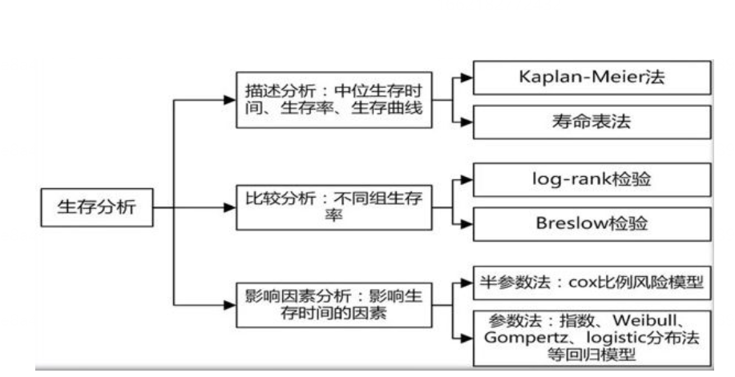
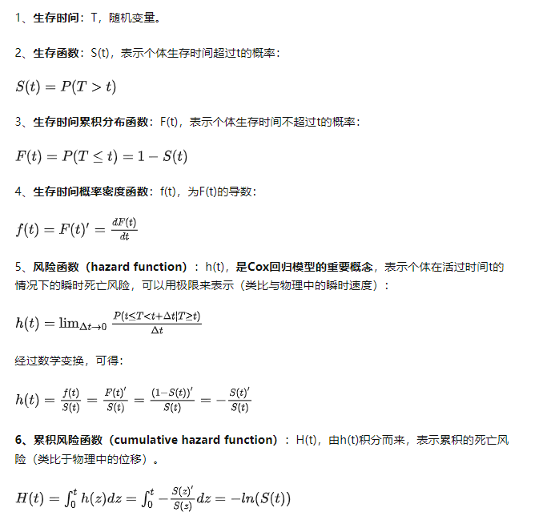
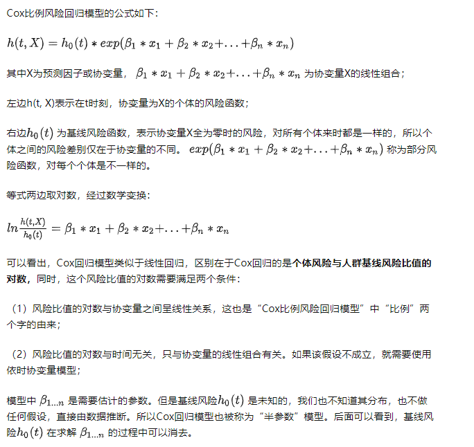
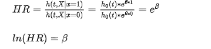
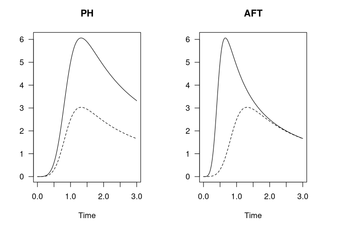
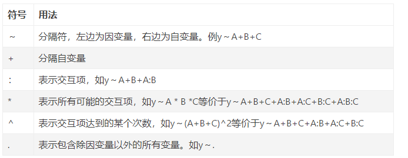
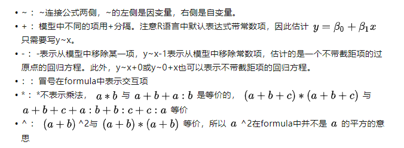
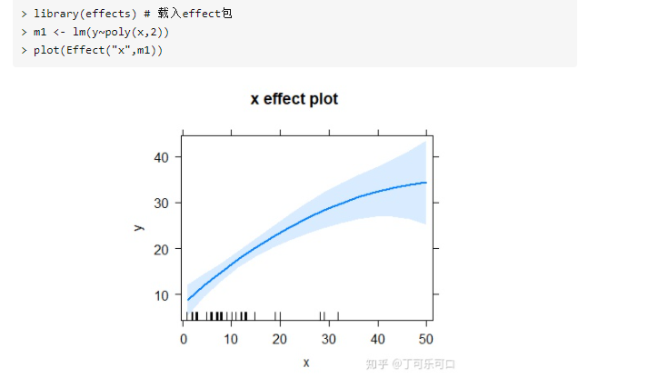

# (PART\*) 模型拟合 {.unnumbered}

# 构建模型 {#Model-building}
## 描述统计模型
### 快速构建描述性统计
#### summarise/across

```R
### 关键的两个函数：
## summarise()
支持分组后统计，内部参数较为麻烦，可以直接在help中检索summarise（）

## 指定函数构造统计：
summary_table <- linelist %>%                                        # 
  group_by(hospital) %>%                                             # 
  summarise(                                                         # 
    cases       = n(),                                                # 
    delay_max   = max(days_onset_hosp, na.rm = T),                    # 
    delay_mean  = round(mean(days_onset_hosp, na.rm=T), digits = 1),  # 
    delay_sd    = round(sd(days_onset_hosp, na.rm = T), digits = 1),  # 
    delay_3     = sum(days_onset_hosp >= 3, na.rm = T),               # 
    pct_delay_3 = scales::percent(delay_3 / cases)                    # 
  )
summary_table  # print

## 条件统计：
## 形式1： 在内部筛选：
linelist %>% 
  group_by(hospital) %>% 
  summarise(
    max_temp_fvr = max(temp[fever == "yes"], na.rm = T),
    max_temp_no = max(temp[fever == "no"], na.rm = T)
  )
## 形式2：在外部筛选：
mtcars %>% 
  mutate(model=rownames(mtcars), 
         vs=ifelse(vs==0, "vshaped", "straight"),
         am=ifelse(am==0, "auto", "manual"), 
         across(c("cyl", "gear"), factor),
         .before=1) %>% as_tibble()
## 形式3：直接条件匹配：
mtcars %>% 
	group_by(cyl) %>%
	summarise_mean(where(is.numeric))

#  形式4： 指定字符后匹配，与形式1相似：
df %>% group_by(class,sex ) %>% 
	summarise(across(contains("h"),mean,na.rm= TRUE))


## 结合across()构造批处理- 支持指定列和批函数：
支持批量处理列数据，支持.col和.fun()
具体参考：
https://www.tidyverse.org/blog/2020/04/dplyr-1-0-0-colwise/
df %>% 
  group_by(g1, g2) %>% 
  summarise(across(a:d, mean))

df %>% 
  group_by(g1, g2) %>%  ## 注意这里的n= n()是内置的count()函数；
  summarise(across(where(is.numeric), mean),n= n()) 

# summarise和across()的完整形式：
linelist %>% 
  group_by(outcome) %>% 
  summarise(across(.cols = c(age_years, temp, wt_kg, ht_cm),  
                   .fns = mean,                               
                   na.rm=T))        

## 对同一数据指定多组函数：
df_grp = df %>% group_by(class) %>%
	group_by(class) %>%
	summarise(across(where(is.numeric),
	list(sum=sum,mean =mean,min= min),na.rm=TRUE))
df_grp	
```

#### mutate/across

```R
## mutate和 across 常用案例说明：添加新列
## 指定条件后添加函数：
df %>% mutate_if(is.numeric, mean, na.rm = TRUE)
df %>% mutate(across(where(is.numeric), mean, na.rm = TRUE))
df %>% mutate_at(vars(x, starts_with("y")), mean, na.rm = TRUE)
df %>% mutate(across(c(x, starts_with("y")), mean, na.rm = TRUE))

## 利用.col和.fus 来构造函数批处理体：	
linelist <- linelist %>% 
  mutate(across(.cols = c(temp, ht_cm, wt_kg), .fns = as.character))


## 指定所有条案后批函数处理：
df %>% mutate_all(mean, na.rm = TRUE)
df %>% mutate(across(everything(), mean, na.rm = TRUE)
```

 

### 高级分组统计

#### 数据分组统计：

##### 基础分组统计

```R
## 基于base R的数据分组统计：
data_split = split(iris[,1:3],iris$Species)
## 基于 base with by的分组统计：
with(UScrime,by(Prob,So,median)) 
## 基于tapply()
(f <- gl(2,5, labels=c("CK", "T")))
> tapply(x, f, sum)
CK  T 
15 40 

## 将数据框分组按列表转化：
ir <- iris %>%
    group_by(Species)   ## 将数据按分类数据分组
  group_split(ir)  ## 将分组数据转为各类列表

## 基于函数来使用tidy的快速分组处理数据：
hh %>% subset(.,aa=='种子' ) %>%   
  group_by(cc,dd)  %>% summarise(mfv = mean(hh)) %>% data.frame()  ->zz

## MAP映射运算
mtcars %>%  split(.$cyl) %>%  ## 这一步是构建分组函数来讲所有数据分组后构建数据框；
  map(~ lm(mpg ~ wt,data= .x)) # 构建函数体；

### 分组数据使用tally()计数;
df %>% group_by(math_level =cut(math,breaks =c(0,60,75,80,100),
		right =FALSE)) %>% tally()
```

##### stby/分组进阶统计

```R
library(summarytools)
##参见：https://cran.r-project.org/web/packages/summarytools/vignettes/introduction.html#header
## 分组统计：
(iris_stats_by_species <- stby(data      = iris, 
                               INDICES   = iris$Species, 
                               FUN       = descr, 
                               stats     = "common", 
                               transpose = TRUE))
## 添加with的分组统计：
with(tobacco, 
     stby(data    = BMI, 
          INDICES = age.gr, 
          FUN     = descr,
          stats   = c("mean", "sd", "min", "med", "max"))
)

## 使用group_by()的分组统计：
library(dplyr)
tobacco$gender %<>% forcats::fct_explicit_na()
tobacco %>% 
  group_by(gender) %>% 
  descr(stats = "fivenum")

```


#### 构造函数处理流

```R
################# 构建函数处理流： ####################
count_data <- linelist %>% 
  group_by(hospital, date_hospitalisation) %>% 
  summarize(n_cases = dplyr::n()) %>% 
  filter(date_hospitalisation > as.Date("2013-06-01")) %>% 
  ungroup()

## summarise()的复杂用法：
# "Roll-up" values into one row per group (per "personID") 
cases_rolled <- obs %>% 
  group_by(personID) %>% 
  arrange(date, .by_group = TRUE) %>%  ## 这里是排序的意思
  summarise(  
    across(everything(),   ## 记住across()来指定对应的函数类型；           
           ~paste0(na.omit(.x), collapse = "; "))) # function is defined which combines non-NA values
```

### 常用统计函数

#### 常用描述性统计函数：

```R
## 计算标准差函数：
std <- function(x) sd(x)/sqrt(length(x))

## 数学运算：
cumsum 累加和
cumprod 累加积
cummin 累加最小值
cummax 累加最大值
cummean 累加均值

# use the appropriate rounding function for your work
危险： round()使用“银行家四舍五入法”，仅当上限为偶数时才从 0.5 向上舍入。使用round_half_up()from janitor始终将一半四舍五入到最接近的整数。看到这个解释
round(c(2.5, 3.5))
## [1] 2 4
janitor::round_half_up(c(2.5, 3.5))
## [1] 3 4
```

#### 中级统计函数 

##### base R中的统计函数：

```R
## t统计：
t.test(age_years ~ gender, data = linelist)

## 夏皮罗-威尔克测试-检验数据是否来自正态分布总体：
shapiro.test(linelist$age_years)

## 秩和检验-wilcoxon:
# 确定两个数值样本是否来自同一分布，当它们的总体不是正态分布或方差不等时。 %>% 
wilcox.test(age_years ~ outcome, data = linelist)

## Kruskal-Wallis 检验
# 是 Wilcoxon 秩和检验的扩展，可用于检验两个以上样本分布的差异
kruskal.test(age_years ~ outcome, linelist)

##卡方检验-用于检验分类变量的统计显著性：
## 注意卡方检验在tidy系列中分析时，必须首先构建交叉表：
## 
linelist %>% 
  tabyl(gender,outcome) %>%  ## tabyl()用于生成交叉表；
  select(-1) %>% 
  chisq_test()

chisq.test(linelist$gender, linelist$outcome)
```

##### tidy流中的统计函数流

###### 描述性回归/tbl_summary

```R
## 使用gtsummary()来优化统计结果输出：
## 卡方：
linelist %>% 
  select(gender, outcome) %>%    # keep variables of interest
  tbl_summary(by = outcome) %>%  # produce summary table and specify grouping variable
  add_p()                        # 默认为卡方检验；

## t检验：
linelist %>% 
  select(age_years, outcome) %>%           
  tbl_summary(                               
    statistic = age_years ~ "{mean} ({sd})", 
    by = outcome) %>%                       
  add_p(age_years ~ "t.test") 
  
  ## wilcoxon秩和检验；
linelist %>% 
  select(age_years, outcome) %>%                      
  tbl_summary(                                         
    statistic = age_years ~ "{median} ({p25}, {p75})", 
    by = outcome) %>%                                
  add_p(age_years ~ "wilcox.test")      

## 复杂形式：
linelist %>% 
  select(age_years, gender, outcome, fever, temp, hospital) %>% # keep only columns of interest
  tbl_summary(     
    by = outcome,    ## 按组进行划分；   
    statistic = list(all_continuous() ~ "{mean} ({sd})", "       
                     all_categorical() ~ "{n} / {N} ({p}%)"),   
    digits = all_continuous() ~ 1,   ## 四舍五入                          # rounding for continuous columns
    type   = all_categorical() ~ "categorical",  ## 两种指定类型；       
    label  = list(                                              # display labels for column names
      outcome   ~ "Outcome",                           
      age_years ~ "Age (years)",
      gender    ~ "Gender",
      temp      ~ "Temperature",
      hospital  ~ "Hospital"),
    missing_text = "Missing"                                   
  )

## 补充：
1、type还有更详细的写法：
  type = all_continuous() ~ 'continuous2',
              statistic = all_continuous()~c(
                "{mean} ({sd})",
                "{median} ({p25}, {p75})"),
```

###### 参数回归/tbl_uvregression()

```R
## 使用gtsummary中的tbl_uvregression()来进行参数回归：
univ_tab <- linelist %>% 
  dplyr::select(explanatory_vars, outcome) %>% 
  tbl_uvregression(                         
    method = glm,                           
    y = outcome,                           
    method.args = list(family = binomial),  
    exponentiate = TRUE                    
  )
## view univariate results table 
univ_tab

## run a regression with all variables of interest 
mv_reg <- explanatory_vars %>%  ## begin with vector of explanatory column names
  str_c(collapse = "+") %>%     ## combine all names of the variables of interest separated by a plus
  str_c("outcome ~ ", .) %>%    ## combine the names of variables of interest with outcome in formula style
  glm(family = "binomial",      ## define type of glm as logistic,
      data = linelist)          ## define your dataset

final_mv_reg <- mv_reg %>%
  step(direction = "forward", trace = FALSE)
options(scipen=999)  ## 关闭科学计数法
## show results table of final regression 
mv_tab <- tbl_regression(final_mv_reg, exponentiate = TRUE)

## 合并建模结果：	
tbl_merge(
  tbls = list(univ_tab, mv_tab),                          # combine
  tab_spanner = c("**Univariate**", "**Multivariable**")) # set header names


## 模型比较：
model1 <- glm(outcome ~ age_cat, family = "binomial", data = linelist)
model2 <- glm(outcome ~ age_cat + gender, family = "binomial", data = linelist)
lmtest::lrtest(model1, model2)
```


### 批处理函数

#### apply函数族

```r
## APPLY:
这个函数的使用格式为：apply(X, MARGIN, FUN, ...)。它应用的数据类型是数组或矩阵，返回值类型由FUN函数结果的长度确定。
# 举例：
apply(a, MARGIN=1, FUN=quantile, probs=seq(0,1, 0.25))

## lapply、sapply和vapply函数：
它们应用的数据类型都是列表，对每一个列表元素应用FUN函数
# lappy是最基本的原型函数，sapply和vapply都是lapply的改进版。
sapply返回的结果比较“友好”，如果结果很整齐，就会得到向量或矩阵或数组


## mapply:相当于sapply的多变量版本；
mapply应用的数据类型为向量或列表，FUN函数对每个数据元素应用FUN函数；如果参数长度为1，得到的结果和sapply是一样的；但如果参数长度不是1，FUN函数将按向量顺序和循环规则（短向量重复）逐个取参数应用到对应数据元素：
> sapply(X=1:4, FUN=rep, times=4)
     [,1] [,2] [,3] [,4]
[1,]    1    2    3    4
[2,]    1    2    3    4
[3,]    1    2    3    4
[4,]    1    2    3    4
> mapply(rep, x = 1:4, times=4)
     [,1] [,2] [,3] [,4]
[1,]    1    2    3    4
[2,]    1    2    3    4
[3,]    1    2    3    4
[4,]    1    2    3    4
> mapply(rep, x = 1:4, times=1:4)
[[1]]
[1] 1

[[2]]
[1] 2 2

[[3]]
[1] 3 3 3

[[4]]
[1] 4 4 4 4
 
## tapply和by(with)函数：
tapply是table()函数的进阶版本；
> (x <- 1:10)
 [1]  1  2  3  4  5  6  7  8  9 10
> (f <- gl(2,5, labels=c("CK", "T")))
 [1] CK CK CK CK CK T  T  T  T  T 
> table(f)
f
CK  T 
 5  5 
> tapply(x, f, sum)
CK  T 
15 40 

##  by和with函数：
# 工作原理类似于加载数据，分组后经分类按函数运算；
with(iris,by(sp1,sp2,sum))

#### aggregate:  ####
首先将数据进行分组（按行），然后对每一组数据进行函数统计，最后把结果组合成一个比较nice的表格返回。
# 第一种实现思路是：加载，构建分组，函数运算；
> aggregate(mtcars, by=list(cyl, gear), FUN=mean)
# 第二种思路是构建数据框内的函数体系：
> aggregate(cbind(mpg,hp) ~ cyl+gear, FUN=mean)
 表示使用 cyl 和 gear 的因子组合对 cbind(mpg,hp) 数据进行操作。
```

#### map/tidy函数映射式批建模

##### 批量构造模型：

```R
## 直接读取形式：
lm_results <- lm(ht_cm ~ age, data = linelist)
summary(lm_results)
tidy(lm_results)

## 使用tidy整理统计检验结果-流形式
model <- glm(outcome ~ age_cat, family = "binomial", data = linelist) %>% 
  tidy(exponentiate = TRUE, conf.int = TRUE) %>%       
  mutate(across(where(is.numeric), round, digits = 2)) 


## 使用map和bind_rows()来批量生成对应数据：
models <- explanatory_vars %>%       # begin with variables of interest
  str_c("outcome ~ ", .) %>%         # combine each variable into formula ("outcome ~ variable of interest")
  # iterate through each univariate formula
  map(                               
    .f = ~glm(                      
      formula = as.formula(.x),     
      family = "binomial",           # specify type of glm (logistic)
      data = linelist)) %>%          # dataset
  
  # tidy up each of the glm regression outputs from above
  map(
    .f = ~tidy(
      .x, 
      exponentiate = TRUE,           
      conf.int = TRUE)) %>%        
  
  # collapse the list of regression outputs in to one data frame
  bind_rows() %>% 
  
  # round all numeric columns
  mutate(across(where(is.numeric), round, digits = 2))
```

##### 批量构造简单统计

```R
### 借助map函数变体来构造统计：
x <- list(1:5, c(1:10, NA))
map_dbl(x, ~ mean(.x, na.rm = TRUE))
#> [1] 3.0 5.5
```

##### tidyr::nest/broom:tidy

```R
mtcars <- as_tibble(mtcars)  # to play nicely with list-cols

nest_mtcars <- mtcars %>%
  nest(data = c(-am))  ## 这里是将非am列以外的数据套叠；

nest_mtcars 
## 输出形式如下：
am data              
  <dbl> <list>            
1     1 <tibble [13 x 10]>
2     0 <tibble [19 x 10]>

## 根据套叠来输出可行的结果：
nest_mtcars %>% 
  mutate( ## 这里会默认返回线性折叠结果，并依据am分组统计：
    fit = map(data, ~ lm(wt ~ mpg + qsec + gear, data = .x)),  # S3 list-col
      ## 来自broom包的tidy函数，自动整理fit拟合的结果；
    tidied = map(fit, tidy)
  ) %>% 
  unnest(tidied) %>% 
  select(-data, -fit)

```

### BROOM优雅输出

#### base r中常用的统计解析

| 函数           | 功能用途                          |
| -------------- | --------------------------------- |
| summary()      | 展示拟合模型的详细结果            |
| coefficients() | 展示拟合模型的模型参数            |
| fitted()       | 列出拟合模型的预测值              |
| residuals()    | 列出拟合模型的残差值              |
| anova()        | 生成拟合模型的方差分析表          |
| AIC()          | 输出赤池系数（评价模型好坏）      |
| confint()      | 提供模型参数的知心区间(默认0.95） |
| plot()         | 生成评价模型的诊断图              |
| predict()      | 通过模型对新的数据集变量预测      |

```R
head(women)
##   height weight
## 1     58    115
## 2     59    117
## 3     60    120
## 4     61    123
## 5     62    126
## 6     63    129
fit<-lm(weight~height,data = women) 
fitted(fit) #列出拟合模型的预测值
##        1        2        3        4        5        6        7        8 
## 112.5833 116.0333 119.4833 122.9333 126.3833 129.8333 133.2833 136.7333 
##        9       10       11       12       13       14       15 
## 140.1833 143.6333 147.0833 150.5333 153.9833 157.4333 160.8833

residuals(fit) #列出拟合模型的残差值
##           1           2           3           4           5           6 
##  2.41666667  0.96666667  0.51666667  0.06666667 -0.38333333 -0.83333333 
##           7           8           9          10          11          12 
## -1.28333333 -1.73333333 -1.18333333 -1.63333333 -1.08333333 -0.53333333 
##          13          14          15 
##  0.01666667  1.56666667  3.11666667

predict(fit) #通过模型对新的数据集变量预测
##        1        2        3        4        5        6        7        8 
## 112.5833 116.0333 119.4833 122.9333 126.3833 129.8333 133.2833 136.7333 
##        9       10       11       12       13       14       15 
## 140.1833 143.6333 147.0833 150.5333 153.9833 157.4333 160.8833
```

#### Broom包中的优雅解析

```R
library(broom)
## 关键是broom体系适配于tidy体系：

#返回模型系数估计及其统计量
fit<-lm(weight~height,data = women)
fit %>% tidy() 
## # A tibble: 2 x 5
##   term        estimate std.error statistic  p.value
##   <chr>          <dbl>     <dbl>     <dbl>    <dbl>
## 1 (Intercept)   -87.5     5.94       -14.7 1.71e- 9
## 2 height          3.45    0.0911      37.9 1.09e-14

#返回模型诊断信息
fit<-lm(weight~height,data = women)
fit  %>%  glance(fit) 
## # A tibble: 1 x 12
##   r.squared adj.r.squared sigma statistic  p.value    df logLik   AIC   BIC
##       <dbl>         <dbl> <dbl>     <dbl>    <dbl> <dbl>  <dbl> <dbl> <dbl>
## 1     0.991         0.990  1.53     1433. 1.09e-14     1  -26.5  59.1  61.2
## # ... with 3 more variables: deviance <dbl>, df.residual <int>, nobs <int>

#augment函数返回预测值,残差等模型结果的原始值
fit<-lm(weight~height,data = women)
fit%>% augment() 
```

## 复杂统计模型
### 变量筛选

#### 变量筛选的基本流程

```R
模型构建中第一个问题就是变量筛选：最常规的办法是先单后多（先进行单因素分析，单因素有意义的再一起纳入多因素模型中）；
但如果变量数目过多，变量间存在共线性或存在较多缺失值而又不愿舍弃含缺失值的样本时，先单后多就存在很多局限性。 
此时可以使用具有变量筛选功能的方法： -共线性问题：岭回归(Ridge Regression)，LASSO回归，弹性网络(Elastic Net Regression) -缺失值情况：随机森林模型

## 常见的筛选变量方法
正则技术（岭回归、LASSO回归、弹性网络）
支持向量机
逐步回归（向前法、向后法、向前向后法）
最优子集（Best Subset Select）
树模型（使用的较少）
随机森林模型
主成分分析（提取多个自变量的主成分，将主成分得分作为最终的自变量）

## 常见的模型评价指标
拟合优度检验（卡方值&P值）
ROC（AUC、sen、spe、accuracy等）
calibration（C-index）
MSE
rmse
模型验证是为了防止过拟合情况（所构建的模型对于本次数据有很好的效果，但是对全新的数据效果不理想）

## 常见的模型验证方法
cross validation（简单交叉，K-fold cross validation，N-fold cross validation）
bootstrap
cross validation + bootstrap（目前最常用）
# 交叉验证（cv）和bootstrap的区别：
.Bootstrap重抽样和交叉验证的区别。其相同之处，都是在数据集较小的时候常用的方法，提高结果的稳定性。不同之处，其一，两者的目的不同。CV主要用于模型选择上，例如KNN中选多大的K，使得估计的误差比较小。而Bootstrap主要用来看选定的模型的不确定性，例如参数的标准差多大。其二，两者的resample方法不同。在k fold CV中，把原始数据集分成k等分（各等分之间没交集），每一次验证中，把其中一份作为验证集，剩余的作为训练集。而在Bootstrap中，并不区分验证集和训练集，并且在resample中，是可放回抽样的，即同一个样本可以重复出现。


## 变量筛选原则~~先单后多
如果某个变量单因素分析时P < 0.05（这个标准可以根据实际案例设置成0.1或者更严格的0.01），就纳入多因素模型。 单因素分析可以用t检验，卡方检验，秩和检验，Logistic回归等。
因变量：Group，1表示疾病，0表示对照 自变量：连续变量和分类变量都有（将分类变量处理成factor--2分类是否处理成因子不影响结果，多分类必须处理成因子）
```

#### 变量筛选的实施方法：

``` r
2.1 参与评估的变量过多，通过数据的时间尺度来去除非因果耦联因子；
# 方法：
############ 子集选择法（Subset Selection）：
子集选择法分为最优子集选择、逐步筛选法等，这部分方法依赖于下述模型评判指标：
此外，还有考虑数据的共线性问题：包括pearson相关性分析和方差膨胀分析；


############ 系数压缩法（Shrinkage）:
适用于岭回归和LASSO；两种方法可以用于自变量相关性非常强时，在进行线性回归进行参数估计时，会导致解不可逆，并且十分不稳定。岭回归由于使用L2范数作为限制，所以只能将估计的参数进行压缩，使得模型更加稳定，但不能对变量进行筛选。


##########    降维法（Dimension Reduction）。
主成分回归以及偏最小二乘回归。主成分回归法主要是先对自变量进行主成分分析，然后挑选变化后的，较为重要的一些新变量进行回归。这部分新变量的构造不依赖于因变量，相当于无监督学习。而偏最小二乘回归相当于在主成分回归的基础上再进行适当的添加，新变量的构造不仅依赖于原本的自变量，还受因变量的影响。

## 前后筛选和后向筛选的区别;
以向后（backward）为例，其原理是，假设有N个自变量或预测指标，先将这N个合并在一起进行一个总的回归，每个自变量会有一个p值，将p>0.05的变量中p值最大的去掉，剩下N-1个自变量，再重复上述过程，直到剩下的自变量都是显著性的。

向前（forward）是另一种算法：先进行N次单因素回归（每个自变量分别进行单因素回归），选出其中SSq（sum of square）最大的那个（设为A），留在回归方程；然后将A和剩下的N-1个自变量分别组合，形成N-1个两因素回归，再选取其中SSq最大的，留下（此时为两个自变量了），和剩下的N-2个去组合~~~以此类推，直到自变量总的SSq不比残差的SSq大，就截止。 
```

#### 变量筛选的重要性评估方法：

```R
########## 基于机器学习的方法：
随机森林分类模型以及对重要变量的选择
gx.rf<-randomForest(gdp~.,data=gxdata_without_x,importance=TRUE, ntree=1000)
importance(gx.rf)
varImpPlot(gx.rf)

#########  标准化回归系数
文章的部分分析中，作者采用多元回归模型，定量分析了海拔、土壤养分、物种多样性、功能多样性和性状组成等在不同气候区对地上生物量影响的相对重要性。简单来说，首先每个非生物或生物变量（作为自变量）都标准化到均值0标准差1，随后拟合了它们与地上生物量（作为因变量）的多元线性回归。并在模型优化后（包括变量选择，去除共线性等），最终通过比较每个自变量的标准化回归系数，确定各类非生物或生物因素对影响地上生物量的相对重要性。-- 这里是对称森林图；

这里既可以使用线性模型，也可以使用非线性模型来构建对应的函数；

############ 相对权重方法：
原理：它是对所有可能子模型添加一个自变量引起的R2平均增加量的一个近似值。

fit <- lm(fish~acre+do2+depth+no3+so4+temp, data = dat)
summary(fit)  #展示拟合回归的简单统计
rel.weights <- relweights(fit)
rel.weights


################### 基于方差分解的多种方法：
### 使用R包：relaimpo
它针对多元线性回归模型提供了评估变量相对重要性的多种指标。R语言中，线性回归通常通过lm()函数实现，lm()的拟合结果可直接作为relaimpo包的输入，relaimpo包中的函数将在此基础上，计算已构建好的回归模型中各个自变量对R2（代表自变量对响应变量总方差的解释程度）的贡献，实现定量分析相对重要性的目的。您也可以将它近似理解为方差分解的原理。

library(relaimpo)
 
#使用函数 calc.relimp() 评估模型中各个自变量的相对重要性，详情 ?calc.relimp
#可以将上述 lm() 拟合的多元线性回归模型直接输入到 calc.relimp()
crf <- calc.relimp(fit_lm, rela = TRUE, 
    type = c('lmg', 'last', 'first', 'betasq', 'pratt', 'genizi', 'car'))  ## 这里标红色为多种评估变量重要性的指标；
crf
plot(crf)
```

#### 多元回归中变量筛选的方法：

##### 前向、后向、混合、暴力破解(AIC/BIC)

```R
# load processed data set from previous section
load(url("https://userpage.fu-berlin.de/soga/300/30100_data_sets/dwd_30200.RData"))
# load helper functions from previous section
load(url("https://userpage.fu-berlin.de/soga/300/30100_data_sets/helper_functions_30200.RData"))
# load list object from previous section
load(url("https://userpage.fu-berlin.de/soga/300/30100_data_sets/model_outcome_I_30200.RData"))

## 均方根误差
rmse = function(model){
  sqrt(sum((model$residual)^2)/nrow(model$model))}

# build the model
m.multi.interact <- lm(formula = MEAN.ANNUAL.RAINFALL ~ 
                         ALTITUDE + 
                         log(ALTITUDE) +
                         I(ALTITUDE^2) +
                         MAX.RAINFALL +
                         log(MAX.RAINFALL) +
                         I(MAX.RAINFALL^2) +
                         I(MAX.RAINFALL*ALTITUDE), 
                       data = train.set)	
# calculate rmse on training set
print(paste('RMSE on training set:', rmse(m.multi.interact)))
# prediction
m.multi.interact.pred <- predict(m.multi.interact, newdata = test.set)
# calculate RMSE for the test data set
print(paste('RMSE on test set:', rmse2(y.test, m.multi.interact.pred)))
# store model object and results of rmse in the `list` object named `model.outcome`
model.outcome[['multi.interact']] = list('model' = m.multi.interact, 
                                         'rmse' =  data.frame('name'= 'multiple interactions',
                                                              'train.RMSE' = rmse(m.multi.interact),
                                                              'test.RMSE' = rmse2(y.test, m.multi.interact.pred)))

summary(m.multi.interact)

##################### 引入前向和后向选择 ##########################
# the Akaike information criterion (AIC) and 
# the Bayesian information criterion (BIC).
################### 前向选择 ##############################

# define (empty) model
test.model <- lm(formula = MEAN.ANNUAL.RAINFALL ~ 1,data = train.set)
                 
# define scope, which features to include
test.scope <- as.formula(lm(MEAN.ANNUAL.RAINFALL ~ ALTITUDE +  MAX.RAINFALL + MEAN.CLOUD.COVER +  MEAN.ANNUAL.AIR.TEMP,  data = train.set))

# call the step function\
## 注意前向选择模型的构建方式：，先设置空白模型，然后比对复杂模型；
step(test.model, scope = test.scope, direction = 'forward')

# build the model
m.forward.test <- lm(formula = MEAN.ANNUAL.RAINFALL ~ MAX.RAINFALL + MEAN.ANNUAL.AIR.TEMP,
                     data = train.set)
# calculate rmse on training set
print(paste('RMSE on training set:', rmse(m.forward.test )))

# prediction
m.forward.test.pred <- predict(m.forward.test , newdata = test.set)
# calculate RMSE for the test data set
print(paste('RMSE on test set:', rmse2(y.test, m.forward.test.pred)))

## 空模型和前向选择模型比较：
# define (empty) model
m.forward.full.baseline <- lm(formula = MEAN.ANNUAL.RAINFALL ~ 1, data = train.set)
# define scope, which features to include
m.forward.full.scope <- as.formula(lm(MEAN.ANNUAL.RAINFALL ~., data = train.set))
# call the step function
m.forward.full <- step(m.forward.full.baseline, 
                       scope = m.forward.full.scope, 
                       direction = 'forward', 
                       trace = 0)
m.forward.full
# calculate rmse on training set
print(paste('RMSE on training set:', rmse(m.forward.full)))
# prediction
m.forward.full.test.pred <- predict(m.forward.full, newdata = test.set)
# calculate RMSE for the test data set
print(paste('RMSE on test set:', rmse2(y.test, m.forward.full.test.pred)))
# store model object and results of rmse in the `list` object named `model.outcome`
model.outcome[['forward.full']] = list('model' = m.forward.full, 
                                       'rmse' =  data.frame('name'= 'forward model',
                                                            'train.RMSE' = rmse(m.forward.full),
                                                            'test.RMSE' = rmse2(y.test, m.forward.full.test.pred)))


###################### 后向选择 ##############################

# define (sophisticated) model
test.model <- lm(formula = MEAN.ANNUAL.RAINFALL ~ ALTITUDE + MAX.RAINFALL + MEAN.CLOUD.COVER + MEAN.ANNUAL.AIR.TEMP, 
                 data = train.set)
# call the step function
step(test.model, direction = 'backward')
# define (empty) model
m.backward.full.baseline <- lm(formula = MEAN.ANNUAL.RAINFALL ~. , data = train.set)
# call the step function
m.backward.full <- step(m.backward.full.baseline, 
                        direction = 'backward',  trace = 0)
                       

################## 混合选择 ###########################
# define model
m.both.full.baseline <- lm(formula = MEAN.ANNUAL.RAINFALL ~., 
                           data = train.set)
# call the step function
m.both.full <- step(m.both.full.baseline, direction = 'both',trace = 0)    
m.both.full

# calculate rmse on training set
print(paste('RMSE on training set:', rmse(m.both.full)))

#########################
### Brute force - BIC ### ###########难怪称之为 蛮力破解的BIC
#########################
# encode log-transformation
features <- colnames(train.set)[!(colnames(train.set)  %in% c('MEAN.ANNUAL.RAINFALL', 'MIN.AIR.TEMP'))]
log_transform <- paste(paste0('log(',features,')'), collapse=" + ")

## 这个公式牛逼：加上所有的log选择，加上所有的二次项，加上所有的交互项；
### 这种模型的构建方式值得选择
formula = as.formula(paste0('MEAN.ANNUAL.RAINFALL ~ . +', log_transform ,'+ .^2 + .*.'))
# define model
m.both.force.BIC.baseline <- lm(formula = formula, data = train.set)
# call the step function
m.both.force.BIC <- step(m.both.force.BIC.baseline,direction = 'both', trace = 0,
                         k= log(nrow(train.set)))
# clculate rmse on training set
print(paste('RMSE on training set:', rmse(m.both.force.BIC)))
```

##### StepReg复杂筛选

```R
## select = c("AIC", "AICc", "BIC", "CP", "HQ", "HQc", "Rsq", "adjRsq", "SL", "SBC"):
## 基于前向、后向和双向,实现多条件、多参数检验筛选函数条件：

## 支持一般线性模型的参数变量选择：
stepwise(
formula,
data,
include = NULL, ## 支持选定变量强制参与最终统计建模：
selection = c("forward", "backward", "bidirection", "score"),
select = c("AIC", "AICc", "BIC", "CP", "HQ", "HQc", "Rsq", "adjRsq", "SL", "SBC"),
sle = 0.15,
sls = 0.15,
multivarStat = c("Pillai", "Wilks", "Hotelling-Lawley", "Roy"),
weights = NULL,
best = NULL)

## 支持cox回归的参数变量选择：
stepwiseCox(
formula,
data,
include = NULL,
selection = c("forward", "backward", "bidirection", "score"),
select = c("SL", "AIC", "AICc", "SBC", "HQ", "HQc", "IC(3/2)", "IC(1)"),
sle = 0.15,
sls = 0.15,
method = c("efron", "breslow", "exact"),
weights = NULL,
best = NULL)

## 支持逻辑回归的变量筛选：
stepwiseLogit(
formula,
data,
include = NULL,
selection = c("forward", "backward", "bidirection", "score"),
select = c("SL", "AIC", "AICc", "SBC", "HQ", "HQc", "IC(3/2)", "IC(1)"),
sle = 0.15,
stepwiseLogit 9
sls = 0.15,
sigMethod = c("Rao", "LRT"),
weights = NULL,
best = NULL)

```

##### 逻辑回归筛选变量

```R
library(tidyverse) # 加载数据处理包
# 读取数据
data <- read_csv('Clinical/Clinical.RocData.Modified.csv',show_col_types = F)
str(data) # 查看数据类型
names(data) # 查看变量名称
# 将分类变量处理成因子
data$Group <- factor(data$Group, levels = c('0','1'), labels = c('Con', 'AD'))
data$EducationLevel <- factor(data$EducationLevel, levels = c('1','2','3','4','5'),
                              labels = c('小学', '初中', '高中', '大学', '研究生'))
data$Gender <- factor(data$Gender, levels = c('0','1'), labels = c('Female', 'Male'))
summary(data) # 查看各变量的基本统计信息

# 连续型自变量
x1 <- colnames(data)[4:60]
# 分类自变量
x2 <- colnames(data)[2:3]

# t检验--数据符合正态分布
library(tableone)
table1 <- CreateTableOne(vars = c(x1, x2), # 指定对哪些变量进行分析
                         data = data,
                         factorVars = x2, # 指定分类变量
                         strata = 'Group', # 指定分组
                         # 是否对总样本进行分析
                         addOverall = T)
result1 <- print(table1, 
                 # 是否对分类变量全部展示
                 showAllLevels = T) 
write.csv(result1, 'Clinical/单因素分析-t检验.csv')

# 秩和检验
library(tableone)
table2 <- CreateTableOne(vars = c(x1, x2), # 指定对哪些变量进行分析
                         data = data,
                         factorVars = x2, # 指定分类变量
                         strata = 'Group', # 指定分组
                         # 是否对总样本进行分析
                         addOverall = F)
result2 <- print(table2, 
                 # 是否对分类变量全部展示
                 showAllLevels = F,
                 # 指定非参数检验变量，exact选项可以指定确切概率检验的变量
                 nonnormal = x1)
write.csv(result2, 'Clinical/单因素分析-秩和检验.csv')

# 单因素Logistic
model <- glm(Group~TP, data = data, family = binomial())
# 查看模型结果
summary(model)$coefficients
# 计算OR值及可信区间
exp(cbind('OR' = coef(model), confint(model)))

# 多因素模型
model <- glm(Group~TP+`LYMPH#`+SBP+DBP+NEUT+FN+`APOA1/APOB`+APOA1+ALB+GLB, data = data, family = binomial())
# 查看模型结果
summary(model)$coefficients
# 计算OR值及可信区间
exp(cbind('OR' = coef(model), confint(model)))

# 非常规先单后多-筛选协变量
# 有用的思想是显著保留，不显著去除；
# 指定自变量X是FN，剩下的都是协变量Z
covar_method <- function(var){
    ## 这里是保留了基本变量：
  model <- glm(Group~FN, data = data, family = binomial())
  coef <- coef(model)[2]
  form <- as.formula(paste0('Group~FN+',var))
    ## 采用逐步纳入的方法进行遍历，遍历后保留OR值增加的变量；
  model2 <- glm(form, data = data, family = binomial())
  coef2 <- coef(model2)[2]
  ratio <- abs(coef2-coef)/coef
  if (ratio > 0.1) {
    return(var)
  }
}

var <- c(x1,x2)
var <- var[-which(var %in% c('FN', 'MoCA-B','P-LCR','HDL-c','LDL-c','RDE-SD','APOA1/APOB','A/G','NEUT#',
                             'LYMPH#','MONO#','EO#','BASO#'))] #去除一些变量名命名不规范的变量，以免引起错误
lapply(var, covar_method)
# 将阳性的协变量与自变量一起进行多因素回归
```

##### 岭回归（ridge）和脊回归（lasso）筛选变量

```R
对于高维数据，普通的变量筛选方法并不见效或者需要消耗大量计算成本和时间成本；且难以避免模型的过拟合及多重共线性问题。此时需要在模型拟合的RSS最小化过程中加入一个正则化项，称之为收缩惩罚；这个惩罚项包含了一个希腊字母λ和对系数β的权重规范化。（RSS+收缩惩罚最小化） 正则化可以对高维数据的系数进行限制，甚至将其缩减到0，避免多重共线性，也可以有效避免过拟合。（岭回归，LASSO，弹性回归） 岭回归中，正则化项是所有变量系数的平方和(L2-norm)，当λ增加时，系数βj缩小，趋向于0，但是永不为0. LASSO回归中，正则化项是变量系数的绝对值和(L1-norm)，这个收缩惩罚项可以使βj收缩到0，因此LASSO具有变量筛选的功能。但是当自变量存在高度共线性或高度两两相关时，LASSO可能会将某个自变量强制删除，这会损失模型预测能力！ 弹性网络中，当α等于0时，弹性网络等价于岭回归；当α等于1时，等价于LASSO；弹性网络技能做到岭回归不能做的变量筛选，又能实现LASSO不能做的变量分组。

## 简单来说：
岭回归不能实现变量筛选，但可以实现一定程度的变量惩罚压缩；
脊回归能实现变量筛选；
弹性网络：既可以实现变量筛选，也可以做到变量压缩。


library(corrplot) # 相关系数分析用
rm(list = ls())
gc()
data <- read_csv('Clinical/Clinical.RocData.Modified.csv',show_col_types = F)
str(data)
names(data) # 查看变量名称
names(data)[9] <- 'MoCA_B' 
names(data)[22:26] <- c('NEUT数','LYMPH数','MONO数','EO数','BASO数') 
names(data)[32:33] <- c('RDE_SD','P_LCR') 
names(data)[37] <- 'A与G的比值' 
names(data)[54:55] <- c('HDL_c','LDL_c') 
names(data)[58] <- 'APOA1与APOB的比值' 
data <- na.omit(data) # 进行NA的行删除，因为LASSO无法处理含有NA值的数据
corr <- cor(as.matrix(data))
write.csv(corr, 'Clinical/Correlation.csv')
corrplot.mixed(corr) # 简单进行可视化,查看是存在多重共线性，存在才进行LASSO

# LASSO(正则化技术)不要将分类变量处理成factor，若涉及多分类变量，手动设置哑变量（可用ifelse函数设置）
# 3分类举例：若data中存在一个变量X有A/B/C三个水平，此时需要将X处理成两个哑变量
data$X_B <- ifelse(data$X == 'B', 1, 0)
data$X_C <- ifelse(data$X == 'C', 1, 0)

library(glmnet) # 通过glmnet函数进行岭回归，LASSO回归，弹性网络
library(caret) # 帮助鉴定合适的参数
# 正则化技术需要将数据储存在矩阵里面，而不能是数据框
# 将因变量和自变量处理成矩阵，自变量类型不能是double，否则报错
X <- as.matrix(data[2:60])
Y <- as.matrix(data[1])

# glmnet()语法中alpha=0表示岭回归，1表示LASSO回归
myRidge <- glmnet(X, Y, alpha = 0, family = 'binomial', nlambda = 1000)
myRidge$lambda[1000] # 选最优模型的lambda值
plot(myRidge) # L1范数与系数值之间的关系
plot(myRidge, xvar = 'lambda') # lambda值减小，压缩参数也减小，而系数绝对值增大
plot(myRidge, xvar = 'dev') # 随着偏差百分比增加，系数绝对值增加
# 查看系数
myCoef <- coef(myRidge, s = 4.525281)
write.csv(as.matrix(myCoef),'Clinical/岭回归系数.csv')

# glmnet()语法中alpha=0表示岭回归，1表示LASSO回归
myLasso <- glmnet(X, Y, alpha = 1, family = 'binomial', nlambda = 500) # glmnet默认运行100次
NROW(myLasso$lambda)
myLasso$lambda[500] # 选最优模型的lambda值
myLasso$df[500] # 最优模型留下的变量数
# lambda = 0.004525281 收敛于最优解，有7个变量留下来
# 绘制图形
plot(myLasso, xvar = 'lambda', label = T)
lasso.coef <- coef(myLasso, s = 0.004525281) # 最优解下的回归系数
# 只有筛选出的自变量才有回归系数
write.csv(as.matrix(lasso.coef),'Clinical/LASSO回归系数.csv')

# 通过交叉验证进行LASSO回归
lambdas <- seq(0,0.5,length.out = 200)
set.seed(20220629)
# nfolds = 3，表示3折交叉验证
cv.lasso <- cv.glmnet(X, Y, alpha = 1, lambda = lambdas, nfolds = 5, family = 'binomial')
plot(cv.lasso) # 纵坐标是MSE
# 两条虚线：均方误差最小时对应的lambda对数值；距离最小均方误差1个标准误时对应的lambda对数值
# 一般第二条虚线对应的是我们的最优解
plot(cv.lasso$glmnet.fit, xvar = 'lambda', label = T)
plot(cv.lasso$glmnet.fit, xvar = 'dev', label = T)
# 如何找到最优lambda：通常距离最小均方误差（MSE）1个标准误时对应的lambda
lasso_lse <- cv.lasso$lambda.1se #提取最优lambda
lasso.coef <- coef(cv.lasso$glmnet.fit, s = lasso_lse, exact = F)
# 没有回归系数的变量即为已剔除变量

# 弹性网络：寻找α和λ的最优组合
grid <- expand.grid(.alpha = seq(0, 1, by = 0.1), .lambda = seq(0, 0.2, by = 0.01))
table(grid)
as.matrix(head(grid))
# trainControl函数设定重抽样的方法LOOCV(留一法)，cv(简单交叉验证)，bootstrp
con <- trainControl(method = 'LOOCV') # 留一法消耗的时间是最多的
# 弹性网络中必须将因变量处理成因子
data$Group <- factor(data$Group)
set.seed(20220629)
enet.train <- train(Group ~ ., data = data, method = 'glmnet',
                    trControl = con, tuneGrid = grid)
enet.train # 选择原则是Accuracy最大，最优参数是α = 0.7；λ = 0.2

# 用最优组合来拟合模型
enet <- glmnet(X, Y, family = 'binomial', alpha = 0.7, lambda = 0.2)
enet.coef <- coef(enet, s = 0.2, exact = T)
enet.coef
```

##### 支持向量机

```R
data <- read_csv('Clinical/Clinical.RocData.Modified.csv',show_col_types = F) %>% as.data.frame()
data <- na.omit(data) # 进行NA的行删除
str(data)
names(data) # 查看变量名称
names(data)[9] <- 'MoCA_B' 
names(data)[22:26] <- c('NEUT数','LYMPH数','MONO数','EO数','BASO数') 
names(data)[32:33] <- c('RDE_SD','P_LCR') 
names(data)[37] <- 'A与G的比值' 
names(data)[54:55] <- c('HDL_c','LDL_c') 
names(data)[58] <- 'APOA1与APOB的比值' 

library(e1071)
# 将因变量处理成因子型
data$Group <- factor(data$Group)
# 线性核函数
# tune.svm函数进行交叉验证选择最优cost成本函数
set.seed(20220629)
linner.tune <- tune.svm(Group ~ ., data = data, kernal = 'linner', cost = c(0.001,0.01,0.1,1,5,10))
summary(linner.tune)
# best parameters: cost = 0.01
# best performance: 0.1583333
best.linner <- linner.tune$best.model
best.linner
# 对拟合的最佳模型进行检验
linner.pred <- predict(best.linner, newdata = data)
table(linner.pred, data$Group)

# 多项式核函数
set.seed(20220629)
poly.tune <- tune.svm(Group ~ ., data = data, kernal = 'polynomial', 
                      degree = c(3,4,5), 
                      coef0 = c(0.1,0.5,1,2,3,4))
summary(poly.tune)
# best parameters: degree = 3, coef0 = 0.1
# best performance: 0.08333333 
best.poly <- poly.tune$best.model
best.poly
# 对拟合的最佳模型进行检验
poly.pred <- predict(best.poly, newdata = data)
table(poly.pred, data$Group)

# 径向基核函数
set.seed(20220629)
rbf.tune <- tune.svm(Group ~ ., data = data, kernal = 'radial', gamma = c(0.5,1,2,3,4,5,6))
summary(rbf.tune)
# best parameters: gamma = 3
# best performance: 0.425 
best.rbf <- rbf.tune$best.model
best.rbf
# 对拟合的最佳模型进行检验
rbf.pred <- predict(best.rbf, newdata = data)
table(rbf.pred, data$Group)

# sigmoid核函数
set.seed(20220629)
sigmoid.tune <- tune.svm(Group ~ ., data = data, kernal = 'sigmoid', 
                         gamma = c(0.1,0.5,1,2,3,4,5),
                         coef0 = c(0.1,0.5,1,2,3,4,5))
summary(sigmoid.tune)
# best parameters: gamma = 3, coef0 = 0.1
# best performance: 0.425 
best.sigmoid <- sigmoid.tune$best.model
best.sigmoid
# 对拟合的最佳模型进行检验
sigmoid.pred <- predict(best.sigmoid, newdata = data)
table(sigmoid.pred, data$Group)

# 四种核函数最佳模型
library(caret)
confusionMatrix(poly.pred, data$Group, positive = '1')

# 支持向量机的变量筛选
set.seed(20220629)
# 设置筛选方法
selecMeth <- rfeControl(functions = lrFuncs, 
                        method = 'cv', # 指定是交叉验证
                        number = 10) # 指定nfold数
# rfe函数中有3种变量筛选方法：svmLinner; svmPoly; svmRadial
# size指定自变量个数
# 指定自变量和因变量
X <- data[,2:60]
Y <- data[,1]
svm.feature <- rfe(X,Y,sizes = 30:1, rfeControl = selecMeth, method = 'svmPoly')
svm.feature # TP, MMSE, MoCA_B, DBP
# 利用筛选出的自变量进行分析
svm.4 <- svm(Group ~ TP+MMSE+MoCA_B+DBP, data = data,
             kernel = 'polynomial', degree = 3, coef0 = 0.1)
names(data)
# 对模型进行预测
svm.4.pred <- predict(svm.4, newdata = data[,c(34,8,9,6)])
table(svm.4.pred, data$Group)
# 图形绘制
plot(svm.4, data = data, 
     TP ~ MoCA_B, # 只展现2维的，维度过高不易观察
     svSymbol = 2, # 指定支持向量的形状为三角形
     dataSymbol = 1) # 支持向量之外的数据为圆圈
```

##### 随机森林变量筛选

```R
为提升模型的预测能力，我们可以生成多个树模型，然后将树模型的结果组合起来。随机森林的两个方法：装袋&变量随机。 使用数据集的约2/3的数据建立树模型，剩下的1/3成为袋外数据（验证前期建立的模型的准确率），这个过程重复N次，最后取平均结果。每个树都任其生长，不进行任何基于测量误差的剪枝，这意味着每一个树模型的方差都很大。但是对多个树模型进行平均化，可以降低方差，同时又不增加偏差。 除了对样本进行随机选择，我们对自变量也进行随机选择。对于分类问题，每次抽取的自变量数是自变量总数的平方根；对于回归问题，每次抽取的自变量数是自变量总数的1/3。 

随机森林可以对变量的重要性进行评分和排序，并不能实现变量的筛选。
data <- read_csv('Clinical/Clinical.RocData.Modified.csv',show_col_types = F)
str(data)
names(data) # 查看变量名称
data <- na.omit(data) # 进行NA的行删除，防止bug
# 因变量：Group，1表示疾病，0表示对照
# 自变量：连续变量和分类变量都有（将分类变量处理成factor--2分类是否处理成因子不影响结果，
# 多分类必须处理成因子）
# 将分类变量处理成因子
names(data)[9] <- 'MoCA_B' 
names(data)[22:26] <- c('NEUT数','LYMPH数','MONO数','EO数','BASO数') 
names(data)[32:33] <- c('RDE_SD','P_LCR') 
names(data)[37] <- 'A与G的比值' 
names(data)[54:55] <- c('HDL_c','LDL_c') 
names(data)[58] <- 'APOA1与APOB的比值' 
# 将因变量处理成factor
data$Group <- factor(data$Group, levels = c('0','1'), labels = c('Con', 'AD'))
data$EducationLevel <- factor(data$EducationLevel, levels = c('1','2','3','4','5'),
                              labels = c('小学', '初中', '高中', '大学', '研究生'))
data$Gender <- factor(data$Gender, levels = c('0','1'), labels = c('Female', 'Male'))
summary(data) # 查看各变量的基本统计信息

# 随机森林的拟合
library(randomForest)
library(randomForest)
set.seed(20220627) # 因为方法有随机选择，所以需要设置随机数，保证代码的复现性
model1 <- randomForest(Group~., data = data)
model1
# Call:
#   randomForest(formula = Group ~ ., data = data) 
# Type of random forest: classification # 使用的是分类随机森林模型
# Number of trees: 500 # 生成了500棵不同的树
# No. of variables tried at each split: 7 #每次树的分枝随机抽取7个变量
# 
# OOB estimate of  error rate: 2.63% # 袋外数据估计的错误率是2.63%
# Confusion matrix:
#   Con AD class.error
# Con  20  0  0.00000000 #预测错误率是0
# AD    1 17  0.05555556 #预测错误率是0.056

# 画误差和树数量的关系图
plot(model1)
# 绿色的线表示AD的误差
# 红色的线表示Con的误差
# 黑色的线表示总样本的误差

# 找出总样本最小误差对应的树数量
which.min(model1$err.rate[,1])

# 重新拟合模型，将ntree = 47，mtry设置每次迭代次数
set.seed(20220627) # 因为方法有随机选择，所以需要设置随机数，保证代码的复现性
model2 <- randomForest(Group~., data = data, ntree = 47, mtry = 7)
model2

# 变量的重要性评分
importance(model2)
# 绘制图形
varImpPlot(model2)
```

##### Lasso回归做COX变量选择

```R
## 这里唯一的区别就是将生存数据纳入其中，并需要指定分布族为“cox”形式：

## 筛选变量前，首先将自变量数据（因子变量）转变成矩阵（matrix）
x.factors <- model.matrix(~ dt$oper.name+dt$relapse+dt$group.tumor.dia+dt$sex+dt$age.group+dt$region+dt$smoking+dt$group.hepth.medical.his+dt$group.ther.be.op+dt$BCLC+dt$group.melt.time+dt$tumor.single.double+dt$group.tumor.num+dt$group.tumor.size+dt$group.tumor.location+dt$AFP+dt$CEA+dt$CA199,dt)[,-1]
#将矩阵的因子变量与其它定量边量合并成数据框，定义了自变量。
x=as.matrix(data.frame(x.factors,dt[,c(21:44)]))
#设置应变量，生存时间和生存状态（生存数据）
y <- data.matrix(Surv(dt$live.time,dt$outcome))
#调用glmnet包中的glmnet函数，注意family那里一定要制定是“cox”，如果是做logistic需要换成"binomial"。
fit <-glmnet(x,y,family = "cox",alpha = 1)
plot(fit,label=T)
plot(fit,xvar="lambda",label=T) ##见图一
#主要在做交叉验证,lasso
fitcv <- cv.glmnet(x,y,family="cox", alpha=1,nfolds=10)
plot(fitcv)  ## 见图2
print(fitcv) ## 1个标准差对应变量少，选此收缩系数
##      Lambda Measure     SE Nonzero
## min 0.02632   11.96 0.2057      21
## 1se 0.11661   12.15 0.1779       5
coef(fitcv, s="lambda.1se")
```

##### 最优子集模型筛选变量

```R
最优子集回归是多元线性回归方程的自变量选择的一类方法。从全部自变量所有可能的自变量组合的子集回归方程中挑选最优者。如m个自变量会拟合2m-1个子集回归方程,然后用回归方程的统计量作准则(如交叉验证误差、Cp、BIC、调整R2等指标)从中挑选。


library(leaps)
sub.fit <- regsubsets(BSAAM ~ ., data = data)# 执行最优子集回归
best.summary <- summary(sub.fit)
# 按照模型评价标准找到评价指标
# 执行最优子集回归后返回的是自变量组合的子集回归方程，以及每个回归方程对应的评价指标,采用which函数选取最优的回归方程。其中调整R2越大越好，马洛斯Cp越小越好。
which.min(best.summary$cp)#马洛斯Cp值
which.max(best.summary$adjr2) #调整R2
which.min(best.summary$bic) #贝叶斯信息准则

## 通过作图观测最佳变量集合的数量集：
将返回结果的调整R2作图，可以看到在模型变量个数为3的时候，调整R2最大。plot(best.summary$adjr2, type = "l",xlab = "numbers of Features", 
     ylab = "adjr2",main = "adjr2 by Feature Inclusion")

plot(sub.fit, scale = "adjr2",main = "Best Subset Features")
coef(sub.fit, 3)
#(Intercept)     APSLAKE      OPRC      OPSLAKE 
#  15424.597    1712.481    1797.465    2389.838

## 以往的学习思路中常忘记处理这一步：
## 将筛选的变量建模并进行共线性检查，方差膨胀系数大于5说明有严重的共线性。对这两个强相关的变量，我们分别做模型，挑选调整R2大的模型。最终我们保留f3模型。
f2 <- lm(BSAAM ~ APSLAKE + OPRC + OPSLAKE, data = data)
vif(f2)
APSLAKE     OPRC     OPSLAKE 
1.011499  6.452569   6.444748
####这两个强相关的变量分别做模型，挑选R2 大的模型
f3 <- lm(BSAAM ~ APSLAKE + OPSLAKE, data = data)#调整R2:0.9002
f4 <- lm(BSAAM ~ APSLAKE + OPRC, data = data)#调整R2:0.862
```


### 线性统计回归

#### 一般线性模型：

```r
# 构建数据：
students <- read.csv("https://userpage.fu-berlin.de/soga/200/2010_data_sets/students.csv")
n <- 12
sample.idx <- sample(1:nrow(students), n)
data <- students[sample.idx , c('height','weight')]

x <- data$height
y <- data$weight
x.bar <- mean(x)
y.bar <- mean(y)

b1 <- sum((x-x.bar)*(y-y.bar)) / sum((x-x.bar)^2)
b1
## 求解线性斜率：
cov(x,y) / var(x)

## 求解截距：
b0 <- y.bar - b1*x.bar
b0


## 使用一般线性方程求解：
# 一般线性方程也被称之为广义线性模型：
model <- lm(weight ~ height, data = data)
# 查看建模结果：
model

## 查看截距和斜率：
coef(model)
## 在给定置信区间中查看斜率和截距的范围：
confint.default(model, level = 0.90)

## 查看模型的残差：
residuals(model)
sum(residuals(model))
## 一个好的模型需要残差满足两个基本条件：
# 第1是残差的和基本等于0，并且再0轴附近上下波动；
# 第2是残差服从正态分布，这包括测试集和训练集都要服从；】

## 可视化建模结果：
plot(data$height, data$weight)
abline(model, col = 'red')
legend("topleft",
       legend = c('data points', 'regression line'), 
       cex = 0.7, 
       col = c('black', 'red'), 
       lwd = c(NA, 1), 
       pch = c(1, NA))

## 查看模型的效应对应拟合值：
fitted(model)

## 将拟合值纳入到可视化比较中：
plot(data$height, data$weight)
abline(model, col ='red')
points(data$height, fitted(model), col = 'green', pch = 15, cex = 0.7)
legend("topleft",
       legend = c('data points', 'regression line', 'fitted values'), 
       cex = 0.7, 
       col = c('black', 'red', 'green'), 
       lwd = c(NA, 1, NA), 
       pch = c(1, NA, 15))


## 模型预测：
new.data <- list(height=c(165, 172, 183))
predict(model, new.data)

## 在给定预测区间中设置范围：
predict(model, interval = "confidence", level = 0.99)

predict(model, interval = "prediction", level = 0.99)

## 可视化置信区间范围：
new.values <- seq(min(data$height)*0.5, max(data$height)*1.5, by = 0.1)
conf <- predict(model, newdata = list('height' = new.values), interval="confidence", level = 0.99)
pred <- predict(model, newdata = list('height' = new.values), interval="prediction", level = 0.99)

plot(data$height, data$weight)
abline(model, col='red')
lines(new.values, conf[,'lwr'])
lines(new.values, conf[,'upr'])
lines(new.values, pred[,'lwr'], lty=2)
lines(new.values, pred[,'upr'], lty=2)

legend("topleft",
       legend = c('data points', 'regression line', 'confidence bands', 'prediction bands'), 
       cex = 0.7, 
       col = c('black', 'red', 'black','black'), 
       lwd = c(NA, 1, 1, 1), 
       lty = c(NA, 1, 1, 2),
       pch = c(1, NA, NA, NA))

## 多项式线性模型拟合：
m1 <- lm(y ~ poly(x, 2), data = poly.data)
m2 <- lm(y ~ x + I(x^2), data = poly.data)

```

#### 广义线性模型

```
广义线性模型（generalize linear model，GLM）扩展了线性模型的框架，它允许非正态响应变量的分析。
广义线性模型是一类服务于一组来自指数分布族的响应变量的模型框架，正态分布、指数分布、伽马分布、卡方分布、贝塔分布、伯努利分布、二项分布、负二项分布、多项分布、泊松分布、集合分布等都属于指数分布族。它们覆盖了生物学数据类型的更大范围，因此广义线性模型也广泛用于生物学领域的数据分析中。
```

```R
## 建模方法的选择：
## 连续变量：
例如血糖变化值：使用协方差分析模型（一般线性模型）；
## 时间次数：
例如呕吐次数：使用Posiison回归模型；
如果一定时间内次数间隔断层较大，则使用负二项回归；
## 改善率：
logisitic回归模型；
## OS,PFS:
COX比例风险模型；
```


##### 2.3.1 二分类logistic 回归：

```R
## 二分类logistic 回归：
## 变量筛选：
m2 <- glm(as.formula(formula_all),data = target_data)
library(MASS)
step.model <- stepAIC(m2,direction = 'backward',trace = FALSE)
summary(step.model)
## 结合stepAIC给出的变量参考建议：
drop1(step.model)

## 如果客户确认后的总变量超过了10个，还是用adjusted R square好一点：

## 构建glm回归：
## 基于上一步变量筛选来构筑新的模型：
## 构建新模型：
new_model = glm(x ~ age + 下肢疾病并发症 + 口服降糖药 + 心血管药物 + 糖化血红蛋白 + 总胆固醇 + 低密度脂蛋白,data = target_data,family = binomial)

## 计算协变量的OR值：
# 计算OR值及可信区间
exp(cbind('OR' = coef(model), confint(new_model)))

## 回归可视化：
new_model %>% tbl_regression(
  exponentiate =TRUE,
  pvalue_fun = ~style_pvalue(.x,digits =2)) %>% 
  add_global_p() %>% 
  bold_p(t=0.1) %>% 
  bold_labels() %>% italicize_levels()
```

##### 2.3.2 多分类logistic 回归：

```r
## 有序多分类和无序多分类的区别说明：
· 如果Y有多个选项，并且各个选项之间可以对比大小，例如，1代表“不愿意”，2代表“无所谓”，3代表“愿意”，这3个选项具有对比意义，数值越高，代表样本的愿意程度越高，那么应该使用多元有序Logistic回归分析(SPSSAU【进阶方法->有序logit】)；

· 如果Y有多个选项，并且各个选项之间不具有对比意义，例如，1代表“淘宝”，2代表“天猫”，3代表“京东”，4代表“亚马逊中国”，数值仅代表不同类别，数值大小不具有对比意义，那么应该使用多元无序Logistic回归分析(SPSSAU【进阶方法->多分类logit】)。


## 有序多分类建模：
## 有序多分类建模需要满足的条件：
假设3：自变量之间无多重共线性。
假设4：模型满足“比例优势”假设。意思是无论因变量的分割点在什么位置，模型中各个自变量对因变量的影响不变，也就是自变量对因变量的回归系数与分割点无关。这个检验，在spss中也称之为平行线检验；
平行线检验χ2 = 8.620, P = 0.375，说明平行性假设成立，即各回归方程相互平行，可以使用有序Logistic过程进行分析。

如果平行线假设不能满足，可以考虑一下两种方法进行处理：①进行无序多分类Logistic回归，而非有序Logistic回归，并能接受因变量失去有序的属性；② 用不同的分割点将因变量变为二分类变量，分别进行二项Logistic回归。

但是，当样本量过大时，平行线检验会过于敏感。即当比例优势存在时，也会显示P<0.05。此时，可以尝试将因变量设置为哑变量，并拟合多个二分类Logistic回归模型，通过观察自变量对各哑变量的OR值是否近似来判断。
```

###### 2.3.2.1 有序多分类逻辑回归

```R
library(MASS)
###生成模拟数据
n <-1000 # define sample size
set.seed(2022) # so can reproduce the results
age      <- rnorm(n, 60, 10)
blood.pressure <- rnorm(n, 125, 15)

sex      <- factor(sample(c('female','male'), n,TRUE))
outcome<- factor(sample(c(1,2,3),n,TRUE),levels = c("1","2","3"),
                 labels = c("poor","fair","good"))
data<-data.frame(age,blood.pressure,sex,outcome)
head(data)


#####单因素分析------------
fit0<-polr(ordered(outcome)~ 1, data=data)#####空模型
fit1<-polr(ordered(outcome)~ +sex, data=data)
summary(fit1)

#####平行线检验---
### 用于多分类逻辑回归中的平行假设检验：
library(brant)
brant(fit1) ###p>0.1,满足平行线检验


####检验模型整体是否有意义
anova(fit0,fit1) ####p=0.0687，接近有意义


#####生成OR、95%CI和P值

#####生成OR、95%CI和P值

OR<- round(exp(fit1$coefficients),2)

CI <- round(exp(confint(fit1)), 2)

CI<- data.frame(CI[1],CI[2])

colnames(CI) <- c("Lower", "Higher")

P <- (pnorm(abs( coef(summary(fit1))[,"t value"]),lower.tail = FALSE)*2)[1]

out<- as.data.frame(cbind(OR, CI, P))

out

#####输出的即为我们需要的OR、95%CI和P value


######多因素分析，方法类似-----------------------------
fit2<-polr(ordered(outcome)~ +sex+age+blood.pressure, data=data)
summary(fit2)

#####平行线检验---
brant(fit2) ###p>0.1,三个变量都满足平行线检验

####检验模型整体是否有意义
anova(fit0,fit2)

#####生成OR、95%CI和P值,和单因素的有些区别
OR_CI<-exp(cbind(OR=coef(fit2),confint(fit2)))
colnames(OR_CI) <- c("OR","Lower", "Higher")
P <- (pnorm(abs( coef(summary(fit2))[,"t value"]),lower.tail = FALSE)*2)
P
#TI
P<-P[1:3] ###提取前三个
out<- as.data.frame(cbind(OR_CI, P))
out

## 计算多因素逻辑回归方法中的OR、95%CI和P值
## 另外一种方法是使用questionr包中的odds.ratio函数。
round(odds.ratio(fit),2)

## 结果解读：
# 以性别为例(仅解释结果，先暂时忽略掉其没有意义)，我们可以说：“和女性相比，
# 男性对自身的健康状况评价更低 （OR=0.82, 95%CI=0.65-1.02）”，
# 或者是“男性认为自身健康好的OR值是女性的0.82倍 （OR=0.82, 95%CI=0.65-1.02）”。


```

###### 2.3.2.2 无序多分类逻辑回归

```R
library(tidyverse)
library(caret)
library(nnet)


## 本质上多因素无序逻辑回归的是给出参照，然后进行组内比较的二分类多元逻辑回归：
## 如果想修改指定参照需要使用以下函数代码：
train.data$Species <- relevel(train.data$Species, ref = "virginica")


# 导入数据
library(datasets)
data("iris")
# 将数据分成训练集和测试集
set.seed(123)
training.samples <- iris$Species %>% 
  createDataPartition(p = 0.8, list = FALSE)
train.data  <- iris[training.samples, ]
test.data <- iris[-training.samples, ]

model <- nnet::multinom(Species ~., data = train.data)
# 查看结果
summary(model)

# install.packages('questionr')
library(questionr)
# 用questionr包中的odds.ratio函数。
round(odds.ratio(model),2)

## 模型预测：
predicted.classes <- model %>% 
  predict(test.data)
```

##### 2.3.3 计数变量回归：

###### 2.3.3.1 泊松分布回归

```R
   生物学数据中很多都是计数型数值，通常具有这些特点：（1）数值是离散的，并且只能是非负整数；（2）数值分布倾向于在特定较小范围内聚集，并具有正偏态的分布特征；（3）通常会出现很多零值；（4）方差随均值而增加。  
  泊松或负二项分布都是离散的概率分布，具有两个重要的属性：（1）数值仅包含非负整数；（2）方差是均值的函数。在早期，计数数型变量常通过数据变换或通过非参数假设检验进行分析，现如今更普遍使用广义线性模型方法的主要原因是可以获得可解释的参数估计。
   泊松分布的典型例子是呈现出偏左态分布；
fit_poisson <- glm(fish~acre+do2+depth+no3+so4+temp, data = dat, family = 'poisson')
summary.glm(fit_poisson)  #展示拟合回归的简单统计
```

######  2.3.3.1 负二项分布回归

```R
## 负二项分布是泊松分布形式的一种：
library(MASS)
## 实现方法1：
m1 <- glm.nb(freq~test,data = target,weights = weight)
summary(m1)
confint(m1)

## 实现方法2：
m2 <- glm(freq~test+age+sex+高血压+血脂异常+:
            噻唑烷二酮类+`α-糖苷酶抑制剂`+`SGLT-2`+胰岛素+acei+arb+B受体阻断剂+ccb+freq_menzhen+all_cost,
          family=negative.binomial(theta = 1),data = target,weights = weight)

## 实现方法3：
fit_glm <- manyglm(Diplo_intensity~Treatment, data = worm,  
    family = 'negative.binomial')
#基于 9999 次自举的 Wald 统计量估计 p 值，其它参数直接使用默认值
summary_fit <- summary.manyglm(fit_glm, test = 'wald', nBoot = 9999)
summary_fit
# 查看建模的合理性，以残差图分析：
plot(summary_fit)
```

#### 加性模型(GA)

##### 一般加性模型：

```R
# 加性模型是常被用来探索响应变量与自变量之间函数形式的一种较为灵活的工具。在一般加性模型中，假定响应变量服从正态分布，并试图建立自变量与响应变量条件均值的非参数函数的可能形式。
# 与上述这种常见的参数回归相比，在非参数化的加性模型中，只设定了可加和性，而并没有对变量关系的函数形式作出假设。 总的来说，加性模型放宽了对响应关系加和形式的限制，允许任意函数之和来建模结果，自变量和响应变量之间的关系可以为任意线性或非线性。
 # mgcv包是执行加性模型的最常见R包之一
#示例数据集，详情加载 agridat 包后 ?lasrosas.corn
library(agridat)
data(lasrosas.corn)
head(lasrosas.corn)
    
### 加和效应：
fit2_k3_k5 <- gam(yield~s(nitro, k = 3) + s(bv, k = 5), data = lasrosas.corn.select) ## 注意这种加和的方法；
summary(fit2_k3_k5)  #检验自变量的显著性以及评估回归整体的方差解释率
### 交互效应:
fit2_inter <- gam(yield~s(nitro, bv, k = 5), data = lasrosas.corn.select)
summary(fit2_inter)
```


##### 广义加性模型：

```R
## 案例学习：
一般加性模型一般化为广义加性模型（GAM），代表了一类服务于一组来自指数分布族（如正态分布、指数分布、泊松分布、二项分布、负二项分布等）的响应变量的非参数化平滑回归框架，概括形式为：
此时fn(X)仍是非参数的函数，而响应变量Y服从指数分布族中的某种分布（不局限于正态性）。g(μY)代表了响应变量Y条件均值的函数（指数、泊松、二项、负二项等），又称连接函数，与在广义线性模型（GLM）中的理解相似，目的是将各类非正态的指数分布族响应变量的条件均值转化为正态形式的条件均值，以建立和自变量的非参数加和响应关系。

连接函数根据响应变量Y的实际分布而具体为不同公式。例如，当响应变量为泊松分布时，连接函数g(μY) = loge(Y)。一般加性模型事实上属于广义加性模型在正态响应变量时的特殊形式，此时g(μY) = Y。

# R - 广义加性模型（GAM）构建详解：以归一化植被指数NDVI为例
df = as.data.frame(df)
train = df[1:115,]
test = df[116:165,]
library(mgcv)
## 构建一般模型：
fit = mgcv::gam(ndvi ~s(soil1)+s(soil2)+s(soil3)+s(soil4)+s(gpp)+
                  s(rain)+s(longwave)+s(shortwave)+s(root_sm)+s(evap)+s(temper),data = train,
                trace = TRUE)
summary(fit)
```

#### 分段线性回归

```R
## 分段线性回归及对分段断点的评估
## 分段线性回归有专门的R包来做这个工作，可以在一定程度上去除人为干扰的影响；
5.3.1  library(SiZer)
library(SiZer)
#示例数据集，详情 ?Arkansas
data(Arkansas)
head(Arkansas)    
model <- piecewise.linear(x = Arkansas$year, y = Arkansas$sqrt.mayflies, 
    CI = TRUE, bootstrap.samples = 1000, sig.level = 0.05)
model
 
#简单作图查看分段线性回归图
plot(model, xlab = 'year', ylab = 'sqrt.mayflies')    
model ## 会返回一个线性模型或者模型的中断点；    
 
5.3.2 segmented
与上述方法相比，segmented包中函数segmented()更加灵活：
（1）它可以从一个给定的已知线性回归或广义线性回归模型出发，寻找可能存在的断点，不局限于简单的纯线性关系，适用情况更广泛；
（2）允许考虑多变量响应的情况，不局限于简单的一元响应关系；
（3）允许出现多个断点的情况，不局限于只能识别单个断点；
（4）关于断点位置的确定，即可以通过指定断点数量自动评估位置，但如果您大致确定了断点可能出现的数值坐标，也可以将其输入至函数中，此时函数将在指定位置两侧确定最佳的断点。
library(segmented)
#例如，先拟合一个简单的线性回归模型
fit_lm <- lm(sqrt.mayflies~year, data = Arkansas)
summary(fit_lm)
#第一种，通过 npsi 指定断点数量
#例如 1 个断点，将自动在全范围内寻找可能的断点位置
lm_seg1 <- segmented(fit_lm, seg.Z = ~year, npsi = 1)
summary(lm_seg1)
 
plot(lm_seg1, xlab = 'year', ylab = 'sqrt.mayflies')
points(sqrt.mayflies~year, data = Arkansas)
 
#第二种，通过 psi 指定断点可能存在的大致初始位置
#例如 x=1997 是可能的断点位置，将它指定，将自动在 x=1997 附近寻找最佳的断点位置
lm_seg2 <- segmented(fit_lm, seg.Z = ~year, psi = 1997) 
summary(lm_seg2)
 
plot(lm_seg2, xlab = 'year', ylab = 'sqrt.mayflies')
points(sqrt.mayflies~year, data = Arkansas)    
```

#### 结构方程模型 

```R
7.1 路径分析
路径分析（Path Analysis）是目前使用的主要SEM模型之一，是没有潜在变量的SEM应用。
路径分析的优点在于，它包含了在一个模型中充当预测变量的变量之间的关系。一个典型的例子是中介模型。
##     

7.2 验证性因子分析（CFA）
验证性因子分析（Confirmatory Factor Analysis，CFA）是一种降维方法，在SEM中也称为测量模型，CFA意在描述潜在因子（ε1和ε2，在SEM中等同于潜在变量）与观测变量（x1-x8）的关系。
     
7.3 潜变量结构模型
潜变量结构模型（Latent Variable Structural Model）主要在路径分析框架内使用测得的潜在变量。

例如，潜变量结构模型的一种常见形式是因子分析和路径分析的组合，因子分析挖掘潜在因子（潜在变量），之后可将潜在变量代入路径分析，假设并测试它们之间的关系。
    
7.4 分段结构方程建模
分段SEM通过引入一个灵活的数学框架，合并各种类型的模型结构、分布和假设，扩展了传统的SEM。分段SEM中，每组关系都是独立（或局部）估计的，此过程将整体关系分解为与每个响应对应的简单或多个（一般为线性）回归，分别对每个响应进行评估，最后合并以生成有关全局SEM的推论。即分别在各个模型中估计路径，然后将它们拼凑起来以构建因果模型。假定的变量关联模式，包括交互作用和非正态响应、随机效应和层次模型以及其它相关结构（包括系统发育、空间和时间）等。

偏最小二乘路径模型（PLS-PM）

################# 关于结构方程模型的总结： ##################
常规的SEM有两个主要目标：
（1）了解一组变量之间的相关/协方差模式；
（2）用指定的模型尽可能解释它们的方差。
因此常规SEM也有人直接称为协方差SEM（下文允许我也使用这一称呼，尽管可能不贴切，因为分段SEM也基于协方差，只是情况比常规SEM复杂一些）。
观测协方差矩阵（原始变量观测值的协方差矩阵）与预测协方差矩阵（模型预测值的协方差矩阵）之间的差异量化了模型的拟合优度。
    
## 模型评估：
    可用于反映模型拟合优度的指标有很多，例如卡方值（CMIN）、卡方自由度比（CMIN/DF）、比较拟合指数（CFI）、近似值的均方根误差（RMSEA）、Akaike信息准则（AIC）、贝叶斯信息标准（BIC）等，它们均以比较两个协方差矩阵的差异为准
## 协方差SEM的局限性
	协方差SEM假定所有变量均来自正态分布，即数据服从多元正态分布。
	协方差SEM假设所有观察结果都是独立的，换句话说，假设数据没有底层结构。例如在生态学研究中，这些假设经常被违反，变量间的空间、时间等相关关系普遍存在；尽管实际中通常忽略该假设。
	SEM通常需要相当大的样本量，每个估计参数至少需要5个样本，更普遍在10个以上。如果变量是嵌套的，则此问题可能会更为棘手，此时通常只能在层次结构的最高层考虑变量，会极大降低分析的能力。
```

#### 混合效应模型

```
## 参见资料：
https://zhuanlan.zhihu.com/p/60528092
https://zhuanlan.zhihu.com/p/50048784
https://blog.csdn.net/qq_27056805/article/details/87462542
https://blog.csdn.net/fjsd155/article/details/88360671
```

```
## 使用说明：
混合效应模型：使用lmer包；
lme4和lmerTest包的lmer函数

## carn中提供的metTools包；用于交互式查看那lme4的结果；
https://cran.r-project.org/web/packages/merTools/vignettes/merToolsIntro.html

#将个体当做随机因素，这样由于个体有m个水平(m个个体),因此会发现会产生m个截距值
#这里的1代表随机截距， | 后面表示分组变量；
model=lmer(pitch~sex+place+(1|subject)，data=data.csv)

#查看结果
model
#查看系数
coef(model)
# 复杂的例子，这里的place表示place中使用随机斜率；
model=lmer(pitch~sex+place+(place|subject)+(1|subject)
      
## 表示在给定随机斜率的情况下，固定截距；加上参数化的交互作用；           
lmer(Y ~ 1 + X1*W + X2 + (1 + X1 | group), ...) 
```

```
## 固定截距（fixed intercept）：固定截距其实并不存在于HLM的模型中，而是“降级”到了一般的最小二乘法回归（OLS），也就是我们最常用的GLM回归分析。
→ lm(Y ~ 1 + X1 + X2, ...)

## 随机截距（random intercept）：在做HLM时，我们通常都会将截距设置为随机截距，也就是允许不同组具有各自的截距（基线水平）。可以理解为，“有的人出生就在终点，而你却在起点”。在R里面，只要你在回归表达式后面加上小括号（当然，这时就不能再用lm了，要用lme4和lmerTest包的lmer函数），括号里就定义了Level 1截距或斜率在Level 2的随机部分（Level 1的随机部分则是个体层面的残差residual，不用我们定义）。竖线“|”后面是分组变量（clustering/grouping variable，可以是省市、学校，而在重复测量、追踪设计中则是被试个体），竖线前面的1代表随机截距、具体变量名则代表这个变量对应的随机斜率。
→ lmer(Y ~ 1 + X1 + X2 + (1 | group), ...)

## 固定斜率（fixed slope）：固定斜率的意思是，某个Level 1自变量的斜率在不同的group里面都是一致的。虽然实际情况未必真的一致，但研究者可以假设并检验斜率是否在组间保持一致而不存在显著差异。需要注意的是，Level 2截距或斜率并不存在固定和随机的区分（或者说都是固定的），除非还有Level 3。
→ lmer(Y ~ 1 + X1 + X2 + (1 | group), ...)

## 随机斜率（random slope）：与固定斜率相反，随机斜率意味着某个Level 1自变量的斜率在不同的group之间存在差异，或者说“依组而变”。可以理解为，“有的人花两个小时就能赚10000，而你却只能挣个10块钱被试费”。你既可以只纳入随机斜率成分而不对斜率的差异作出具体解释，也可以再纳入一个Level 2的自变量与这个Level 1自变量发生交互作用（即跨层交互），从而解释为什么X的效应依组而变、是什么因素导致了这种变化。
→ lmer(Y ~ 1 + X1 + X2 + (1 + X1 | group), ...) # 这里的1可以省略，默认都纳入截距（但只有随机截距时则不能省）
→ lmer(Y ~ 1 + X1*W + X2 + (1 + X1 | group), ...) # W表示一个Level 2解释变量，X1*W即为一个跨层交互作用
```


```R
## 简单R代码实现：
library(nlme)
mod_lmm1 <- lme(raw_lab_result.x~ test*time +raw_lab_result.y+age+sex+高血压+血脂异常+心肌梗塞+心肌缺血+心绞痛+房颤+卒中+心力衰竭+外周血管疾病+糖尿病足+神经病变+
        +all_score+磺脲类+格列奈类+
       ccb+ 利尿剂+抗凝药+抗血小板药+调脂药+freq_zhuyuan+ all_days+freq_menzhen+all_cost,random = ~1|patient,data = target,weights = c('weight'))
summary(mod_lmm1)
intervals(mod_lmm1,which = 'fixed')
```


### 方差检验

```R
## 代码更新：anova：
set.seed(0)
#创建数据框
data <- data.frame(program = rep(c("A", "B", "C"), each = 30),
                 weight_loss = c(runif(30, 0, 3),runif(30, 0, 5),runif(30, 1, 7)))
                                 
## 方差检验前提：
# 即数据集应该符合正态和各组的方差相等，
# 可以分别用shapiro.test和bartlett.test检验从P值观察到这两个假设是符合的。
# 这两个检验的结局是p值大于0.05，则数据正态，方差相等。
## 或者使用：
library (car) #conduct Levene's Test for equations of variances
leveneTest(weight_loss ~ program, data = data) 

#fit the one-way ANOVA model
## var.equal=TRUE满足方差齐性的需要：
result2 <- oneway.test(value~variable,data=anova1,var.equal=TRUE)
# 各水平的总体方差不相等(var.equal=FALSE)，则使用Welch的近似方法
result2 <- oneway.test(value~variable,data=anova1,var.equal=FALSE)

#view the model output
summary(model)
## 将统计结果整理成表格形式：
library(broom)
tidy(model)

## 模型检验：
## qq图：
# 理想情况下，标准化残差将沿着图中的直线对角线下降。
# 然而，在上图中，我们可以看到残差在开始和结束时偏离了这条线。
# 这表明我们的正态性假设可能被违反。
plot(model)

## 事后检验：
# 0.05 显着性水平上，每个程序的平均体重损失之间存在统计学上的显着差异。
# Tukey的HSD法要求各样本的样本相等或者接近，在样本量相差很大的情况下还是建议使用其他方法。
TukeyHSD(model, conf.level=.95) 
plot(TukeyHSD(model, conf.level=.95), las = 2)

## 参数事后比较：
pairwise.t.test(x, g, p.adjust.method=”bonferroni”)

## 非参数的方差检验：
kruskal.test(DEPDC1 ~ molecular_group, data=myeloma)


## 有以下两种算法来进行事后检验：
# 区别在于：
# 参见：https://blog.csdn.net/jbb0523/article/details/109990924
# 参见：https://baijiahao.baidu.com/s?id=1731958531513315048&wfr=spider&for=pc
# DunnTest:处理组与对比组样本均数之间差别有无统计学意义；
# NemenyiTest:是完全随机设计多样本间多重比较秩和检验的方法；
# 相对来说，当分组较少时，使用DunnTest比使用NemenyiTest更合适；’
ans <- kwAllPairsDunnTest(count ~ spray, data = InsectSprays,
                          p.adjust.method = "bonferroni")
ans <- kwAllPairsNemenyiTest(count ~ spray, data = InsectSprays)
summary(ans)
```


### 相关统计R包资源：

#### BruceR-模型检验和模型整合输出

```R
PROCESS()：致敬Hayes (2013, 2018)开发的SPSS PROCESS宏程序，更方便地进行各种中介效应和调节效应分析，支持一般/广义的线性/线性混合模型。
HLM_ICC_rWG()：计算多层线性模型的ICC(1)、ICC(2)、rWG指标。
lavaan_summary()：整理、汇总lavaan包的结构方程模型结果，同时可以更方便地计算各种类型的bootstrap置信区间。
granger_causality()：多元时间序列数据的格兰杰因果检验。
show_colors()：展示不同颜色或配色方案。
%^%：paste0()的管道函数版本，更方便地拼接字符串。

## 其他资料参见；
https://zhuanlan.zhihu.com/p/376007591
https://zhuanlan.zhihu.com/p/281150493
```

```r

# install.packages("bruceR")####
library(bruceR)
# 基础R编程（自动设置文件夹路径、一站式数据导入导出、数据匹配拼接等）
# 多变量计算（极简化计算多题项平均分/总分及反向计分、数值重新编码等）
# 信度与因素分析（量表信度分析、探索性因素分析EFA、主成分分析PCA、验证性因素分析CFA）
# 描述与相关分析（描述统计、频数统计、相关分析、相关系数差异性检验）
# t检验与方差分析（单样本/独立样本/配对样本t检验、多因素被试间/被试内/混合设计方差分析ANOVA、简单效应检验与多重比较）
# 普通与多层回归分析（多种回归模型结果的完整报告与表格输出、多层线性模型HLM补充分析）
# 中介与调节效应分析（普通与多水平的中介效应、调节效应、有调节的中介效应等，包括简单斜率分析、条件中介作用、链式中介作用、跨层调节作用等）
# 统计与绘图辅助工具（总均值/组均值中心化处理、时间序列交叉相关分析与格兰杰因果检验、ggplot2绘图主题theme_bruce、颜色卡/配色方案展示等）


## 数据清理与导入：
# 导入
data=import("MyData.csv")
export(data, file="NewData.csv")
# 一次同时导出两个数据集到Excel
export(list(airquality, npk), sheet=c("air", "npk"), file="Two_Datasets.xlsx")


## 打印三线表(表格或者统计模型)到word或者控制台；
dt=as.data.table(psych::bfi)
dt[, `:=`(
  E=MEAN(dt, "E", 1:5, rev=c("E1", "E2"), likert=1:6),
  A=MEAN(dt, "A", 1:5, rev="A1", likert=1:6),
  C=MEAN(dt, "C", 1:5, rev=c(4, 5), likert=1:6),
  N=MEAN(dt, "N", 1:5, likert=1:6),
  O=MEAN(dt, "O", 1:5, rev=c(2, 5), likert=1:6)
)]
dt
print_table(dt) ## 打印到控制台
## 打印到word：
print_table(head(dt), file="Results2.doc")

## 打印模型结果输出：
names(iris)
model = lm(Sepal.Length ~ Sepal.Width,data = iris)

print_table(model, file="Results23.doc")


### 优化现有模型输出 
summary(model) 
model_summary(model)  
GLM_summary(model)

## 描述性统计：
## 参数中plotw = T 时出相关关系图：
## N  Mean    SD  |  Median   Min   Max  Skewness  Kurtosis
install.packages("GGally")
Describe(iris, plot=F, upper.triangle=TRUE, upper.smooth="lm")

##  排序：带sort() "-"（按频数从大到小排列）或"+"（按频数从小到大排列）
Freq(iris$Sepal.Length,sort = "-")


## 带P值矫正的相关性统计：
## 直接输出，不需要再进行一步协方差转换：
Corr(airquality)
## 带出图和相关性统计结果：（输出相关系数及其95%置信区间）
Corr(airquality, p.adjust="bonferroni")


## TTEST()：单样本/独立样本/配对样本t检验
## （输出效应量Cohen's d及其95%置信区间、贝叶斯因子BF10）
# 参数：test.sided：假设检验的方向，默认是双尾（一般用不到这个参数）
# 参数：file：保存的Word文档，默认输出到R控制台
# 
d1=between.3
d1$Y1=d1$SCORE  # 复制一下
d1$Y2=rnorm(32)  # 随机数
d1$B=factor(d1$B, levels=1:2, labels=c("Low", "High"))
d1$C=factor(d1$C, levels=1:2, labels=c("M", "F"))
d2=within.1

## 单样本t检验 ##
TTEST(d1, "SCORE")
TTEST(d1, "SCORE", test.value=5)

## 独立样本t检验 ##
TTEST(d1, "SCORE", x="A")
TTEST(d1, "SCORE", x="A", var.equal=FALSE)
## 批量分析多个自变量和因变量：
TTEST(d1, y="Y1", x=c("A", "B", "C"))
TTEST(d1, y=c("Y1", "Y2"), x=c("A", "B", "C"),
      mean.diff=FALSE,  # 不保存原始均值差异
      file="t-result.doc")

## 配对样本t检验 ##
TTEST(d2, y=c("A1", "A2"), paired=TRUE)
TTEST(d2, y=c("A1", "A2", "A3", "A4"), paired=TRUE)

## MANOVA()：多因素被试间/被试内/混合设计方差分析ANOVA
## （输出效应量partial η²、generalized η²）
# dvs.pattern="A(.)B(.)"会自动提取"A1B1"、"A1B2"……中的数字作为因素水平；
# between：被试间因素的名称
# within：被试内因素的名称
# covariate：协变量的名称
## sph.correction：重复测量ANOVA中，违背球形假设后的校正方法，续下：
## 默认是"none"，可选择"GG"（Greenhouse-Geisser）或"HF"（Huynh-Feldt）
# 补充：P<P0.05 差异有统计学意义 假设成立 两方差的相差有显著意义。

## 被试间设计 ##
between.2
MANOVA(between.2, dv="SCORE", between=c("A", "B"))

## 被试内设计 ##
within.3
MANOVA(within.3, dvs="A1B1C1:A2B2C2", dvs.pattern="A(.)B(.)C(.)",
       within=c("A", "B", "C"))

## 混合设计 ## 这里的混合设计，应该是指组件和组内的设计水平同时检测：
mixed.3_2b1w
install.packages("afex")
MANOVA(mixed.3_2b1w, dvs="B1:B2", dvs.pattern="B(.)",
       between=c("A", "C"), within="B")

## 换个变量名 ##
data.new=mixed.3_1b2w
names(data.new)=c("Group", "Cond_01", "Cond_02", "Cond_03", "Cond_04")
MANOVA(data.new,
       dvs="Cond_01:Cond_04",
       dvs.pattern="Cond_(..)",
       between="Group",
       within="Condition")

## 长数据也行 ##
## 这个很有用，典型案例：
# 同时比较组内、组件、协方差内数据间的方差波动水平：
library(afex)
?afex::obk.long
MANOVA(afex::obk.long,
       subID="id",
       dv="value",
       between=c("treatment", "gender"),
       within=c("phase", "hour"),
       cov="age",
       sph.correction="GG")

## EMMEANS()：简单效应检验与多重比较
## （输出效应量Cohen's d及其95%置信区间）
# effect：待检验的“简单主效应”（如果输入多个，还会报告“简单交互作用”和“简单简单效应”）
# by：简单效应检验中的“调节变量”（也可以输入多个，则检验“简单简单效应”）
# 在这里管道符传递以后还会继续传递结果，并保存下一个结果：

# between.2
MANOVA(between.2, dv="SCORE", between=c("A", "B")) %>%
  EMMEANS("A", by="B") %>%
  EMMEANS("B", by="A")

# within.3
MANOVA(within.3, dvs="A1B1C1:A2B2C2", dvs.pattern="A(.)B(.)C(.)",
       within=c("A", "B", "C")) %>%
  EMMEANS("A", by="B") %>%
  EMMEANS(c("A", "B"), by="C") %>%
  EMMEANS("A", by=c("B", "C"))

```

#### rstatix使用指南

```r
### 描述统计量
get_summary_stats(): Compute summary statistics for one or multiple numeric variables. Can handle grouped data.
freq_table(): Compute frequency table of categorical variables.
get_mode(): Compute the mode of a vector, that is the most frequent values.
identify_outliers(): Detect univariate outliers using boxplot methods.
mahalanobis_distance(): Compute Mahalanobis Distance and Flag Multivariate Outliers.
shapiro_test() and mshapiro_test(): Univariate and multivariate Shapiro-Wilk normality test. 

### 比较均值
t_test(): perform one-sample, two-sample and pairwise t-tests
wilcox_test(): perform one-sample, two-sample and pairwise Wilcoxon tests
sign_test(): perform sign test to determine whether there is a median difference between paired or matched observations.
anova_test(): an easy-to-use wrapper around car::Anova() to perform different types of ANOVA tests, including independent measures ANOVA, repeated measures ANOVA and mixed ANOVA.
kruskal_test(): perform kruskal-wallis rank sum test
tukey_hsd(): performs tukey post-hoc tests. Can handle different inputs formats: aov, lm, formula.
dunn_test(): compute multiple pairwise comparisons following Kruskal-Wallis test.
emmeans_test(): pipe-friendly wrapper arround emmeans function to perform pairwise comparisons of estimated marginal means. Useful for post-hoc analyses following up ANOVA/ANCOVA tests.
get_comparisons(): Create a list of possible pairwise comparisons between groups.
get_pvalue_position: autocompute p-value positions for plotting significance using ggplot2.

### 促进R的ANOVA计算
factorial_design(): build factorial design for easily computing ANOVA using the car::Anova() function. This might be very useful for repeated measures ANOVA, which is hard to set up with the car package.
anova_summary(): Create beautiful summary tables of ANOVA test results obtained from either car::Anova() or stats::aov(). The results include ANOVA table, generalized effect size and some assumption checks, such as Mauchly’s test for sphericity in the case of repeated measures ANOVA.
    
### 比较方差
levene_test(): Pipe-friendly framework to easily compute Levene’s test for homogeneity of variance across groups. Handles grouped data.
box_m(): Box’s M-test for homogeneity of covariance matrices

### 效应值
cohens_d(): Compute cohen’s d measure of effect size for t-tests.
eta_squared() and partial_eta_squared(): Compute effect size for ANOVA.
cramer_v(): Compute Cramer’s V, which measures the strength of the association between categorical variables.

### 相关分析 计算相关性:
cor_test(): correlation test between two or more variables using Pearson, Spearman or Kendall methods.
cor_mat(): compute correlation matrix with p-values. Returns a data frame containing the matrix of the correlation coefficients. The output has an attribute named “pvalue”, which contains the matrix of the correlation test p-values.
cor_get_pval(): extract a correlation matrix p-values from an object of class cor_mat().
cor_pmat(): compute the correlation matrix, but returns only the p-values of the correlation tests.
as_cor_mat(): convert a cor_test object into a correlation matrix format.

## 重塑相关矩阵:
cor_reorder(): reorder correlation matrix, according to the coefficients, using the hierarchical clustering method.
cor_gather(): takes a correlation matrix and collapses (or melt) it into long format data frame (paired list)
cor_spread(): spread a long correlation data frame into wide format (correlation matrix).

## 取子集:
cor_select(): subset a correlation matrix by selecting variables of interest.
pull_triangle(), pull_upper_triangle(), pull_lower_triangle(): pull upper and lower triangular parts of a (correlation) matrix.
replace_triangle(), replace_upper_triangle(), replace_lower_triangle(): replace upper and lower triangular parts of a (correlation) matrix.

## 可视化相关矩阵:
cor_as_symbols(): replaces the correlation coefficients, in a matrix, by symbols according to the value.
cor_plot(): visualize correlation matrix using base plot.
cor_mark_significant(): add significance levels to a correlation matrix.

#### 矫正p值和添加显著性标记
adjust_pvalue(): add an adjusted p-values column to a data frame containing statistical test p-values
add_significance(): add a column containing the p-value significance level

### 其他
doo(): alternative to dplyr::do for doing anything. Technically it uses nest() + mutate() + map() to apply arbitrary computation to a grouped data frame.
sample_n_by(): sample n rows by group from a table
convert_as_factor(), set_ref_level(), reorder_levels(): Provides pipe-friendly functions to convert simultaneously multiple variables into a factor variable.
make_clean_names(): Pipe-friendly function to make syntactically valid column names (for input data frame) or names (for input vector).
```

#### eazystat 体系

```R
## 网站主页;
https://www.r-bloggers.com/2022/01/happy-birthday-easystats-a-retrospective/

##insight:：
🔮这个无依赖的低级帮助程序包提供了一个统一的门户来提取有关各种统计模型的信息。如果您（作为用户或开发人员）曾经对 R 中对象的多样性及其提供的 API 以及如何从这种疯狂中创建 (S3) 方法感到沮丧，那么这正是适合您的软件包！

## datawizard :
🧙生态系统的最新成员！这个包构成了整个生态系统的数据整理后端，如果您想进行类似 tidyverse的数据整理，但希望避免向您的项目添加依赖，那么它可能正是您正在寻找的

### 然后，我们有专门的软件包来从统计模型中提取额外的信息。

bayestestR：
👻一个包，提供用于操作和可视化贝叶斯统计模型的实用工具。

effectize：
🐉一个一站式解决方案，用于计算人类已知的几乎所有效果大小

correlation：🔗专用于计算和可视化的软件包，可能是最全面的相关性套件。

modelbased：📈一个实用程序包，用于处理统计模型的预测，可用于计算和可视化边际均值或对比分析。

### 统计模型的信息通过以下两个包进行提取和聚合：

performance：💪计算、分析和测试统计模型的性能。

parameters：📊提取几乎所有统计模型参数的综合数据框，并提供帮助以优雅的表格和图表呈现它们。

### 最后，这两个高级软件包利用所有其他软件包以图形或文本方式传达统计分析的结果。

see：
🎨这个包构成了整个生态系统的可视化后端，并与ggplot2接口以支持各种easystats对象的绘图方法。

report：
📜 🎉这个包提供了一种自动化的方式来创建文本报告，详细说明统计分析的结果。
```

#### finalfit 辅助批运行回归模型：

```R
## 参见资料：

## 类型1：
library(finalfit)
dependent <- "mort_5yr"
explanatory <- c("ulcer.factor", "age", "sex.factor", "t_stage.factor")
fit2 = melanoma %>% 
  finalfit(dependent, explanatory, metrics = TRUE)
  
## 类型2：
library(finalfit)
dependent <- "mort_5yr"
explanatory <- c("ulcer.factor", "I(age^2)", "age")
melanoma %>% 
  finalfit(dependent, explanatory, metrics = TRUE)

## 绘制逻辑回归的OR森林图：
dependent <- "mort_5yr"
explanatory_multi <- c("ulcer.factor", "t_stage.factor")
melanoma %>% 
  or_plot(dependent, explanatory_multi,
          breaks = c(0.5, 1, 2, 5, 10, 25),
          table_text_size = 3.5,
          title_text_size = 16)	

##  补充说明：
finalfit包中函数支持导出的结果到rmarkdown体系中，再经由markdown体系导出到word函数中。
```


## 临床统计模型

### 平衡匹配

```R
## 进行平衡匹配的主要原因：
# 辛普森悖论：
https://www.zhihu.com/people/wang-jiang-yuan-59/posts
```

#### 逆概率加权：

```R
# Propensity score IPTW
library(MatchIt)
library(ggplot2)
library(dplyr)
library(twang)

dt1 <- read.csv("~/Documents/96 R/riskfactor.csv")
head(dt1)

# Pre-requirements for Dataset and Variables
# 1. Treatment variable should be binary with value of (0, 1)
dt1$DLSTYPN <- ifelse(dt1$DLSTYP==1, 1, 0)

# 2. Covariates should be no missing value
dt2 <- dt1[complete.cases(dt1$LOGCACBSAVAL,dt1$LOGAACBSAVAL, dt1$CVCBSAVAL), ]
nrow(dt2)

# 3. All categorical string covariates should be re-coded with numeric values.
dt2$DIABMIN <- ifelse(dt2$DIABMI=="Y", 1, 0)
dt2$HYPMIN <- ifelse(dt2$HYPMI=="Y", 1, 0)
dt2$CPBCMN <- ifelse(dt2$CPBCM=="Y", 1, 0)
dt2$NCPBCMN <- ifelse(dt2$NCPBCM=="Y", 1, 0)
dt2$STNCMN <- ifelse(dt2$STNCM=="Y", 1, 0)
dt2$VITDCMN <- ifelse(dt2$VITDCM=="Y", 1, 0)
head(dt2)

# Step 1: Run logistic regression to get PS
param <- matchit(DLSTYPN ~ DLAGE+AGE+SEXN+BMIMI+MAPMI+PPMI+SMOKE1N+DIABMIN
                 +HYPMIN+BSTGMI+BSHDLMI+BSLDLMI+LOGBSCRPMI
                 +AVGCACAT+AVGP+AVGPTH+LOGAVGFGFMI+AVGOHDMI 
                 +CPBCMN+NCPBCMN+STNCMN+VITDCMN 
                 +LOGCACBSAVAL+LOGAACBSAVAL+CVCBSAVAL, data=dt2)
dt2$param_ps <- param$distance
head(dt2)
nrow(dt2)

# Step 2: Check the distribution of PS
ggplot(data=dt2, aes(param_ps, fill=factor(DLSTYPN))) + 
  geom_histogram(binwidth=0.01, alpha=0.5, position="identity")

# Step 3 (Optional): Trim <2.5 percentiles and >97.5 percentiles of PS
p2_5_cutoff <- quantile(dt2$param_ps, 0.025)
p97_5_cutoff <- quantile(dt2$param_ps, 0.975)
dt3 <- dt2 %>% filter(param_ps >=p2_5_cutoff, dt2$param_ps <= p97_5_cutoff)
nrow(dt3)

# Step 4: Calculate IPTW with stabilization
dt3$iptw <- ifelse(dt3$DLSTYPN==1, (mean(dt3$param_ps))/dt3$param_ps, 
                   (mean(1-dt3$param_ps))/(1-dt3$param_ps))

# Step 5: Check the balance of ASD before and after IPTW
iptw <- dx.wts(dt3$iptw, data=dt3, 
                vars=c("DLAGE", "AGE", "SEXN", "BMIMI","MAPMI","PPMI","SMOKE1N",
"DIABMIN","HYPMIN","BSTGMI","BSHDLMI","BSLDLMI",
 "LOGBSCRPMI","AVGCACAT","AVGP","AVGPTH","LOGAVGFGFMI",
   "AVGOHDMI", "CPBCMN","NCPBCMN","STNCMN","VITDCMN",
     "LOGCACBSAVAL","LOGAACBSAVAL","CVCBSAVAL"),
                treat.var="DLSTYPN",estimand="ATT")
bal.table(iptw)

# install.packages("twang")
library(twang)
# Step 6: Include IPTW as a weighting variable to perform outcome analysis
# 1. Logistic regression 
logistic_iptw <- glm(outcome ~ DLSTYPN+DLAGE+AGE+SEXN+BMIMI+MAPMI+PPMI+SMOKE1N
                     +DIABMIN+HYPMIN+BSTGMI+BSHDLMI+BSLDLMI+LOGBSCRPMI
                     +AVGCACAT+AVGP+AVGPTH+LOGAVGFGFMI+AVGOHDMI 
                     +CPBCMN+NCPBCMN+STNCMN+VITDCMN 
                     +LOGCACBSAVAL+LOGAACBSAVAL+CVCBSAVAL, 
                     data=dt3, weights=iptw, family=binomial)
summary(logistic_iptw)
exp(coef(logistic_iptw))

# 2. Cox regression
cox_iptw <- coxph(outcome = Surv(time, status) ~ DLSTYPN+DLAGE+AGE+SEXN+BMIMI
                  +MAPMI+PPMI+SMOKE1N +DIABMIN+HYPMIN+BSTGMI+BSHDLMI+BSLDLMI
                  +LOGBSCRPMI+AVGCACAT+AVGP+AVGPTH+LOGAVGFGFMI+AVGOHDMI 
                  +CPBCMN+NCPBCMN+STNCMN+VITDCMN 
                  +LOGCACBSAVAL+LOGAACBSAVAL+CVCBSAVAL, 
                  data=dt3, weights=iptw)
summary(cox_iptw)

```

#### psm倾向性评分匹配：

```R
## 补充说明：

## 倾向于评分平衡匹配：
## 构造数据集：
baseline_group2 <- read_csv("/workspace/dev/glp1/data/analysisdata/baseline_group2.csv") %>% dplyr::select(-X1)
baseline_group2<- as.data.frame(baseline_group2)  
baseline_group2[,c(7:49)] <- lapply(baseline_group2[,c(7:49)],as.integer)

covarsname <- colnames(baseline_group2)
x <- baseline_group2[,covarsname]
w <- x[,'test'] ## 分组变量：
x <- x[,-c(1:4,9,7)] ## 建模变量：

################# 倾向性得分匹配： ###############
library("MatchIt")
library("tableone")
library('survival')
library(Matching)

## 方法1：Matching方法：
library(MASS)
library(Matching)
bout.nm <- MatchBalance(w~x, match.out = NULL,ks=FALSE)
bal.nm <- baltest.collect(matchbal.out = bout.nm,var.names = colnames(x),after = FALSE)
round(bal.nm,3)


## 方法2：matchit方法：
## 构建普通的psm：
m.out <- matchit(treat ~ educ + age + race, data = lalonde,
                 method = "nearest",ratio=1,caliper=0.01)
m.data <- match.data(m.out)
## 参数介绍：
# method ='exact'： 精确匹配；或者使用 "nearest"最近邻匹配；
# ratio=1 : 比例1:1
## 卡钳值：
# caliper=0.001：设置的越小，越能够精确匹配；
# caliper = c(.1, age = 2, educ = 1) ##针对具体的参数来定义；

## 熵平衡：
install.packages('ebal')
library(ebal)

# create toy data: treatment indicator and three covariates X1-3
w <- c(rep(0,50),rep(1,30))
x <- rbind(replicate(3,rnorm(50,0)),replicate(3,rnorm(30,.5))) %>% data.frame()
colnames(x) <- paste("x",1:3,sep="")
# entropy balancing
eb.out <- ebalance(Treatment=w,X=x)
# 结果提取：
x$weight <- c(eb.out$w,w[w==1])

# 平衡评估：                   
bout.eb <- MatchBalance(w~x, weights =c(eb.out$w,w[w==1]),ks=FALSE)
bal.eb <- baltest.collect(matchbal.out = bout.eb,var.names = colnames(x),after = FALSE)
round(bal.eb,3)

##################  应用权重与检测平衡可靠性：
library(Matrix)
library(grid)
library(survival)
library(survey)
xx = cbind(w,x)

des1 <- svydesign(ids = ~1, weights = ~weight,data =xx)
vars = paste("x",1:3,sep="")
tab <- svyCreateTableOne(vars = vars,,strata = 'w',data = des1)
## 出具smd
print(tab, showAlllevels = TRUE,catDigits = 2, contDigits = 2,smd = TRUE)


```

#### 熵平衡匹配

```R
install.packages('ebal')
library(ebal)
### 熵平衡不改变1，只改变0 的权重值：

# create toy data: treatment indicator and three covariates X1-3
w <- c(rep(0,50),rep(1,30))
x <- rbind(replicate(3,rnorm(50,0)),replicate(3,rnorm(30,.5))) %>% data.frame()
colnames(x) <- paste("x",1:3,sep="")
# entropy balancing
eb.out <- ebalance(Treatment=w,X=x)
# 结果提取：
x$weight <- c(eb.out$w,w[w==1])

# 平衡评估：                   
bout.eb <- MatchBalance(w~x, weights =c(eb.out$w,w[w==1]),ks=FALSE)
bal.eb <- baltest.collect(matchbal.out = bout.eb,var.names = colnames(x),after = FALSE)
round(bal.eb,3)

# 应用权重：
library(Matrix)
library(grid)
library(survival)
library(survey)
xx = cbind(w,x)

des1 <- svydesign(ids = ~1, weights = ~weight,data =xx)
vars = paste("x",1:3,sep="")
tab <- svyCreateTableOne(vars = vars,,strata = 'w',data = des1)
## 出具smd
print(tab, showAlllevels = TRUE,catDigits = 2, contDigits = 2,smd = TRUE)

```

#### 多组倾向得分匹配

```R
install.packages("twang")
library(twang)
data(AOD)
mnps.AOD <- mnps(treat ~ illact + crimjust + subprob + subdep + white,
                 data = AOD,
                 estimand = "ATE",
                 verbose = FALSE,
                 stop.method = c("es.mean", "ks.mean"),
                 n.trees = 3000)
bal.table(mnps.AOD, digits = 2)
summary(mnps.AOD)
AOD$w <- get.weights(mnps.AOD, stop.method = "es.mean")
design.mnps <- svydesign(ids=~1, weights=~w, data=AOD)
```


### 生存分析

```
## 参考资料:
(1) https://www.emilyzabor.com/tutorials/survival_analysis_in_r_tutorial.html#Part_3:_Competing_Risks
(2)
https://www.drizopoulos.com/courses/emc/survival%20analysis%20in%20r%20companion
(3) 分布族描述：
https://devinincerti.com/code/survival-distributions.html
（4） 这本书把所有的生存分析与R都讲的清清楚楚：
http://ehar.se/r/ehar2/parametric.html#the-piecewise-constant-proportional-hazards-model
```



#### KM曲线

##### 2.1.1 常见比较检验方法：

```
对KM生存函数有三种常见检验方法：log-rank、breslow、tarone。这三种都属于卡方检验的方法。KM法根据观察时点的顺序，把生存资料从小到大排列，依次计算实际死亡数和预期死亡数。并根据公式计算卡方统计量，复合（自由度=组数-1）的卡方分布。不同的是，不同的方法在计算统计量的时候，赋予了不同的权重。

# 对数秩（Log-Rank）检验
各时点的权重均为“1”。就是不考虑各观察时点开始时存活的人数对统计模型的影响。也就是每个时点死亡情况的变化对整个模型的贡献是一样的。

# Breslow检验
在Log Rank检验的基础上增加了权重，并设置权重为各时点开始时存活的人数。也就是开始存活人数多的时点死亡情况的变化对整个模型的贡献较大，而开始存活人数少的时点死亡情况的变化对整个模型的贡献较小。
# Tarone-Ware检验
是权重的取值方法介于以上两种方法之间，设置权重为各时点开始时存活的人数的平方根。同样是开始存活人数多的时点死亡情况的变化对整个模型的贡献较大，而开始存活人数少的时点死亡情况的变化对整个模型的贡献较小。只是开始存活人数多的时点对整个模型的贡献不如Breslow检验大。
简而言之，log-rank法侧重于远期差别，breslow法侧重于近期差别，tarone法介于两者之间。
```

```R
Kaplan-Meier曲线采用Log-rank 检验方法对组间差异进行比较，采用Possion分布计算事件发生率及其置信区间。Log-rank检验的零假设是指两组的生存时间分布完全一致，当p<0.05时，就可以认为两组的生存时间分布存在统计学差异。
其中生存曲线的组间比较常采用Log-rank检验（对远期差异敏感）和Wilcoxon检验（对近期敏感）。
library(survival)
library(survminer)
# Fit survival curves
fit <- survfit(Surv(time, status) ~ sex, data = lung)

# log-rank检验：
# 本质上是时间节点下的列联表卡方检验：
# 当满足比例风险 (PH) 假设时，对数秩检验是最有效的检验
# 即检验不同组受试者的生存函数是否在统计学上有显着差异的假设
surv_diff <- survdiff(Surv(time, status) ~ sex, data = lung) 
## 模型提取的p值为log-rank检验结果：
p.value <- 1 - pchisq(surv_diff$chisq, length(surv_diff$n) -1) 
p.value <-  p.value %>% format(round(.,digits =3),nsmall=3)

##  Peto & Peto Gehan-Wilcoxon 检验
peto_peto <- survdiff(Surv(time, status == 2) ~ sex, data = lung, rho = 1)
peto_peto


# Breslow检验：
survdiff(Surv(time, status) ~ sex, rho = 1)
## 使用surv_pvalue的method包含了多种方法：
surv_pvalue(fit, method = "Gehan-Breslow")
## 另外一种实现方法：
Br_fit <- survfit(Surv(time, status) ~ 1, data = stanford2, 
    type = "fleming-harrington")
Br_fit


```

##### 2.1.2 RR值计算及可视化：

```R
## 续上（单变量）：
require("survival")
fit <- survfit(Surv(time, status) ~ sex, data = lung)

## 写一个计算RR的函数：
# 举例：ac为一组，bd为一组，ab为有；cd为无；
# RR = (a/(a+b)) / (c/(c+d))
options(scipen = 3)
rr_ca = function(fit){
  
  n.event = fit$n.event
  stra = fit$strata %>% data.frame() 
  data = cbind(c(rep(1,stra$.[1]),rep(2,stra$.[2])),n.event) %>% 
    data.frame() %>%  rename("cla" = V1) %>% 
    mutate(z01 = ifelse(n.event>0,1,0))
  a = data %>% filter(cla==1 & z01==1) %>% dim() %>% .[1]
  c = data %>% filter(cla==1 & z01==0) %>% dim() %>% .[1]
  b = data %>% filter(cla==2 & z01==1) %>% dim() %>% .[1]
  d = data %>% filter(cla==2 & z01==0) %>% dim() %>% .[1]
  rr = (a/(a+b)) / (c/(c+d)) 
  
  ## 计算上下限：
  rr_mat = matrix(c(a,b,c,d),byrow=TRUE,nrow=2)
  # install.packages("epitools")
  library("epitools")
  rr_ur = epitab(rr_mat,method="riskratio")
  
  rr_ur_out = rr_ur$tab %>% data.frame() %>% 
    select(lower,upper,p.value) %>% 
    rows_delete(tibble(lower=NA)) %>% 
    mutate(lower = format(round(lower,digits =2),nsmall=2),
           upper  = format(round(upper,digits =2),nsmall=2)) %>% 
    data.frame()
  
  RR = paste0("RR=",round(rr,2),",","95%CI[",rr_ur_out$lower,",",rr_ur_out$upper,"]")

  return(RR)
}
rr = rr_ca(fit)

  ## 添加p值和RR:
fig = ggsurvplot(fit,
                 fun="event",
                 palette=c("#B47846","#4682B4"),
                 
                 legend.title = "Sex",
                 legend.labs=c("baseline","followup"),
                 legend= c("right"),
                 
                 risk.table = F,
                 conf.int = F,
                 risk.table.height=0.32,
                 
                 ## 参数配置：
                 title="Kaplan-Meier Curve for MI",
                 # legend.title="Period",
                 xlab="Time(Days)",
                 ylab="Patients with an event(%)")
fig$plot + 
  ggplot2::annotate("text",x = 200, y = 0.95 ,size =5,label = paste0('P=',p.value)) +
  ggplot2::annotate("text",x = 200, y = 0.90 ,size =5,label = rr ) +
  theme(legend.title = element_text(size=15),
        legend.text = element_text(size = 15))


## 多变量生成组图可视化：
library("survival")
library("survminer")
require("survival")
fit2 <- survfit( Surv(time, status) ~ sex + rx + adhere,
                data = colon )
ggsurv <- ggsurvplot(fit2, fun = "event", conf.int = TRUE,
                     ggtheme = theme_bw())
 
ggsurv$plot +theme_bw() + 
  theme (legend.position = "right")+
  facet_grid(rx ~ adhere)
```

##### 2.1.3 landmark分析

```
landmark分析关注的是事件结局中当KM曲线相交时的解决办法：
具体实施：
将cox针对time进行分组组合数据，然后分段拟合和求RR值和p值；
再之后将分段km曲线拟合到一张图中即可；
```

#####  2.1.4 生成中位生存时间

```R
## 计算中位生存时间：
lung %>% 
  filter(status == 1) %>% 
  summarize(median_surv = median(time))


## 可视化报表：
survfit(Surv(time, status) ~ 1, data = lung) %>% 
  tbl_survfit(
    probs = 0.5,
    label_header = "**Median survival (95% CI)**"
  )
```


#### COX回归

```
##  参见资料：
# https://rviews.rstudio.com/2017/09/25/survival-analysis-with-r/
https://www.emilyzabor.com/tutorials/survival_analysis_in_r_tutorial.html#(x)-year_survival_and_the_survival_curve
# 论文资料：
https://www.ncbi.nlm.nih.gov/pmc/articles/PMC4645729/
https://ekja.org/journal/view.php?number=8532
```

##### 构建cox回归模型检验（比例）

###### cox回归构建方法原理

```
## 参见资料：
https://zhuanlan.zhihu.com/p/53847644
```

**cox回归用到的参数变量**



**cox回归基于偏似然回归求解 β值：**

```
（1）回归求参数值，原理的h(t)是一个不指定分布族的非参数变量；

（2）求每个协变量的 β值不需要基于非参数h(t)就可以求解，因为在对数转换过程中被消去了。

（3）从对数转换后的cox回归解释中，可以看到【风险比值的对数与时无关，只与胁逼哪里的线性组合有关。如果该假设不成立，就需要使用时依cox回归】

(4) 参见：
https://zhuanlan.zhihu.com/p/97501833
如果我们认为h(t)是常数c，那么存活时间就满足参数为c的指数分布。如果认为logh(t) = a + bt，那么存活时间满足Gompertz分布，如果认为logh(t) = a + log(t)。那么存活时间满足Weibull分布。 

（5）关于利用最大似然方法求解 β值时补充解释：
最大似然依赖于先验背景和θ值。而已有的推导表明三种删失方法都不会影响θ的界定，也即无论哪种删失（限定在常用的三种删失）所推导得到的基于似然估计得到的总体概率分布是相对固定的，也即求解β值的解并不受到删失类型的影响。
```



**回归参数的解读**

```
## 基于上述求对数消除的方法就可以获得每个协变量的 β值，则利用h(t)函数求解
HR = eβ( β为指数)，则ln(HR) = β;
因此，如果 β>0,则HR>1为危险因素；反之，当 β<0,则HR<1，为保护性因素。
```



###### 参数解释和先验假设

```R
## 1前提配置：-----
## 1、状态结局：
# 一般结局为0-1，其中1的另外一种可能来自于删失；
# 所谓删失是指患者在中途因意外因素退出试验；
# Cox回归主要探讨什么样的患者死亡的更快，什么因素影响了患者死亡的速度。

# 删失定义；
生存结局（status）一般分为「死亡」和删失两类。「死亡」指的是我们感兴趣的终点事件（如白血病患者死亡、冠心病患者第二次发病）。除此之外的结局或生存结局则归类为删失（censoring），也称为截尾或终检。
删失的一般原因有：
1. 研究截至日期时，感兴趣终点事件仍未出现
2. 失访，不知道感兴趣终点事件何时发生或是否会发生
3. 因各种原因中途退出
4. 死于其它「事件」，如交通意外或其他疾病；
删失分为左删失、右删失和中间删失：

## 右删失分为三种类型：
# 一型删失：
在一型删失方案中，试验中收集失效部件的失效时间，一旦试验进程到达提前设计的停止时间T，则删失所有剩余未失效部件，并停止试验进程。但此时收到的失效数据的数据量k是一个随机数。
# 二型删失：
在二型删失方案中，试验会提前给定收集到的失效数据量n，则试验会在收集到提前给定数据的数据量时停止。相较于一型删失方案，二型的优点是能够收集到固定数量的删失数据，但由于试验时间不可控制，为收集大足够多的数据会导致试验时间过长和成本大大提高。
# III型删失（Type III censoring）：
不同起点，无固定终点 在实际的研究过程中，往往不能保证所有研究对象在同一时间同时进入研究，在研究开始后，随着研究对象的陆续招募进入研究，不同研究对象的观察起始时间有先有后。同时，在研究结束前，有些研究对象已经发生终点事件，可以记录其准确的生存时间，但也有些研究对象中途退出研究，或者在研究结束时仍然未发生终点事件，他们的生存时间无法明确。这种观察起始时间和删失时间均不相同的类型，称之为III型删失，也是临床研究中最为常见的类型。由于删失数据往往是随机发生的，因此III型删失也称为随机删失（Random censoring）。


## 2、模型参数解释
# 1、HR值：
# HR值：Cox模型用来衡量某个因素对于生存的影响程度，HR就是影响程度的量化。
# 如果HR=1，则X是0还是1对于生存状况无影响，如果HR>1,则X为1时会增加死亡的风险，
# 如果HR<1，则X为1是会减少死亡的风险。
# 当自变量增大一个单位时，对于COX回归，改变了风险比HR的自然对数值。

# 2、相关性分析：
# 3）相关性分析：Cox的单因素回归分析时p<0.05，但是用于多因素回归时会出现p>0.05的情况。
# 这个时候往往是该因素和其他因素有一定的相关性，
# 需要去做进一步的相关性分析。

## 3、模型构建的先验假设：
#（3.1）比例风险假设：又称PH假设，指模型自变量系数为固定值，不随时间T的变化而变化。
vet <- mutate(veteran, AG = ifelse((age < 60), "LT60", "OV60"),
              AG = factor(AG),
              trt = factor(trt,labels=c("standard","test")),
              prior = factor(prior,labels=c("N0","Yes")))

## 观测协变量如何随时间变化： 
## 适合删失数据的Aalen加性回归模型
aa_fit <-aareg(Surv(time, status) ~ trt + celltype +
                 karno + diagtime + age + prior , 
               data = vet)
## 使用autoplot的前提是需要配置好分类变量和连续变量的属性：
cox %>% autoplot()


## 使用cox.zph测试比例风险假设（针对每个变量）
fit <- coxph(Surv(time, status) ~ trt + celltype + karno + 
               diagtime + age + prior , data = veteran)
test.ph = cox.zph(fit) ## p值小于0.05时该变量不符合使用Schoenfeld 假设；
## 通过可视化方法来校验Schoenfeld分布：
ggcoxzph(test.ph)

## 当变量违反该假设时，使用分层或者交互来解决：
# 添加covariate×time相互作用。
# 分层（对令人讨厌的混杂因素有用）。
# 还有有一种方法是使用时间加速失效模型（Accelerated Failure Time Models，AFT）

#（3.2）对数线性假设： 模型中对数风险比值Ln(HR)与自变量X呈线性关系。
# 这个假设检验通常被忽略；

## 4 通过可视化偏差的方法来检查纳入数据集的异常值：
ggcoxdiagnostics(fit, type = "deviance",
                 linear.predictions = FALSE, ggtheme = theme_bw())
```

###### 构建cox模型的两种方法

```R
## 构建模型方法1：
library(survey)
library(survival)
library(survminer)
cox <- coxph(Surv(time, status) ~ trt + celltype + karno + 
               diagtime + age + prior , data = veteran)

summary(cox)
cox_fit <- survfit(cox)
plot(cox_fit, main = "cph model", xlab="Days")

## 构建模型方法2:：
#用 cph()函数来拟合Cox比例风险回归模
res.cox <- cph(Surv(time, status) ~ age + sex, data = lung)
#构建生存函数
med <- Quantile(res.cox) # 计算中位生存时间
surv <- Survival(res.cox) # 构建生存概率函数
#绘图：预测中位生存时间
nom <- nomogram(res.cox, fun=function(x) med(lp=x),
                funlabel="Median Survival Time")
plot(nom)

## 计算中位生存时间和和生存概率：
med <- Quantile(res.cox) # 计算中位生存时间
surv <- Survival(res.cox) # 构建生存概率函数
## 计算指定时间的生存概率：
summary(res.cox, times = c(1000, 2000))
## 计算指定生存概率累计和的天数：
# 在probs参数中quantile()我们必须指定一个减去我们的目标生存概率；这是因为该 # 函数在累积分布函数 (CDF) 约定下工作，并且 CDF 等于 1 减去生存概率
# 找出生存概率等于 0.7 的天数和等于 0.6 的天数
quantile(KM_fit, probs = 1 - c(0.7, 0.6))

## 预测多年持续生存概率：
#  根据模型预测患者1年，3年和5年的生存概率。
t <- c(1*365,3*365,5*365)
survprob <- predictSurvProb(cox1,newd=test,times=t)
```

###### 模型结果解读

```
# 2、z值代表Wald统计量，其值等于回归系数coef除以其标准误se(coef)，即z = coef/se(coef)；有统计量必有其对应的假设检验的显著性P值，其说明bata值是否与0有统计学意义上的显著差别。
# 补充来说：
标记为“z”的列给出了Wald统计值。它对应于每个回归系数与其标准误差的比率（z = coef / se（coef））。wald统计评估是否beta（ββ）系数在统计上显着不同于0。

# 3、coef(-0.5310)值小于0说明HR值小于1，而这里的Cox模型是group two相对于group one而言的，那么按照测试数据集来说：male=1，female=1，即女性的死亡风险相比男性要低
# 
# 4、exp(coef)[等价于HR]等于0.59，即风险比例等于0.59，说明女性(male=2)减少了0.59倍风险，女性与良好预后相关
#      
# 5、Likelihood ratio test，Wald test，Score (logrank) test则是给出了3种可选择的P值，这三者是asymptotically equivalent；当样本数目足够大时，这三者的值是相似的；当样本数目较少时，这三者是有差别的，但是Likelihood ratio test会比其他两种在小样本中表现的更优

```

###### 模型评估(c-index)

```R
# c-index：可以看到Cox回归中还有一个值是Concordance；
# 它反映模型的区分能力，考察模型正确预测的能力。
# c-index等于0.5时，表示模型的预测结果是随机的，没有任何预测作用，0.5-0.7为低准确度，
# 0.7-0.9表示中等准确度，0.9以上表示高准确度。
## base-R中：rcorrcens已被删除：
rcorrcens(Surv(time,status) ~ predict(res.cox), data =lung)

## Hmisc::rcorr.cens()
data <- read.csv("survivaldta.csv")
library(Hmisc)
library(survival)
f <- cph(Surv(time,death)~x1+x2+x3,data=survivldata)
fp <- predict(f)
cindex.orig=1-rcorr.cens(fp,Surv(time,death))


## survival::survConcordance
data <- read.csv("survivaldta.csv")
library(survival)
fit <- coxph(Surv(time,death)~x1+x2+x3,data=survivldata)
sum.surv <- summary(fit)
c_index <-sum.surv$concordance
c_index

## concordance.concordant            se.std(c-d) 
##             0.54469239             0.02788881

# or using the function survConcordance to get c-index
c_index <- survConcordance(Surv(time,death)~predict(fit,survivldata))$concordance

```

###### 绘制多变量列线图

```R
Cox比例风险模型也是多因素回归模型的一种，在考虑结局时，还加入了时间因素的影响。

列线图（Alignment Diagram），又称诺莫图（Nomogram图），用来把多因素回归分析结果（logistic回归和cox回归）用图形方式表现出来，将多个预测指标进行整合，然后采用带有刻度的线段，按照一定的比例绘制在同一平面上，从而用以表达预测模型中各个变量之间的相互关系。

根据模型中各个影响因素对结局变量的贡献程度（回归系数的大小），给每个影响因素的每个取值水平进行赋分，然后再将各个评分相加得到总评分，最后通过总评分与结局事件发生概率之间的函数转换关系，从而计算出该个体结局事件的预测值。

## 列线图解读：
就那上图来说。我们想知道年龄45岁 (age=45) 的女性（sex=1）的患病风险，只需要将age=45岁向“ points（评分）”轴投射，则：points=50；同理 sex=1 时，points≈37。两者相加则“ Total points=87”；将此数值在“ Total points ”轴上向“ Risk ”概率轴投射，则可知风险大概在0.4和0.5之间。（参见图中红线）。
```

```R
## 方法1：
library(survival)
library(rms)

dd <- datadist(lung)
options(datadist = "dd")

coxfit <- cph(Surv(time, status) ~ age + sex + ph.ecog + ph.karno + pat.karno,
              data = lung, x=T,y=T,surv = T
              )

# 构建生存函数，注意你的最大生存时间
surv <- Survival(coxfit) 
surv1 <- function(x) surv(365,x) # 1年OS
surv2 <- function(x) surv(365*2,x) # 2年OS

nom <- nomogram(coxfit,
                fun = list(surv1,surv2),
                lp = T,
                funlabel = c('1-year survival Probability',
                         '2-year survival Probability'),
                maxscale = 100,
                fun.at = c(0.95,0.9,0.8,0.7,0.6,0.5,0.4,0.3,0.2,0.1))

## 绘制列线图：
plot(nom, 
     lplabel="Linear Predictor",
     xfrac = 0.2, # 左侧标签距离坐标轴的距离
     #varname.label = TRUE, 
     tcl = -0.2, # 刻度长短和方向 
     lmgp = 0.1, # 坐标轴标签距离坐标轴远近
     points.label ='Points', 
     total.points.label = 'Total Points',
     cap.labels = FALSE,
     cex.var = 1, # 左侧标签字体大小
     cex.axis = 1, # 坐标轴字体大小
     col.grid = gray(c(0.8, 0.95))) # 竖线颜色


## 方法2：动态弹出：
library(DynNom)

coxfit <- cph(Surv(time, status) ~ age + sex + ph.ecog + ph.karno + pat.karno, data = lung, x=T,y=T,surv = T)
             

DynNom(coxfit,
       DNxlab = "Survival probability",
       KMtitle="Kaplan-Meier plot", 
       KMxlab = "Time (Days)", 
       KMylab = "Survival probability")

## 方法3：
library(regplot)

coxfit <- cph(Surv(time, status) ~ age + sex + ph.ecog + ph.karno + pat.karno,data = lung, x=T,y=T,surv = T)
                
regplot(coxfit,
        plots = c("violin", "boxes"), ##连续性变量形状，可选"no plot" "density" "boxes" "ecdf" "bars" "boxplot" "violin" "bean" "spikes"；分类变量的形状，可选"no plot" "boxes" "bars" "spikes"
        observation = lung[1,], #用哪行观测，或者T F
        center = T, # 对齐变量
        subticks = T,
        droplines = T,#是否画竖线
        title = "nomogram",
        points = T, # 截距项显示为0-100
        odds = T, # 是否显示OR值
        showP = T, # 是否显示变量的显著性标记
        rank = "sd", # 根据sd给变量排序
        interval="confidence", # 展示可信区间
        clickable = F # 是否可以交互)

## 方法4：
library(VRPM)
library(survival)

cox_fit <- coxph(Surv(time, status) ~ age + sex + ph.ecog + ph.karno + pat.karno,
              data = lung,model = T)

colplot(cox_fit,coloroptions = 3,filename = "cox.png")
```

###### 可视化多变量条件下连续变量与累计风险的关系：

```R
## 参见资料：
https://zhuanlan.zhihu.com/p/370963253

library(ggplot2)
library(titanic)
library(rms)
library(survival)
rm(list = ls())

data <- lung[, c("time", "status", "age", "sex", "ph.karno")]
data <- na.omit(data)
data$sex <- factor(data$sex, levels = c(1, 2))

fit <- coxph(Surv(time, status) ~ age + sex + ph.karno, data = data)
fit

dd <- datadist(data)
options(datadist = "dd")
dd$limits$age[2] <- 0 # 指定参考点
## 使用rms提供的样条样本采样方法获得：
fit <- update(fit)
HR <- Predict(fit, age = seq(40, 80, 1), fun = exp, ref.zero = T)
ggplot(HR) + 
  geom_line(data = dt, aes(x = age, y = HR, color = "HR"), linetype = 2) + 
  geom_line(data = dt, aes(x = age, y = HR_lwr, color = "HR_lwr"), linetype = 2) + 
  geom_line(data = dt, aes(x = age, y = HR_upr, color = "HR_upr"), linetype = 2) + 
  labs(color = "") + 
  theme(legend.position = c(0.8, 0.8))
```

##### 构建时依cox回归模型检验（非比例）

###### 时依协变量 类型

```R
时依协变量（Time-Dependent Covariate），所谓时依协变量，顾名思义指的就是随时间变化而变化解释变量，也有翻译成时变解释变量、时变协变量，我觉得也很不错。 大体时变协变量分为几个情况：

- 内在时依协变量：时依协变量是指随时间变化自变量本身发生变化的那些变量，比如有些患者原来是吸烟的，但在随访过程中戒烟了，这种时依协变量被称为内在时依协变量。

- 外在时依协变量：还有一种情况，随着时间的变化，模型中自变量本身取值并未发生改变，但其效应却在发生变化，这种时依协变量被称为外在时依协变量。

- 交互项纳入：有时候我们也会刻意构建一种时依协变量，比如当违背比例风险假定时，我们可以将变量与时间的相乘作为将互项纳入（即使变量本身不一定会随时间变化而变化），这样就可以进行COX回归了。当然我们也可以利用这个原理考察比例风险假定是否满足。

一个典型的例子就是多疗程治疗下用户的死亡时间，如果以用户接受的药剂量来做协变量，则属于一个经典时变变量。 因为用户活得越久，接受大疗程越多，注入的要药剂也越多。换而言之，药剂量在用户的生存期内，是随时间变化的，不像性别这些因素一样保持不变。 这样的问题在用户流失中同样存在，如优惠券的累计发放量，同样与药剂量类似。

对于这种变量，我们需要对原始数据做split。根据变化的时间节点，把原始数据打断为多行。 以用户流失为例，假设某用户在一年内35日、186日、303日分别接受了优惠券：
```

###### R 时依COX

```R
# 先进行PH检验：
library(survival)
fit <- coxph(Surv(time, status) ~ factor(trt) + factor(prior) + karno, data = veteran)
## 时依模式下的变量是否符合比例风险假设：
zp <- cox.zph(fit, transform = function(time) log(time + 20))
zp
## 如果不符合需要根据需要来修改时间变量的方法：
zp2 <- cox.zph(fit, transform = function(time) log(time))
zp2
               
## 构建时依变量模型 -- 方法1:
## tt这里是构架了一种处理函数，来转换时间尺度的变化：
# 常用转换有三种形式：
x*t ; x*log(t); x*log(t+20)               
                       
fit2 <- coxph(Surv(time, status) ~ factor(trt) + factor(prior) + karno + tt(karno), data = veteran, tt = function(x, t, ...) x*log(t+20))
              
summary(fit2)
              
## 构建时依变量模型 -- 方法2:   
# 注意不能通过添加交互项的方法来为cox回归添加协变量，因为那种方法相当于给指定协变量添加了一个静态变量：              
先以unique生存时间为分割点，将每个id拆分成多条记录，然后在拆分的数据集中构建协变量*时间的交互项。拆分数据集可通过survival包的survSplit()函数或Greg包timeSplitter()函数实现。    
这里的实现逻辑本质上是放宽了cox回归的假设要求；              
##   方法1：使用survive包的survSplit()函数：    
# id 一般默认为患者id；
veteran2 <- survSplit(Surv(time, status) ~., cut = unique(veteran$time), data = veteran, id = "id")             
 
fit3_1 <- coxph(Surv(tstart, time, status) ~ trt + prior + karno + karno : log(time + 20), data = veteran2)
summary(fit3_1)              

## 方法2：使用Greg包的timeSplitter：
veteran$id <- 1:nrow(veteran)
veteran4 <- timeSplitter(data = veteran, by = unique(veteran$time), time_var = "time", event_var = "status")     
              
## 总结：
1. survSplit()函数和timeSplitter()函数拆分的数据集完全一样，差别在于：1）起止时间变量的命名不同，survSplit()函数为tstart和time，timeSplitter()函数为Start_time和Stop_time；2）survSplit()函数可以通过参数id在拆分数据集中生成变量id，而timeSplitter()函数则需在拆分前手动生成变量id。

2. 以unique生存时间为分割点和以unique事件发生的生存时间为分割点，回归结果是一样的，只不过以unique生存时间为分割点的拆分数据集会更大。       
              
3、tt参数构建的模型占用的内存相对更大（fit5），所以在数据量较大的情况下可以优先选择先拆分数据集再构建模型的方式。       

4、最后要说明一点，在不考虑时依协变量的情况下，是否拆分数据集以及分割点的选择，对回归结果没有影响。              
```

##### 构建分段cox回归模型检验（非比例）

```
虽然风险比例假定在整个随访时间内不成立，但在一个较短的时间段内则可能是成立的，分段模型的逻辑就是把整个生存时间拆分成多个时间段，每一段拟合一个比例风险模型。

## 第一种情况：
很多案例常从中位生存时间处下刀，SPSS中进行含时依协变量的COX回归时，会给出模型的-2 Log Likelihood值，根据模型“smaller-is-better”的信息准则格式，可以采用尝试法，选用-2LL值最小的模型对应的时间点为分割点，当然我们还需要兼顾样本量的问题【EVP原则：10 outcome events per variable】。

## 参见资料：
https://cran.r-project.org/web/packages/eha/vignettes/tpchreg.html
https://cran.r-project.org/web/packages/eha/vignettes/tpchreg.html


## 分段cox回归：
## 本质上是一种中间删失的cox数据组：
## 使用surv函数来定义：t
oldmort$birthyear <- floor(oldmort$birthdate) - 1800
## Surv(time, time2, event,type=c('right','interval'))
om <- toTpch(Surv(enter, exit, event) ~ sex + civ + birthyear, 
             cuts = seq(60, 100, by = 2), data = oldmort)
head(om)

oldpar <- par(mfrow = c(1, 2), las = 1, lwd = 1.5)
plot(fit3, fn = "haz", log = "y", main = "log(hazards)", 
     xlab = "Age", ylab = "log(Deaths / Year)", col = "blue")
plot(fit3, fn = "haz", log = "", main = "hazards", 
     xlab = "Age", ylab = "Deaths / Year", col = "blue")
```

#### 竞争风险研究（Fine-gray）

##### 竞争风险统计背景

```R
## 定义；
竞争风险模型( Competing Risk Model ) : 指的是在观察队列中，存在某种已知事件可能会影响另一种事件发生的概率或者是完全阻碍其发生,则可认为前者与后者存在竞争风险。
所谓竞争风险模型（Competing Risk Model）是一种处理多种潜在结局生存数据的分析方法，早在1999年Fine和Gray就提出了部分分布的半参数比例风险模型，通常使用的终点指标是累积发生率函数（Cumulative incidence function，CIF）。 作者：咩咩羊不是羊 https://www.bilibili.com/read/cv14611796 出处：bilibili

# 当受试者在事件发生时间设置中有多个可能事件时
例子：复发、死于疾病等
例如，可以想象复发的患者更有可能死亡，因此复发时间和死亡时间不会是独立事件。

# 竞争风险的背景：
1、给定事件的特定原因危害：这表示事件在没有因其他事件而失败的事件中的每单位时间发生率
2、给定事件的累积发生率：这表示事件单位时间的发生率以及竞争事件的影响

## 竞争风险模型分析原因：
竞争风险模型:适用于多个终点的生存数据，是一种处理多种潜在结局生存数据的分析方法,通过计算每个结局的累积发生率函数( Cumulative Incidences Function , CIF )进行分析。

单一结局的生存分析,主要关注研究对象的生存概率或者死L _风险，这里的生存概率仅仅是这一个结局的生存的概率，而竞争风险中,可能是多个结局共同的总的生存概率或者总的死L _风险,研究的兴趣点的生存概率是这个总生存概率的一部分。

## 竞争风险模型也分为单因素多终点和多因素多终点两种：
# 单因素多终点：
使用CIF（见上）意为各自的关心事件累积发生函数、竞争事件累积发生函数。CIF假设事件每次发生有且仅有一种，具有期望属性,即各类别CIF之和等于复合事件CIF。

# 多因素多终点：
CS :表示时刻未发生任何事件的观察个体发生第k类事件的瞬时概率强度。
SD :表示时刻未发生第k类事件的观察个体发生第k类事件的瞬时概率强度。
其中：
CS解决了比例风险模型中不能同时较准确地考虑多个终点事件,适合病因学研究。
缺点:
1、要求观察量两两之间及协变量之间独立;
2、对结果的解释不是很直观。

## 何时选择竞争风险模型：
临床生存数据如果有多个结局,当存在竞争结局时,不满足”删失独立”的假设，则不能用Cox比例风，险模型进行多因素分析,否则会出现错误的HR。竞争事件比例> 10%采用传统方法可造成严重偏倚,而<10%可能出现假阳性或假阴性。
```

|            | 单因素分析       | 单因素分析               |
| ---------- | ---------------- | ------------------------ |
|            | 不存在竞争风险   | 存在竞争风险             |
| 发生率     | Kaplan-Meier     | CIF                      |
| 生存曲线   | Kaplan-Meier曲线 | Nelson-Aalen累积风险曲线 |
| 差异性检验 | Log-rank         | Gray's检验               |

##### R 代码实现竞争风险回归

```R
# 此案例数据是从 
http://www.stat.unipg.it/luca/R/

# 单因素竞争风险：
library(foreign) 
bmt <-read.csv(‘bmtcrr.csv’) 
library(cmprsk)
bmt$D <- as.factor(bmt$D) 

fit1 <- cuminc(ftime,Status,D) 
plot(fit1,xlab = ‘Month’, ylab = ‘CIF’,lwd=2,lty=1, 
    col = c(‘red’,’blue’,’black’,’forestgreen’))
    
# 多因素竞争风险 -方法1:：	
## 注意cov的构建应尽可能展开数据，并分类成0-1类的数字编码形式：
cov <- data.frame(age = bmt$Age, 
                 sex_F = ifelse(bmt$Sex==‘F’,1,0), 
                dis_AML = ifelse(bmt$D==‘AML’,1,0), 
                 phase_cr1 = ifelse(bmt$Phase==‘CR1’,1,0), 
                 phase_cr2 = ifelse(bmt$Phase==‘CR2’,1,0), 
                 phase_cr3 = ifelse(bmt$Phase==‘CR3’,1,0), 
                source_PB = ifelse(bmt$Source==‘PB’,1,0)) 
1fit2 <- crr(bmt$ftime, bmt$Status, cov , failcode=1, cencode=0) 
2summary(fit2)

# 多因素竞争风险 -- 方法2：
# 竞争风险图表：
## 竞争分享评估；
## 参见资料：
# https://www.emilyzabor.com/tutorials/survival_analysis_in_r_tutorial.html
library(cmprsk)
data(Melanoma, package = "MASS")
## cencode=2表示删失的数据类型：
ci_fit <- cuminc(Melanoma$time, Melanoma$status, cencode = 2)
plot(ci_fit, xlab = "Days")
ggcompetingrisks(ci_fit, xlab = "Days")

## 比较组间竞争差异：
ci_fit <- cuminc(Melanoma$time, Melanoma$status,
                 group = Melanoma$ulcer,cencode = 2)
ci_ulcer[["Tests"]]
ggcompetingrisks(
  fit = ci_ulcer, 
  multiple_panels = FALSE,
  xlab = "Days",
  ylab = "Cumulative incidence of event",
  title = "Death by ulceration",
  ylim = c(0, 1))

## 绘制竞争风险图表：生存曲线（不同竞争风险因素 ）：
ciplotdat1 <- 
  ci_ulcer %>% 
  # 可以识别数据组内的列表
  list_modify("Tests" = NULL) %>% 
  # 使用浅拷贝方法从列表直接考虑一层数据，并转置成数据框：
  map_df(`[`, c("time", "est"), .id = "id") %>% 
  filter(id %in% c("0 1", "1 1")) %>% 
  mutate(Ulceration = recode(
    id, 
    "0 1" = "Not ulcerated", 
    "1 1" = "Ulcerated")
  )

mel_plot <- 
  ggplot(ciplotdat1, aes(x = time, y = est, color = Ulceration)) +
  geom_step(lwd = 1.2)  +
  ylim(c(0, 1)) +
  coord_cartesian(xlim = c(0, 5000)) +
  scale_x_continuous(breaks = seq(0, 5000, 1000)) +
  theme_classic() +
  theme(plot.title = element_text(size = 14),
        legend.title = element_blank(),
        legend.position = "bottom") +
  labs(x = "Days", 
       y = "Cumulative incidence",
       title = "Melanoma death by ulceration status") +
  annotate("text", x = 0, y = 1, hjust = 0,
           label = paste0(
             "p-value = ", 
             ifelse(ci_ulcer$Tests[1, 2] < .001, 
                    "<.001", 
                    round(ci_ulcer$Tests[1, 2], 3))))

mel_fit <- survfit(
  Surv(time, ifelse(status != 2, 1, 0)) ~ ulcer, 
  data = Melanoma)

num <- ggsurvplot(
  fit = mel_fit, 
  risk.table = TRUE, 
  risk.table.y.text = FALSE,
  ylab = "Days",
  risk.table.fontsize = 3.2,
  tables.theme = theme_survminer(font.main = 10),
  title = "Test")

cowplot::plot_grid(
  mel_plot, 
  num$table + theme_cleantable(), 
  nrow = 2, 
  rel_heights = c(4, 1), 
  align = "v", 
  axis = "b")

## 竞争风险评估的协变量回归评估：
# 使用crr函数：并需要将协变量指定为矩阵；
# 如果感兴趣的事件结局不止一个，可以使用failcode来请求不同事件的结果；
shr_fit <- 
  crr(ftime = Melanoma$time,
    fstatus = Melanoma$status,
    cov1 = Melanoma[, c("sex", "age")],
    cencode = 2)
View(Melanoma)
## 如果性别和年龄未被编码为数值变量，crr不能处理字符变量：
#需要使用model.matrix()来进行编码定义：
chardat <- 
  Melanoma %>% 
  mutate(
    sex_char = ifelse(sex == 0, "Male", "Female"))
## 这里的covs1对应使用如上：
covs1 <- model.matrix(~ sex_char + age, data = chardat)[, -1]
```

##### R 代码实现竞争风险回归列线图：

```R
## 参见资料：
https://cloud.tencent.com/developer/article/1666334

## 资料来自：
http://www.stat.unipg.it/luca/R/

library(foreign)
bmt <-read.csv(‘bmtcrr.csv’)
bmt$id<-1:nrow(bmt)
bmt$sex <- as.factor(ifelse(bmt$Sex==‘F’,1,0))
bmt$D <- as.factor(ifelse(bmt$D==‘AML’,1,0))
bmt$phase_cr <- as.factor(ifelse(bmt$Phase==‘Relapse’,1,0))
bmt$source = as.factor(ifelse(bmt$Source==‘PB’,1,0))

## 注意事项：
列线图中不建议使用哑变量，应避免在列线图中使用哑变量；

regplot包中的regplot()函数可以绘制更多美观的列线图。但是，它目前仅接受由coxph()，lm()和glm()函数返回的回归对象。
因此，为了绘制竞争风险模型的列线图，我们需要对原始数据集进行加权，以创建用于竞争风险模型分析的新数据集。
mstate包中crprep()函数的主要功能是创建此加权数据集，如下面的R代码所示。然后，我们可以使用coxph()函数拟合加权数据集的竞争风险模型，再将其给regplot()函数以绘制列线图。对于特定的加权原理，读者可以参考Geskus等人发表的文章。此处不再详述。

library(mstate)
df.w <- crprep(“ftime”, “Status”,
               data=bmt, trans=c(1,2),
               cens=0, id=“id”,
               keep=c(“age”,”sex”,”D”,”phase_cr”,”source”))
df.w$T<- df.w$Tstop - df.w$Tstart

m.crr<- coxph(Surv(T,status==1)~age+sex+D+phase_cr+source,
             data=df.w[df.w$failcode==1,],
             weight=weight.cens,
             subset=failcode==1)
summary(m.crr)

library(regplot)
regplot(m.crr,observation=df.w[df.w$id==31&df.w$failcode==1,],
        failtime = c(36, 60), prfail = T, droplines=T)
# 为了便于比较，可以在原始数据集bmt中进一步构建Cox回归模型，将id=31的患者的协变 # 量的值计算为相应的得分，并计算总分，分别计算id=31的患者在36个月和60个月的累积复# 发概率。计算结果分别为：0.205和0.217(图33)。
library(survival)
m.cph<-coxph(Surv(ftime,Status==1)~age+sex+D+phase_cr+source,
             data=bmt)
summary(m.cph)
regplot(m.cph,observation=bmt[bmt$id==31,],
       failtime = c(36,60), prfail = TRUE,droplines=T)
```

#### COX模型的扩展

##### 使用参数分布族来拟合cox回归模型：

```R
## 如果基线风险是参数类型，则可以在某些条件下使用参数cox回归法方法更精准的解释cox回归结果；
# 如果基线风险被认为是非参数的，则将获得 Cox 比例风险模型。
# Weibull 和exponential是仅有的同时具有比例风险和加速故障时间表示的参数回归模型。

# 关于不同分布族的选择方法：
# 参考:https://blog.sciencenet.cn/blog-927304-876450.html
# 如果我们认为h(t)是常数c，那么存活时间就满足参数为c的指数分布。如果认为logh(t) = a + bt，那么存活时间满足Gompertz分布，如果认为logh(t) = a + log(t)。那么存活时间满足Weibull分布。


## survival提供了survreg函数用于参数分析cox回归；
# 当survreg中的method为log形式时，则表示使用AFT模型：
# 注意survreg计算的p值是基于似然比(LR)，而不是 Wald 检验。
## Weibull 分布：
survreg(Surv(futime, fustat) ~ ecog.ps + rx, ovarian, dist='weibull',
                                    scale=1)

## exponential指数分布：
survreg(Surv(futime, fustat) ~ ecog.ps + rx, ovarian,
        dist="exponential")

## Gompertz 分布：
# 这里是参数化的cox回归类型，需要注意AFT中的Gompertz还需要后向参数：
library(eha)
fit <- phreg(Surv(enter + 40, exit + 40, event) ~ I(birthdate - 1810) + strata(ses), data = mort, dist = "gompertz")
             
plot(fit, fn = "haz", col = c("red", "blue"), 
     main = "Male mortality by social class", 
     ylab = "Gompertz hazard", xlab = "Age")
```

##### 协变量分层cox回归：

```E
如果某个分类性质的混杂因素不满足风险比例假定，可以考虑分层分析。分层分析一般用于混杂因素比较少的情况，且进行分层的变量须是分类变量（分层实际上就是按分层变量的各个水平分为不同的层），每一层内仍然要求保持比例风险假定。

也就是要求在进行分层分析时，允许基线风险率在分层因素的各个层上完全不同，但其他因素的相对危险度RR在各个时点及层内保持不变。由于无法估计基线风险函数，进行分层的变量对生存结局的影响强度就无法分析，也就无法获得分层因素的统计学检验，因此分层因素只适合用于控制混杂。

直接将混杂因素进行多因素回归分析也可以控制混杂，不同的是这种在Cox回归模型中，要求基线风险率在混在因素不同的水平间是一样的，其他因素的相对危险度RR在混杂因素的各个水平中保持一致：

在某些情况下，我们在数据中存在固有的异质性（例如，多中心试验），或者我们有一个不满足比例风险假设的分类变量，我们可以使用分层。为了拟合分层 Cox 模型，我们在使用strata()函数的模型公式中包含分层因子。

## 两种形式：
## 形式（1）：直接生成每个风险模型具有不同的基线风险sex;
fit <- coxph(Surv(years, status2) ~ age + drug + log(serBilir) + strata(sex), data = pbc2.id)
             
## 形式（2）：
如果希望获得分层和其他协变量之间的交互：
fit_int <- coxph(Surv(years, status2) ~ age * strata(sex) + drug + log(serBilir), data = pbc2.id)

## 可视化：
# 需要使用expand.grid生成分组后的扩展数据集：
ND <- with(pbc2.id, expand.grid(
    age = 60, 
    drug = factor("placebo", levels = levels(drug)),
    serBilir = 15,
    sex = factor("male", levels = levels(sex))))
sfit <- survfit(fit_int, newdata = ND)
plot(sfit, col = c("black", "red"))
legend("topright", levels(pbc2.id$sex), lty = 1, lwd = 2, col = c("black", "red"), bty = "n")     
       
```

##### 集群cox回归

```R
当分层cox回归的每个中心条件下都有相对充足的人群数据时，使用分层cox回归是合适的。但是当分层后人群数不够，则需要处理集群数据来合理外推：

## 第一种方法：跨集群合并：
# 使用cluster()方法：
例如，在多中心试验中，我们想要估计跨中心的合并治疗效果。为了考虑 Cox 模型中的聚类并获得合并效应，我们使用分组折刀方差估计调整结果估计的标准误差。这是我们使用函数时自动实现的cluster(). 

marginal_model <- coxph(Surv(time, status) ~ age + cluster(inst), data = lung)

# summary(marginal_model)
在p值检验中的z-score似然估计中的会输出一个robust结果错误矫正以及返回的p值；

## 第二种方法：观测集群数据的异质性：
在这种方法中，我们假设集群内的所有成员共享一个未观察到的变量。由于这个变量的共享产生了相关性。
# 使用frailty()
frailty_model <- coxph(Surv(time, status) ~ age + frailty(inst), 
    data = lung)
summary(frailty_model)

```

##### 加速失效时间模型（AFT）



###### 2.4.4.1 模型假设检验

```R
# 在加速失效时间回归模型中，评估协变量对生存时间对数的影响。在这种情况下获得的模型包括广义 gamma、Log-logistic、Log-normal、威布尔和指数。

# 使用替代的时间加速模型的原因：
比例风险模型不需要考虑生存时间的特定概率分布；因此，它是分析生存数据最有用的模型。但是模型的效率严重依赖于比例风险假设，因此，Cox 模型通常被称为比例风险模型。在比例风险模型不可接受的情况下，从 Cox 模型得出的估计值将导致模型拟合不当和推论不正确 ( 16 – 22 )。在这种情况下，加速故障时间模型尤其重要。这些模型——由于具有生存时间的参数分布——使统计推断更加准确，并导致模型的正确拟合
```

###### 2.4.4.2 模型拟合

```R
## 方法来自survivel：最常用为对数正态和逻辑正态：
# 也支持gamma、指数和威布尔分布；
fit_lnorm <- survreg(Surv(years, status2) ~ drug + sex + age, data = pbc2.id,dist = "lognormal")
                   
fit_llogis <- survreg(Surv(years, status2) ~ drug + sex + age, data = pbc2.id,dist = "loglogistic")
                   
summary(fit_llogis)

## 使用方法来自：eha包：
library(eha)
fit.gaft <- aftreg(Surv(enter - 60, exit - 60, event) ~ sex + region, 
                   id = id, param = "lifeExp", dist = "gompertz", 
                   data = oldmort)
summary(fit.gaft)
```

###### 2.4.4.3 交互项检查效果图

```
## 参见：
https://www.drizopoulos.com/courses/emc/survival%20analysis%20in%20r%20companion
```

###### 2.5.4 复杂与简单模型的交互检验

```
fit_alt <- survreg(Surv(years, status2) ~ (drug + sex) * (age + I(age^2)), data = pbc2.id)

fit_null <- survreg(Surv(years, status2) ~ drug + sex + age, data = pbc2.id)

anova(fit_null, fit_alt)
```

###### 2.4.4.5 残差分析-模型拟合效果检验

```R
fit_weib <- survreg(Surv(Time, death) ~ drug * gender, data = aids.id)
fitted_values <- fit_weib$linear.predictors
resids <- (log(fit_weib$y[, 1]) - fitted_values) / fit_weib$scale
resKM <- survfit(Surv(resids, death) ~ 1, data = aids.id)
plot(resKM, mark.time = FALSE, xlab = "AFT Residuals", ylab = "Survival Probability")
xx <- seq(min(resids), max(resids), length.out = 35)
yy <- exp(- exp(xx))
lines(xx, yy, col = "red", lwd = 2)
legend("bottomleft", c("KM estimate", "95% CI KM estimate", 
    "Survival function of Extreme Value distribution"), 
    lty = c(1,2,1), col = c(1,1,2), bty = "n")
```

##### finalfit批运行cox回归

###### 2.4.5.1 COX回归

```R
# install.packages("finalfit")
library(finalfit)
library(survival)
melanoma <- boot::melanoma 
names(melanoma)

## 构造可读参数模型：
dependent_os  <- "Surv(time, status)"
explanatory   <- c("age", "sex", "thickness", "ulcer")

## 单次运行模型：
melanoma %>% 
  ## 输出每个参数变量的单变量HR和多变量HR;
  finalfit(dependent_os, explanatory)

## 标签调整：
melanoma %>% 
  finalfit(dependent_os, explanatory, add_dependent_label = FALSE) %>% 
  rename("Overall survival" = label) %>% 
  rename(" " = levels) %>% 
  rename("  " = all)


## 指定变量(基于条件筛选后，直接输出指定变量的多变量HR和p值)：
explanatory_multi <- c("age", "thickness", "ulcer")
melanoma %>% 
  finalfit(dependent_os, explanatory, 
           ## explanatory_multi指定保留的变量（为变量筛选后）
           explanatory_multi, keep_models = TRUE)

## 变量的PH检验：
explanatory <- c("age", "sex", "thickness", "ulcer", "year")
melanoma %>% 
  coxphmulti(dependent_os, explanatory) %>% 
  cox.zph() %>% 
  ## 内部函数进行全局参数赋值：
  {zph_result <<- .} %>% 
  ## 输出cox.zph()函数运行结果：
  plot(var=2)


## 分层cox回归模型实现：
explanatory <- c("age", "sex", "ulcer", "thickness", 
                 "strata(year)")
melanoma %>% 
  finalfit(dependent_os, explanatory)

## 使用cluster和frailty聚类分析：
# Simulate random hospital identifier
melanoma <- melanoma %>% 
  mutate(hospital_id = c(rep(1:10, 20), rep(11, 5)))

# Cluster model
explanatory <- c("age", "sex", "thickness", "ulcer", 
                 "cluster(hospital_id)")
melanoma %>% 
  finalfit(dependent_os, explanatory)

# Frailty model
explanatory <- c("age", "sex", "thickness", "ulcer", 
                 "frailty(hospital_id)")
melanoma %>% 
  finalfit(dependent_os, explanatory)

## 风险比例森林图：
melanoma %>% 
  hr_plot(dependent_os, explanatory)

## 补充：
explanatory = c("age.factor", "sex.factor", "obstruct.factor", "perfor.factor")
dependent = "Surv(time, status)"
colon_s %>%
  coxphmulti(dependent, explanatory) %>%
  ## 提取整洁的coxphmulti结果：
  fit2df()
```

###### 2.4.5.2 竞争风险模型：

```R
explanatory   <- c("age", "sex", "thickness", "ulcer")
dependent_dss <- "Surv(time, status_dss)"
dependent_crr <- "Surv(time, status_crr)"

melanoma %>%
    # Summary table
    # 这里是将分类变量进行参数化分解，保证每个列名下的变量都有独特分类用于计算
    #  HR和P值；
  summary_factorlist(dependent_dss, explanatory, 
                     column = TRUE, fit_id = TRUE) %>%
    # CPH univariable
      ff_merge(
    melanoma %>%
      # 计算 每个变量的HR;    
      coxphmulti(dependent_dss, explanatory) %>%
      fit2df(estimate_suffix = " (DSS CPH univariable)")
    ) %>%
    # CPH multivariable
  ff_merge(
    melanoma %>%
      coxphmulti(dependent_dss, explanatory) %>%
      fit2df(estimate_suffix = " (DSS CPH multivariable)")
    ) %>%
    # Fine and Gray competing risks regression
  ff_merge(
    melanoma %>%
      ## 注意这种写法：提取的是竞争风险模型的参数：
      crrmulti(dependent_crr, explanatory) %>%
      fit2df(estimate_suffix = " (competing risks multivariable)")
    ) %>%
  select(-fit_id, -index) %>%
  dependent_label(melanoma, "Survival")
```

##### pec包提高cox回归模型的交叉时间点验证

```R
install.packages("pec")
library(pec) ##验证模型
library(rms)  ##拟合生存分析模型
library(survival)  ##生存分析包
library(glmnet)  ##Lasso回归包

set.seed(1234)
x <- nrow(dt) %>% runif()  
## 随机生成449个生成从0到1区间范围内的服从正态分布的随机数
dt <- transform(dt,sample= order(x))%>% arrange(sample)
###随机排列数据集样本
###拆分数据集
train  <- dt[1:((nrow(dt)-1)/2),-45]
test <- dt[((nrow(dt)+1)/2):nrow(dt),-45]

## 全模型：
## 注意cph来自rms包，并对原有的coxph回归做进一步拓展：
cox1 <- cph(Surv(live.time,outcome==1)~.,x=T,y=T,data=train, surv=TRUE)
## cox2 筛选变量搭建的模型
cox2 <- cph(Surv(live.time,outcome==1)~relapse+BCLC+tumor.single.double+AFP,x=T,y=T,data=train,surv=TRUE)

## 模型区分度对比和验证
## eval.times 输入评价模型区分能力的时间点向量，缺少的话系统认为是最大生存时间
## 此时相当于单个时间点评估，同之前文章中求的模型concordance
## 这个就是优于rms的一个点，可以对每个时间点比较。
## cindex来自pec包，专门用于时序回归模型之间的比较检验：
## 官网定义：
# 该函数提供了审查一致性概率的加权估计的概率的倒数，以调整正确的审查。
# 基于自举重采样或自举二次抽样的交叉验证可用于评估和
# 比较各种回归建模策略对同一组数据的判别能力。
c_index  <- cindex(list("Cox(43 variables)"=cox1, "Cox(4 variables)"=cox2),
                   formula=Surv(live.time,outcome==1)~.,
                   data=test,
                   eval.times=seq(365,5*365,36.5))
## 设置画图参数
##mar 以数值向量表示的边界大小，顺序为“下、左、上、右”，单位为英分*。
##默认值为c(5, 4, 4, 2) + 0.1
##mgp 设定标题、坐标轴名称、坐标轴距图形边框的距离。默认值为c(3,1,0)，
##其中第一个值影响的是标题
## cex.axis 坐标轴刻度放大倍数
## cex.main 标题的放大倍数
## legend.x，legend.y 图例位置的横坐标和纵坐标
## legend.cex 图例文字大小
par(mgp=c(3.1,0.8,0),mar=c(5,5,3,1),cex.axis=0.8,cex.main=0.8)
plot(c_index,xlim = c(0,2000),legend.x=1,legend.y=1,legend.cex=0.8)


## 采用bootstrap重抽样法进行交叉验证，提高结果稳定性。
## calPlot也来自pec包：
calPolt2 <- calPlot(list("Cox(43 variables)"=cox1,
                         "Cox(4 variables)"=cox2),
                    time=3*365,#设置想要观察的时间点
                    data=test,legend.x=0.5,
                    legend.y=0.3,legend.cex=0.8,
                    splitMethod = "BootCv",
                    B=1000）
```

### 补充R包

```
## survMS R 包：生存模型模拟
## 参见：
https://github.com/mathildesautreuil/survMS


生存管理系统是一个 R 包，它从具有不同复杂程度的不同生存模型生成生存数据。包中实现了三个生存模型来模拟生存数据：Cox 模型、加速故障时间 (AFT) 模型和加速危险 (AH) 模型。这些模型有其特殊性。事实上，Cox 模型是比例风险模型，而不是 AFT 和 AH 模型。比例风险模型意味着具有不同解释变量的两个人之间的风险比不依赖于时间。在 AFT 模型中，解释变量对个体的生存有加速或减速的影响。在 Cox 模型和 AFT 模型这两个模型中，生存函数的曲线从不相交。例如，当人们对具有相交生存曲线的更复杂的数据感兴趣时，为了使方法更难预测生存，包中实现了两种方法。第一种方法包括修改 AFT 模型以具有相交的生存曲线。第二种方法涉及使用 AH 模型（对于Accelerated Hazards ) 以生成生存数据。AH模型比上面提到的两种模型更灵活。在 AH 模型中，变量加速或减速危险风险。因此，AH 模型的生存曲线可以相互交叉。从上面提到的不同模型中产生的生存时间。假设模型的基线风险函数是已知的并且遵循特定的概率分布。对于这些不同的模型，我们使用基线风险的参数分布来生成生存时间。

请注意，我们停留在没有交互的线性依赖框架中。我们将在第二步中将包调整为非线性框架以模拟交互。通过用解释变量的非线性函数替换解释变量的线性部分，该包的实现很容易适应具有交互作用的非线性框架。包中的所有函数都经过编码，以便轻松引入解释变量的这种非线性函数。
```


## 构造模型的辅助函数或参数
### 常用参数

```R
## 正则运算符：
&& 和 || 是短路运算，即遇到TRUE （FALSE）则返回TRUE（false）而不继续往下计算；
而& 和 | 是向量运算符，对向量中所有元素分别进行运算；

## 数据类型知识：
R中使用NA表示缺失值，null表示空值，NaN表示非数，Inf表示无穷大；
```

### 查询线性模型结果

```R
## 函数
summary()
展示拟合模型的详细结果
# coefficients
列出拟合模型的模型参数(截距项和斜率)
# confine():
提供模型参数的置信区间(默认95%)
# fitted()
列出拟合模型的预测值
# residuals (   
列出拟合模型的残差值
# anova()
生成一个拟合模型的方差分析表,或者比较两个或更多拟合模型的方差分析表
此外，anova还可以将模型的结果求出，解出每个协变量的截距值；    
# vcov()
列出模型参数的协方差矩阵
# AIC()
输出赤池信息统计量
    
## 另外一种方法是使用questionr包中的odds.ratio函数。
## 计算模型回归后拟合的p、OR和95%CI值等；    
round(odds.ratio(fit),2)
    
## 提取模型输出结果：
summary(step.model)
## 结合逐步回归给出的变量参考建议：
drop1(step.model)

## 可视化交互效应模型变量间的强弱关系：
library(effects)
plot(effect('prey_num*temperature', fit2), multiline=TRUE)    
    
## 整理检验结果：
#view the model output
summary(model)
## 将统计结果整理成表格形式：
library(broom)
tidy(model)

```

### R语言笔记.formula

##### 常用公式构建参数：





```R
## 补充：
1、I()：使用I()包含二次项和交互项；
model.frame( y ~ x + x^2, data = data.frame(x = rnorm(5), y = rnorm(5)))
y~x+x^2

首先先在外面算好x^2的值,然后再放进formula
用I(): `y~x + I(x^2)

2、*：在公式中*表示交互式，同时包含参数间的交互作用和不同参数各自的作用；
而：表示仅提取交互项的作用；

3、y ~ .：其中"."表示将所有的环境变量全部纳入到其中；

4、使用poly()函数来直接简写交互项：
## 直接写公式：
m1 <- lm(y~x+I(x^2),data = swiss)
## 使用poly 函数
m2 <- lm(y ~ poly(x, 2, raw=TRUE),data = swiss) # raw 参数表示使用正交多项式

5、lm()函数释义：
此时再看lm(y~x)、lm(y~x+1)、lm(y~-1)三者的区别便可发现：
+1表示有截距项与-1相对应，
-1指没有截距项，
而x表示默认有截距项。
```



```
## 补充：
## 模型中的“1”代表什么？
#将个体当做随机因素，这样由于个体有m个水平(m个个体),因此会发现会产生m个截距值。不仅仅是这样，还是作为做随机效应
#这里的1代表随机截距， | 后面表示分组变量；
model=lmer(pitch~sex+place+(1|subject)，data=data.csv)

## 
# 复杂的例子，这里的place表示place中使用随机斜率；
model=lmer(pitch~sex+place+(place|subject)+(1|subject)
      
## 表示在给定随机斜率的情况下，固定截距；加上参数化的交互作用；           
lmer(Y ~ 1 + X1*W + X2 + (1 + X1 | group), ...)
```

##### 手动构造交互变量：

```R
在R语言中，两个变量相乘可以用“*”表示，若任一个变量为分类变量，R语言会警告“‘*’ not meaningful for factors”。回归模型中如果需要添加交互项，可以直接在formula中通过“*”或“:”实现（连续变量和分类变量均适用）。但在某些情况下，可能需要拆解分类变量的交互项而后使用，那么在R语言中如何实现手动构建交互项呢？


## “连续变量*连续变量”
dat <- within(dat, {
  gender <- factor(gender, labels = c("male", "female"))
  prog <- factor(prog, labels = c("jog", "swim", "read"))})
fit1 <- lm(loss ~ hours * effort, data = dat)
summary(fit1)
等价于：
fit1 <- lm(loss ~ hours + effort + hours : effort, data = dat)
summary(fit1)


## “连续变量*分类变量”、
## 方法1:
dat$gender <- relevel(dat$gender, ref = "female") 
fit2 <- lm(loss ~ hours * gender, data = dat)
summary(fit2)
等价于：
dat$hours_gender_male <- dat$hours * (dat$gender == "male") 
fit2 <- lm(loss ~ hours + gender + hours_gender_male, data = dat)
summary(fit2)

## 方法2：
dat$prog <- relevel(dat$prog, ref = "read") 
fit3 <- lm(loss ~ hours * prog, data = dat)
summary(fit3)
等价于：
dat$hours_prog_jog <- dat$hours * (dat$prog == "jog") 
dat$hours_prog_swim <- dat$hours * (dat$prog == "swim") 
fit3 <- lm(loss ~ hours + prog + hours_prog_jog + hours_prog_swim, data = dat)
summary(fit3)

## “分类变量*分类变量”
## 方法1：
dat$gender <- relevel(dat$gender, ref = "female") 
dat$prog <- relevel(dat$prog, ref = "read") 

fit4 <- lm(loss ~ gender * prog, data = dat)
summary(fit4)
等价于：
dat$gender_male_prog_jog <- (dat$gender == "male") * (dat$prog == "jog") 
dat$gender_male_prog_swim <- (dat$gender == "male") * (dat$prog == "swim") 

fit4 <- lm(loss ~ gender + prog + gender_male_prog_jog + gender_male_prog_swim, data = dat)
summary(fit4)

## 方法2：
dat$effort_cat <- cut(dat$effort, breaks = c(0, 25, 35, Inf), labels = c("low", "medium", "high"))
dat$effort_cat <- relevel(dat$effort_cat, ref = "low")
dat$prog <- relevel(dat$prog, ref = "read") 
fit5 <- lm(loss ~ effort_cat * prog, data = dat)
summary(fit5)

等价于：
dat$effort_cat_medium_prog_jog <- (dat$effort_cat == "medium") * (dat$prog == "jog")
dat$effort_cat_high_prog_jog <- (dat$effort_cat == "high") * (dat$prog == "jog")
dat$effort_cat_medium_prog_swim <- (dat$effort_cat == "medium") * (dat$prog == "swim")
dat$effort_cat_high_prog_swim <- (dat$effort_cat == "high") * (dat$prog == "swim")

fit5 <- lm(loss ~ effort_cat + prog + effort_cat_medium_prog_jog + effort_cat_high_prog_jog +
             effort_cat_medium_prog_swim + effort_cat_high_prog_swim, data = dat)
summary(fit5)

```

##### 分组回归和交互项回归的区别

```R
# 参见：https://zhuanlan.zhihu.com/p/429103359
```

```R
例如以mtcar中的数据为例：
研究wt对mpg的影响是否因为am而异？

## 经比较发现：
# 当添加额外协变量时，分组回归和交互式回归的结果不同：
举例俩说：
fit1_1 <- lm(mpg ~ wt + hp, mtcars, subset = (am == 0))
summary(fit1_1)
fit1_2 <- lm(mpg ~ wt + hp, mtcars, subset = (am == 1))
summary(fit1_2)
不等价于：
fit1 <- lm(mpg ~ wt * factor(am) + hp, mtcars)
summary(fit1)

# 当没有添加额外协变量时，分组回归和交互式回归的结果相同：
fit2_1 <- lm(mpg ~ wt, mtcars, subset = (am == 0))
summary(fit2_1)
fit2_2 <- lm(mpg ~ wt, mtcars, subset = (am == 1))
summary(fit2_2)
等价于：
fit1 <- lm(mpg ~ wt * factor(am) , mtcars)
summary(fit1)

## 总结：
1. 亚组分析主要关注不同亚组的疗效是否有统计学差异，而不是亚组的疗效是否有统计学意义。
2. 亚组分析需注意：（1）分亚组后样本量减少，检验效能降低（Ⅱ类错误）；（2）对同一效应进行多次检验增加假阳性率（Ⅰ类错误）；（3）在随机分组试验中，亚组分析会破坏随机化的作用，结果解释需谨慎。
3. 预先定义的亚组分析和事后亚组分析▪  预先定义的亚组分析（prespecified subgroup analysis），一般作为验证性分析，需要在临床试验方案中提前声明，并在计算样本量和随机化分组时考虑亚组变量的影响，确定研究的假设检验和统计方法。▪  预事后亚组分析（post hoc subgroup analyses），一般作为探索性分析。
```

##### 构建GLM分布族和链接函数

```R
逻辑回归、一般线性回归等都是广义线性回归的一种分布族下的子集函数；广义线性模型通过拟合响应变量的条件均值的一个函数（不是响应变量的条件均值），并假设响应变量服从指数分布族中的某个分布（不限于正态分布），从而极大地扩展了标准线性模型。模型参数估计的推导依据是极大似然估计，而非最小二乘法。

此外，在glm模型中可以选择使用链接函数log或者identity，其中log函数会对因变量做log转换处理，而identity对原始因变量不做修正。


## 举例如下：
# 二项式分布：
glm(Y ~ X1 + X2 + X3, family=binomial(link="logit"), data=data)
# 正态：n趋于无穷大则为高斯分布
glm(y~x,family=gaussian(link="identity"),data=base)
glm(y~x,family=gaussian(link="log"),data=base)
# 反正态
glm(y~x,family=inverse.gaussian(link="identity"),data=base)

# 泊松回归适用于在给定时间内响应变量为事件发生数目的情形，其假设Y服从泊松分布，连接函数为log(λ)，概率分布为泊松分布：
glm(y~x,family=poisson(link="identity"),data=base)

# 连续概率变量函数，
glm(y~x,family=Gamma(link="identity"),data=base)
```

### 特征工程

```
1、避免无意义的信息；
## 这里所指 的无意义信息，包含两种，第一种是指因果联系十分薄弱的非相关信息；
第二种是无法区分数据类型的数据；

2、避免重复性新信息，
## 简言之，就是在处理去除掉存在强共线性的信息；

3、避免复杂的信息：
## 简言之，去除那些多阶信息，保留尽可能的单阶信息。但可能部分情况下，这个问题 并不 绝对。
```


##### 构造哑变量

```
library(caret)
library(ISLR)
dummies <- dummyVars(~League+Division+NewLeague, data = Hitters)
dummies <- predict(dummies, newdata = Hitters)
head(dummies)
```

##### 构造训练集和测试集

```R
set.seed(1)
index <- sample(1:nrow(Hitters_dummy), size = 0.8*nrow(Hitters_dummy))
train <- Hitters_dummy[index,]
test <- Hitters_dummy[-index,] 
```


## 深度学习
### R 中执行keras

```R
library(tensorflow)
library(keras)

## 第五步：在R中学习使用keras软件分析：####
######### 5.1数据可视化：
iris_tar <- iris[,5]

plot(iris$Petal.Length, 
     iris$Petal.Width, 
     pch=21, bg=c("red","green3","blue")[unclass(iris$Species)], 
     xlab="Petal Length", 
     ylab="Petal Width")

########  5.2 数据相关性分析：
# Store the overall correlation in `M`
M <- cor(iris[,1:4])
# Plot the correlation plot with `M`
library(corrplot)
corrplot(M, method="circle")


########  5.3 数据处理及建模数据准备：
## 将类型数据转为向量分类型数据：
iris[,5] <- as.numeric(iris[,5]) -1
iris <- as.matrix(iris)

# Set iris `dimnames` to `NULL`
dimnames(iris) <- NULL
#  转为矩阵：
iris <- as.matrix(iris )


# 第三步：构建训练集和测试集：
ind <- sample(2, nrow(iris), replace=TRUE, prob=c(0.67, 0.33))
# Split the `iris` data
iris.training <- iris[ind==1, 1:4]
iris.test <- iris[ind==2, 1:4]

# Split the class attribute
iris.trainingtarget <- iris[ind==1, 5]
iris.testtarget <- iris[ind==2, 5]

# One hot encode training target values
iris.trainLabels <- to_categorical(iris.trainingtarget)

# One hot encode test target values
iris.testLabels <- to_categorical(iris.testtarget)


########  5.4 构建模型：
#### 5.4.1 构建初级模型：
# Initialize a sequential model
model <- keras_model_sequential() 

# Add layers to the model
model %>% 
  ## 参数意义：'relu'用于激活隐藏层；'softmax'表示输出层；
  ## 输出值为为3个分类单元；
  ## 假设输入的隐藏层为8个；
  ## 这里的input_shape为4是因为仅有4列参与建模；
  
  layer_dense(units = 8, activation = 'relu', input_shape = c(4)) %>% 
  layer_dense(units = 3, activation = 'softmax')

#### 5.4.2 模型评价：
# 模型的评价：
summary(model)  
# 获取模型参数；
get_config(model)
# 获取模型的名称：
get_layer(model, index = 1)

#### 5.4.3 编译和拟合模型：
# Compile the model
# 该过程需要两个函数;优化器和损失函数；
# 如果是二元分类的问题应该使用binary_crossentropy
model %>% compile(
  loss = 'categorical_crossentropy',
  optimizer = 'adam',
  metrics = 'accuracy'
)

#### 5.4.4 可视化模型拟合过程：

# Store the fitting history in `history` 
history <- model %>% fit(
  iris.training, 
  iris.trainLabels, 
  epochs = 200, ## 200次迭代；
  batch_size = 5,  ## 每次5个样本；通过这样做，您可以优化效率，
  ## 因为您可以确保不会同时将太多输入模式加载到内存中。
  validation_split = 0.2
)

# 可视化在训练过程中准确性和损失函数的变化过程：
plot(history)


# 5.4.4.1 可视化损失函数的变化过程：
# Plot the model loss of the training data
plot(history$metrics$loss, main="Model Loss", xlab = "epoch", ylab="loss", col="blue", type="l")
# Plot the model loss of the test data
lines(history$metrics$val_loss, col="green")
# Add legend
legend("topright", c("train","test"), col=c("blue", "green"), lty=c(1,1))

# 5.4.4.3 可视化准确性函数的变化过程：
# Plot the accuracy of the training data 
plot(history$metrics$acc, main="Model Accuracy", xlab = "epoch", ylab="accuracy", col="blue", type="l")
# Plot the accuracy of the validation data
lines(history$metrics$val_acc, col="green")
# Add Legend
legend("bottomright", c("train","test"), col=c("blue", "green"), lty=c(1,1))


##### 5.4.5 基于测试数据进行数据预测并构建混淆矩阵：
# Predict the classes for the test data
classes <- model %>% predict_classes(iris.test, batch_size = 128)
# Confusion matrix
table(iris.testtarget, classes)

# Evaluate on test data and labels
score <- model %>% evaluate(iris.test, iris.testLabels, batch_size = 128)

# Print the score
print(score)


##### 5.4.6 模型调参：
# 通过添加层、增加隐藏单元的数量以及通过您自己的优化compile()函数的参数。


# Initialize the sequential model
model2 <- keras_model_sequential() 

# Add layers to model
model2 %>% 
  ## 通过增加二级隐藏层的数量来增加拟合精度：
  layer_dense(units = 28, activation = 'relu', input_shape = c(4)) %>% 
  layer_dense(units = 5, activation = 'relu') %>% 
  layer_dense(units = 3, activation = 'softmax')

# Compile the model
model2 %>% compile(
  loss = 'categorical_crossentropy',
  optimizer = 'adam', ## 还可以使用sgd；
  metrics = 'accuracy'
)


# Fit the model to the data
model2 %>% fit(
  iris.training, iris.trainLabels, 
  epochs = 200, batch_size = 5, 
  validation_split = 0.2
)

# Evaluate the model
score2 <- model2 %>% evaluate(iris.test, iris.testLabels, batch_size = 128)

# Print the score
print(score2)


##### 5.4.7 模型保存和读取：

save_model_hdf5(model, "my_model.h5")
model <- load_model_hdf5("my_model.h5")

## 第六步：在R的pyhton中使用keras软件分析：####


```


~~~


## 机器学习
### 机器学习 -mlr3包

```
https://zhuanlan.zhihu.com/p/112845336
```

```R
过去：整合机器学习算法的包：
- mlr 包

- caret 包

现在：新一代整合机器学习算法的包，也是上面两个的进化版：
- mlr3verse 包（首推）

- tidymodels 包

```

```R
## 机器学习书籍在线：

https://mlr3book.mlr-org.com/

## Tidy Modeling with R
https://www.tmwr.org/index.html

## Hands-On Machine Learning with R
Bradley Boehmke & Brandon Greenwell
https://bradleyboehmke.github.io/HOML/

## 构造R包：
R Packages (2e)
https://r-pkgs.org/

## 高效R编程：
Efficient R programming
https://csgillespie.github.io/efficientR/

## bookdown with R：
bookdown: Authoring Books and Technical Documents with R Markdown
https://bookdown.org/yihui/bookdown/

## Engineering Production-Grade Shiny Apps
https://engineering-shiny.org/
```

### 常规机器学习
#### 支持向量机（SVM）

```r
setwd('/Users/jerseyshen/Documents/JianShu_Project/20191230')

## 加载数据：
data = read.csv("data.csv",
                header = T)
data = data[,-1]
date = seq(as.Date('2002-01-01'),
           as.Date('2015-12-01'),
           '1 month')[1:165]

## 分割数据：
train = data[1:115,]
test = data[116:165,]
date_train = date[1:115]
date_test = date[116:165]


## 构建模型：
model_init = svm(shortwave ~ temper+evap,
                 data = train,
                 kernel = 'radial')

## 5. 模型训练结果与实测数据相关性及RMSE分析（图1）

train_simu = as.numeric(model_init$fitted)
pl_point_df = data.frame(SIMU = as.numeric(train_simu),
                         TRAIN = train$shortwave)
label_df = data.frame(
  x = c(-0.5,-0.5,-0.5),
  y = c(0.3,0.25,0.2),
  label = c(paste0("COR = ", round(cor(train_simu,train$shortwave),2)),
            paste0("p = ", formatC(cor.test(train_simu,train$shortwave)$p.value)),
            paste0("RMSE = ", round(rmse(train_simu,train$shortwave),3)))
)

p1_cor = ggplot()+
  geom_point(data = pl_point_df,
             aes(x = SIMU, y= TRAIN),
             size = 5,
             color = 'blue',
             shape = 1)+
  geom_abline(intercept = 0,slope = 1,size = 1)+
  geom_text(data = label_df,aes(x = x,y = y,label = label),size = 6,color = 'black',
            hjust = 0)+
  theme_bw()+
  theme(
    axis.text =  element_text(face = 'bold',color = 'black',size = 12),
    axis.title =  element_text(face = 'bold',color = 'black',size = 14, hjust = .5)
  )+
  xlab('SIMULATION RESULT')+
  ylab('REAL SHORTWAVE')

png('plot1.png',
    height = 20,
    width = 20,
    units = 'cm',
    res = 800)
print(p1_cor)
dev.off()


## 6、剩下还包含两步，第一是与时间序列分析一致；
## 7、还需要对测试集进行相同的分析操作，观察数据建模的一致性关系；


## 8、模型模拟残差分析(图5)
TRAIN_RES = model_init$fitted - train$shortwave
TEST_RES = test_simu - test$shortwave

df_res1 = data.frame(RES = TRAIN_RES, Type = "TRAIN_RES")
df_res2 = data.frame(RES = TEST_RES, Type = "TEST_RES")
df_res = rbind(df_res1,df_res2)
label_df_res = data.frame(
  x = c(0.3,0.3,0.3,0.3),
  y = c(500,450,400,350),
  labels = c(
    paste0('TRAIN_MEAN = ',round(mean(TRAIN_RES),2)),
    paste0('TRAIN_SD = ',round(sd(TRAIN_RES),2)),
    paste0('TEST_MEAN = ',round(mean(TEST_RES),2)),
    paste0('TEST_SD = ',round(sd(TEST_RES),2))
  )
)

p5 = ggplot()+
  geom_density(data = df_res,aes(x = RES, y = ..count..,fill = Type))+
  geom_text(data = label_df_res,aes(x = x, y = y, label = labels),
            color = 'black',fontface= 'bold',size = 5,hjust= 1)+
  theme_bw()+
  theme(
    axis.text =  element_text(face = 'bold',color = 'black',size = 12),
    axis.title =  element_text(face = 'bold',color = 'black',size = 14, hjust = .5),
    legend.text = element_text(face = 'bold',color = 'black',size = 12),
    legend.title = element_blank(),
    legend.position = 'bottom',
    legend.direction = 'horizontal'
  )+
  xlab('RES')+
  ylab('Count')

png('plot5.png',
    height = 20,
    width = 20, 
    units = 'cm',
    res= 800)
print(p5)
dev.off()
```

#### 随机森林

```R
gx.rf<-randomForest(gdp~.,data=gxdata_without_x,importance=TRUE, ntree=1000)
importance(gx.rf)

varImpPlot(gx.rf)
```

### 朴素贝叶斯
待添加