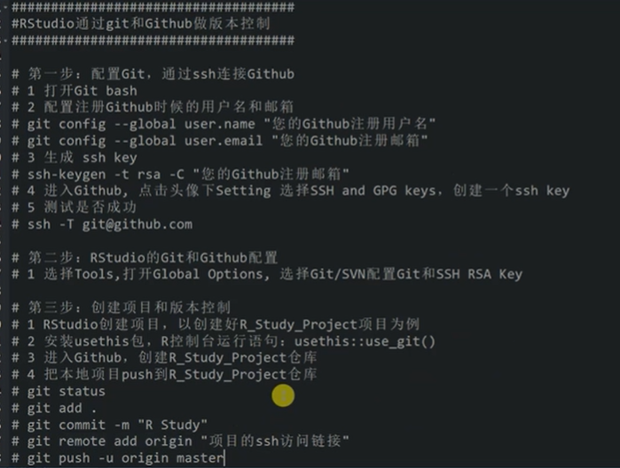

# (PART\*) 工具箱 {.unnumbered}
# 常用统计R代码 {#Common-statistical-R-code}
## R-系统功能
### 常用R系统代码

```r
# 代码环境的配置信息：
sessionInfo()

## 查看函数的参数：
args(sample)

## 查看文件路径：
Sys.getenv("PATH")

## 默认加载R包：
从R的安装目录bai的etc目录下找到duRprofile.site文件(例如R-2.15.0\etc\Rprofile.site)，用记事本打开，在这个文dao件最后添加一行：
options(defaultPackages=c(getOption("defaultPackages"), "foreign", "survival"))

## 查看系统时间：
as.character(format(Sys.time(), "%s"))

## 当前时间：
Sys.Date()
date()

## 全局参数配置：
## 关闭科学技术法：
options(scipen=999)  
## 设置全局小数点打印位数：
options(scipen = 1, digits = 2)
## 全局中文字符修正测试;
options(encoding = 'UTF-8')
## 修改全局语言-减少中文乱码的可能性：
Sys.setlocale("LC_ALL","Chinese")
## 全局代码编写参数：
# -*- coding: utf-8 -*-    # 适用于一般脚本的抬头；
## 设置java运行的内存：
options(java.parameters = "-Xmx10g" )

## 局部参数配置：
强制保留3位小数：
format(round(p.value*100)/100,nsmall=3)
format(round(t1$p.value,digits =3),nsmall=3)
```


### 辅助R包：

```R
##################### 高效安装R包：
library(pacman)
p_load(beepr,esquisse)  ## 它会自动安装未安装的R包，并加载到环境中；

##################### 工作结束后提醒：
library(beepr)
beepr::beep(sound =8)

####################### 构建文件树
# 构建文件树路径：
## 方法1：中文不识别：
fs::dir_tree(path = "./", recurse = TRUE)

## 方法2：中文识别：
install.packages("drat")
drat::addRepo("stlarepo")
install.packages("dir2json")
library(dir2json)
cat(dir2tree("./"))
## 中文不识别：
dir2json::shinyDirTree(".")

## 方法3：
使用dos命令中的tree 工具，即tree /f > 1.txt 
复制到对应的剪切板中：tree | clip

###################### 代码注释器：
## 快速生成代码注释器：
# install.packages("bannerCommenter")
library(bannerCommenter)
## 注释代码：
banner("hkaisydfiukasdjh")
boxup("alkwsu", "akijdsk")

################### 查看函数的查看内存和运行时间
library(data.table)
library(dplyr)
set.seed(123)
tbl.test <- data.table(x = rnorm(1e6))

bench::mark(
  fcase = tbl.test[, .(fcase(x < 1, x + 1, rep_len(TRUE, length(x)), x))],case_when = tbl.test[, .(case_when(x < 1 ~ x + 1, TRUE ~ x))])
#>   expression      min   median `itr/sec` mem_alloc `gc/sec`
#>   <bch:expr> <bch:tm> <bch:tm>     <dbl> <bch:byt>    <dbl>
#> 1 fcase        16.5ms   24.3ms     33.3     36.1MB     43.1
#> 2 case_when   146.4ms  147.9ms      6.60   129.9MB     28.1

###################### 整理脚本集中的代码：
## 方法1：
install.packages("styler")
## 运行下面代码：1、代码保存成文件形式；2、代码无执行错误；
styler::：style_active_file() 

## 方法2：
install_github("ROpenSci/Rclean")
library(Rclean)
script <- system.file("example", "long_script.R", 
	package = "Rclean")
clean(script, "fit_sqrt_A")
```

### 常用系统脚本

#### R置换系统R包迁移

```
#启动当前版本，输入以下命令
oldip <- installed.packages()[,1]
save(oldip, file="installedPackages.Rdata")
#卸载旧版本
#下载安装新版本，启动新版本输入以下命令
load("installedPackages.Rdata")
newip <- installed.packages()[,1]
for(i in setdiff(oldip, newip)) install.packages(i)
```

#### R与linux交互

```R
if (!require(ape, quietly = TRUE)) install.packages('ape')
library(ape)
args <- commandArgs(TRUE)
if (length(args) >3 &&  length(args) <2) {
  cat("usage: Rscript fasta2nexus.R dirname postfix filterout\n")
  cat("filterout: joined with comma\n")
}else{
  setwd(args[1])
  if(length(args)==2) arg[3] <- ""
  filter <- unlist(strsplit(arg[3],","))
  for (i in grep(paste0(args[2], "$"), value = TRUE, list.files())) {
    temp <- read.FASTA(i)
    names(temp) <- gsub("@.*", "", names(temp))
    temp <- temp[setdiff(names(temp),filter)]
    write.nexus.data(temp, paste0(i, ".nex"))
  }
}
```

#### 键盘和鼠标监听

```R
## 案例 1：
1. 利用R语言画图，根据键盘输入显示对应的文字。
2. 每按一下键盘，输出一个字母在屏幕上面。
3. 按ctrl+c时，停止键盘事件

# 字母工具
letter<-function(){

# 画图函数
  draw<-function(label='',x=0,y=0){
    plot(x,y,type='n')
    text(x,y,label=label,cex=5)
  }

# 键盘事件
  keydown<-function(K){
if (K == "ctrl-C") return(invisible(1))
print(K)
    draw(K)
  }

# 画图
  draw()

# 注册键盘事件，启动监听
  getGraphicsEvent(prompt="Letter Tool",onKeybd = keydown)
}

#启动程序
letter()
```

#### 文件管理

##### 3.4.1 常用文件管理：

```R
## 修改文件夹的内的文件名：
library(tidyverse)
newname<- list.files("E:/sjdata/F2_ENVS/aseutif/",pattern = "tif") %>% strsplit(.,".tif")
nw <- c()
for(i in 1:42){
  nw <- c(nw,newname[[i]][1])}
nw

news <- paste0("E:/sjdata/F2_ENVS/aseutif/",nw,".tif")
file.rename(from = list.files(path="E:/sjdata/F2_ENVS/aseutif/",pattern = "tif",full.names = TRUE),
            to = news)

## 查看文件大小：
### 查看数据集的大小：
## fs包：
fs::file_size(file)
https://cran.r-project.org/web/packages/fs/fs.pdf

## dir_info() 
查看指定路径下文件的元数据信息；

## 使用dir重新替代list.files()
list.files() 函数等价于 dir() 函数被替代了；
dir ( "../. ." ,  pattern  =  "^[a-lr]" ,  full.names  =  TRUE ,  ignore.case  =  TRUE )

## 构建文件树路径；
fs::dir_tree(path = here("data"), recurse = TRUE)

##### 关于here的用法补充 #####
## 直接读取上层文件夹下的数据路径层：
dir(here("data"))
## 注意here这里的data是针对的上层文件夹；
fs::dir_tree(path = here("data"), recurse = TRUE)
## here中连接的子文件夹中不需要再写对应的参数位置；
# 如下所示，就是表示data文件夹下的aa文件夹；但感觉这个思路也很蠢！！！
fs::dir_tree(path = here("data","aa"), recurse = TRUE)


## 获取当前数据名称下内存的占用：
l2 <- list(mtcars, mtcars, mtcars, mtcars)
lobstr::obj_size(l2)
```

##### 3.4.2 全集-处理R文件

```R
## 创建code文件夹：
if(!file.exists("code")) dir.create("code")

# 创建并写入数据到文件A.txt和B.txt
cat("file A\n", file = "A.txt")

#新建tmp文件夹，并拷贝A.txt和B.txt到tmp文件夹下
dir.create("tmp")
file.copy(c("A.txt", "B.txt"), "tmp")

#删除tmp文件夹,并删除里面的内容,当recursive = TRUE;
unlink("tmp", recursive = TRUE)

#修改文件名C.txt为D.txt
file.rename("C.txt", "D.txt")

#读取bin目录下所有文件及目录(包含全路径)
df <- dir(file.path(R.home(), "bin"), full.names = TRUE)
#返回当前目录下所有文件及目录的信息
file.info(list.files())

#返回当前目录下所有文件的最近一次修改时间
file.mtime(list.files())
file.info(list.files())$mtime

#返回当前目录下所有文件的大小，目录size返回为0
file.size(list.files(()))
file.info(list.files())$size

## 复制文件

file.copy用于

file.copy(from, to, overwrite = recursive, recursive = FALSE,
          copy.mode = TRUE, copy.date = FALSE)
from是原始文件（目录）名，to是新文件（目录）名，二者可以是vector，但是长度需相同；

overwrite 若为TRUE，则文件被覆盖；

recursive 复制目录时recursive需为TRUE；

copy.mode若为TRUE，permission bits一并复制过来；

copy.date若为TRUE，文件日期一并复制过来。

## 删除
函数unlink可以用来删除文件或目录，函数file.remove可以用来删除文件。
```


#### 工作环境保存

```r 
## RDS格式的数据共享：
## 单一的多维数据矩阵：
export(linelist, here("data", "clean", "my_linelist.rds"))

## Rdata格式的数据共享:
## 可以同时包含多个数据框、模型结果、列表；
rio::export(my_list, my_dataframe, my_vector, "my_objects.Rdata")
rio::import_list("my_list.Rdata")

## 读取数据：
load("mydata.RData")
load("mydata.rda")

##  将数据结果导出到rdata:
save(object1, object2, file=“mywork.rda") # Slected objects
```

#### 配置git-RSTUDIO

##### 配置git-RSTUDIO



```
https://www.bilibili.com/video/BV1QQ4y1v7p1?spm_id_from=333.337.search-card.all.click
```


##### github配置R报错相关

```R
## 解决报错1：
在使用github客户端提交代码时，报错
failed to receive handshake ssl/tls connection failed
## 解决方法：
# 任意位置git-bush：
$ git config --global http.sslBackend "openssl"
$ git config --global http.sslCAInfo [path to .pem file]

## 解决报错2：
报错解决]Error in nchar(object, type = "chars") : invalid multibyte string, element 1
## 解决方法：
在R的窗口上运行Sys.setlocale(category = "LC_ALL", locale = "us")即可解决

## 解决报错3：
# 关于一个非常复杂的报错：
Error: Failed to install 'unknown package' from GitHub: HTTP error 401. Bad
## 解决办法：
## 先利用:
# R中打开：
usethis::browse_github_pat()
# 网页端打开github：R:GITHUB_PAT=nicheer124499
# R打开：
usethis::edit_r_environ()
这会打开一个环境页，将刚才设置的R.GITHUB_PAT=gouzahndang123 粘贴复制上 然后保存，重启R就可以了。注意剪切上去的形式不是和上面的一致：需要：
GITHUB_PAT=gouzahndang123(等价的秘钥)
然后打开还会持续报错；
## 在git中使用：
$ git config --global http.sslBackend "openssl"
git config --global http.sslCAInfo D:/bclang/R-4.0.2/library/openssl/cacert.pem
之后，使用
> Sys.getenv("GITHUB_PAT")
> Sys.unsetenv("GITHUB_PAT")
> Sys.getenv("GITHUB_PAT")
```

#### 默认加载R包：

```
## 默认加载R包
从R的安装目录的etc目录下找到Rprofile.site文件(例如R-2.15.0\etc\Rprofile.site)，用记事本打开，在这个文件最后添加一行：
options(defaultPackages=c(getOption("defaultPackages"), "foreign", "survival"))
把"foreign", "survival"改成你需要自动加载的包就行了
```

#### 改变R 的临时缓冲目录

```
## 因为在构建模型过程中会涉及大量的rep，而部分R包的优化效果并不好，会产生局量 的临时缓存文件，但C盘往往是不够的；因此需要改变系统的临时缓冲文件到其他盘；
## 网络上检索到的各种办法都不能实际解决临时缓冲文件的问题：
## 解决办法是在对应版本的R文件下：
## 如：创建一个名为：Renviron.site的文件：
（例如C：\ Program Files \ R \ R-3.3.2 \ etc）
## 创建后的文件，用notepad++打开：
## E:/rtemp 为临时文件缓冲路径：实测有效！！
TMPDIR=E:/rtemp 
TMP=E:/rtemp 
TEMP=E:/rtemp
```


### S3和S4事件

```R
## S3 类型，list函数的变体，一个对象可以有多个类；使用attr来定义对象的类；
x <- 1
attr(x, "class") <- "foo"  // class(x) <- c("foo", "bar")
x

## S3构造的形式：
myClass <- structure(list(), class = "myClass")

myClass <- list()
class(myClass) <- "myClass"

# 继续添加类型；
class(dnaseq) = append(class(dnaseq),"DNAseq")
class(dnaseq)
[1] "list"   "DNAseq"

## 读取类型，使用$;
class(x)

## 读取顺序：
如果 class 属性是一个向量 c(”foo”, ”bar”), 则优先寻找
mean.foo, 然后 mean.bar, 最后 mean.default.

## 继承关系；
由于 class 属性可以是向量, 所以 S3 中的继承关系自然地表
现为 class 属性的前一个分量是后一个的子类.NextMethod() 函
数可以使得一系列的方法被依次应用于对象上.

bar <- function(x) UseMethod("bar", x)
bar.son <- function(x) c("I am son.", NextMethod())
bar.father <- function(x) c("I am father.")
foo <- structure(1, class = c("son", "father"))
bar(foo)  ## 注意这里调用的方法，是根据bar.son中的结果返回下一个类；

## 

```

```R
## S4 类型：

S4 调度很复杂，因为 S4 有两个重要的特性：

多重继承，即一个类可以有多个父类，
多重分派，即泛型可以使用多个参数来选择一个方法。

###---------------------S4类-------------------
# setClass(Class, representation, prototype, contains=character(), 
#          validity, access, where, version, sealed, package,  
#          S3methods = FALSE, slots)
#Class：定义的类名
#slots：定义类的属性
#prototype：定义属性的默认值（这个有什么用，我还没有发掘）
#contains = character()：定义父类和继承关系
#where：定义存储空间
#sealed：若是TRUE，则同类名不能被定义
#package：定义所属包


setClass("Person", slots = list(name="character",age="numeric"))

#实例化一个人,也就是创建一个对象,这里使用new来实例化对象：
Person3 <- new("Person",name="potter",age=49) 
Person3

#创建一个子类
setClass("Student",slots = list(ID="character",school= "character"),
         contains = "Person")   #contain表明类的继承关系，继承自Person
#实例化类
Person3 <- new("Person",name="potter",age=49)

Student1 <- new("Student",name="liming",age=16,ID="2020051419",school="Taiwan University")

Student1
## 使用@ 来检测类的属性：
Student1@name
Student1@school

work<-function(x) cat(x, "is working")
work('Conan')
# 定义Person对象
setClass("Person",slots=list(name="character",age="numeric"))
# 定义泛型函数work，即接口
setGeneric("work",function(object) standardGeneric("work"))
# 定义work的实现，并指定参数类型为Person对象
setMethod("work", signature(object = "Person"), function(object) cat(object@name , "is working") )
# 创建一个Person对象a
a<-new("Person",name="Conan",age=16)
# 把对象a传入work函数
work(a)
# 检查work的类型
class(work)
# 直接查看work函数
work
# 查看work函数的现实定义
showMethods(work)
# 查看Person对象的work函数现实
getMethod("work", "Person")

selectMethod("work", "Person")
# 检查Person对象有没有work函数
existsMethod("work", "Person")
hasMethod("work", "Person")

```


## R报错机制学习

### 1 常见异常处理函数

```R
## 报错及反馈机制学习
# 异常处理是指在程序（脚本）运行期间发生的异常，是一种预先知道的状态。
# 错误是异常，异常并不总是错误。

## 1 常见异常处理函数；
-stop()
-stopifnot()
-warning()
-supressWarnings()
-error()
-on.exit()
-warn()
-Try
-TryCatch
-withCallingHandlers

# 异常处理的辅助函数：
## message()：
# 在函数内部输出(并且message内部可以执行预算）
# 类似于print()，更适合函数编程打印；

## class:
# 解析Error和Warning message;
```

### 2 STOP

```R
################# 停止 ######
# 2.1 stop():
# 停止表达式，并中断函数体：
test_stop <- function(min, max) {
  if (max < min) 
    stop('Upsii:max < min')
  print('We are good: max > min')
}
test_stop(22,10)
#> Error in test(22, 10) : max < min
test_stop(10,22)
#> [1] "We are good: max > min"

## 2.2 stopifnot() ：
## 条件判断：
## 分为两种情况：
## 第一种是在stopifnot内部设置条件判断，true执行计算，不返回；否则，报错Error；
## 第二种是在stopifnot前，也即在输入stopifnot内部前设置条件判断，
# 并基于条件判断给出反馈。

input_numbers <- c(23,22,25)
stopifnot(is.numeric(input_numbers)) #all TRUE
input_statements <- c(10==10, 22 > 10)
stopifnot(input_statements) #all TRUE
input_pi <- 3.15 #this is not a PI number!
stopifnot(all.equal(pi, input_pi)) #Error returned
```

### 3 WARNING

```R
############## 警告 ########
# warning() and supressWarnings() functions
## 3.1 warning() 
test_warning <- function(min, max){
  if(max < min) {
    warning("Warning, warning. Max < Min")
  }
  if(max > min) {
    message("Well, max > min")}}
test_warning(20,10)  -> t1


#> Warning message:
#> In test_warning(20, 10) : Warning, warning. Max < Min

# 3.2 supressWarnings():禁止警告；也即警告消息不反馈；
suppressWarnings(test_warning(10,20))
# 这个函数功能也可以在option中设置：
options(warning = F) # ----还需要确定
```

### 4 捕捉错误

```R
################# 捕捉错误： ###########
## 4.1 try()：捕捉错误，并忽略，收集错误信息

input_list <- list(1, 2, 3, 'R Rules', 10, -500, 1.23, 0, 1024)

for(inp in input_list) {
  print(paste("Power to the 2 of", inp, "is: ", inp**2))
}
# Try() with silent ON
for(inp in input_list) {
  try(print(paste("Power to the 2 of", inp, "is: ", inp**2)), silent = TRUE)
}

# Try() without silent：会挑选出条件错误判断语句，并返回错误！
for(inp in input_list) {
  try(print(paste("Power to the 2 of", inp, "is: ", inp**2)))
}

# try()函数的另外一个重要作用是解析错误，并返回错误属性；
sos =function(x,y){x*y}
x.inv <- try(sos(1,'2'), silent=TRUE)  
print('try-error' %in% class(x.inv))  ## TRUE

## 4.2 TryCatch()： 捕捉错误，停止，并基于错误进行下一步条件判断；
TC_fun = function(x) {
  tryCatch(x**2,
           warning = function(w) {print(paste("negative argument", x)); 
             -inp**x},
           error = function(e) {print(paste("non-numeric argument", x)); 
             NaN}) 
}
## 关于warning，在catch体系中不打印，直接执行函数体；
## 关于error：识别到错误，打印错误，并基于错误执行二次函数运算；
for(input in input_list) {
  print(paste("TryCatch function of", input, "=", TC_fun(input)))
}

## 4.3 流控制：
## 4.3.1 在内部执行参数运算：
power_calculation <- function(x,y){
  tryCatch(
    expr = {
      message(x**y)
      message("Successfully calculated x to power of y.")
    },
    error = function(e){
      message('Caught an error!')
      print(e)
    },
    warning = function(w){
      message('Caught an warning!')
      print(w)
    },
    finally = {
      message('... Program execution finished ...')})}
power_calculation(0,3)

## 4.3.2 在外部执行参数运算：
beera <- function(expr){
  tryCatch(expr,
           error = function(e){
             message("An error occurred:\n", e)
           },
           warning = function(w){
             message("A warning occured:\n", w)
           },
           finally = {
             message("Finally done!")
           })}

beera({2 + '2'})

```

### 5 代码错误调试

```R
## 调试：错误跟踪：----
traceback()
check_n_value <- function(n) {
  if(n > 0) {
    browser()  ## Error occurs around here
    stop("n should be <= 0")
  }
}
check_n_value(1)
```

### 6 代码时间消耗跟踪

``` r
## 时间消耗跟踪：-----
library(microbenchmark)
microbenchmark(a <- rnorm(1000), 
               b <- mean(rnorm(1000)))

## 函数运算时间统计：
start <-proc.time()
proc.time()-start


  time_start<-Sys.time()
  print(1)
  exc_time<-difftime(Sys.time(),time_start,units = 'secs')
  print(paste0('code执行时间：',round(exc_time,2),'secs'))
```

### 7 补充案例

```R
######################## stop：
stop("na entries in table")
# 另外的用途在于可以在函数中使用:
例如else之后的结果可以直接使用 else stop("这是个错误！")

# 使用try来避开错误循环的影响结果：直接进行下一个循环；
###answer1:#####
count <- 0
inverses <- vector(mode = "list", 100)  
repeat {  
  if (count == 100) break  
  count <- count + 1  
  x <- matrix(sample(0:2, 4, replace = T), 2, 2)  
    ## 这一步收集错误，并使得函数能够继续运行，并且不报错！
  x.inv <- try(solve(x), silent=TRUE)  
  if ('try-error' %in% class(x.inv)) {
    next  ## 这里是 函数不返回信息，也可以选择输出一些指定参数说明；
  } else{ 
    inverses[[count]] <- x.inv  
  }
} 
inverses

## 使用tryCatch()来设计收集函数错误；并且返回错误位置，下次方便继续运行；
for (n in 1:length(productlink)){
  tryCatch({
    download.file(productlink[n],paste0(getwd(),"/html/",productid[n,],".html"),cacheOK = TRUE)
  },error=function(e){cat("ERROR :",conditionMessage(e),"\n")})
  Sys.sleep(0.5) #增加了Sys.sleep(seconds)函数，让每一步循环都暂停一段时间。这个虽然会降低程序速度，但对于有访问限制的网站，不失为一个好的办法。
}

## 在这里数据监测有效性，在利用stop返回错误；

if (!sum(check)==length(productlink)) {
  productlink<-NULL
  productid<-NULL
  stop("invalid productid please double check if any space or else in, and resave the file or the script will not run")
}

## 直接显式收集错误，然后将错误按照打印输出；类似于stop的形式；
data<-function(n){
  ####隐掉获得productname/price/category的代码
  if(!length(productname)==1) {productname="Product not download or not existing"}
  if (!length(price)==1) {
    price=NA 
    category<-"Product not download or not existing"
  }
data.frame(productname,price,category)
```

### 8 相关资料

```
https://www.geeksforgeeks.org/handling-errors-in-r-programming/

https://bookdown.org/rdpeng/RProgDA/error-handling-and-generation.html

http://adv-r.had.co.nz/Exceptions-Debugging.html
```


## 常用快捷命令

### 高效管道符号

#### 使用%$%来传递属性值

```R
## 在传统的base R统计中：
%$% 的作用是把左侧数据的属性名传给右侧，让右侧的调用函数直接通过名字，就可以获取左侧的数据。

iris %>% table() -- 无法直接运用；
但可以使用%$%来进行优化base_R的管道运行；

## 执行高效运算：
set.seed(123)
data.frame(x=1:10,y=rnorm(10),z=letters[1:10]) %$% .[x>5,]
```

#### 使用%T>%向左遍历输出：

```R
library(magrittr)
set.seed(123)
rnorm(10000) %>%
  abs %>% `*` (50)  %>%  ## 指定参数运算时，可以直接使用``进行注释运算；
  matrix(ncol=100)  %>%
  rowMeans %>% round %>% 
## 传统在分析时，需要先将结果导出后在执行hist，这里还是用%T>%就可以实现边出图边向右输出。执行逻辑是在执行%T>%之前进行前后向遍历；
  `%%`(7) %T>% hist %>% sum  
```

#### **%<>%** 复合操作符

```R
%<>%复合赋值操作符， 功能与 %>% 基本是一样的，多了一项额外的操作，就是把结果写回到最左侧的对象（覆盖原来的值）。

library(magrittr)
set.seed(123)
x<-rnorm(10)
x %<>% abs %>% sort   ## 等价于,相当于直接赋值更新；
x %>% abs %>% sort ->x 
```

#### %||% 验证函数

```R
## %||%是rlang包的一个验证函数参数：
## 原函数如下：
function (x, y)
    ## x为非na时，输出y，否则输出x；
{ if (is_null(x)) y  else x} 
## 对执行一些默认函数输出时很有用，比如ggplot2中的画图参数常有默认值，就需要执行用户参数判断来输出是否验证结果形式。
```

#### %&% 矩阵乘积

```
%&% 是Matrix包一个取矩阵乘积的函数；
```

####  `<<—` 参数赋值

```R
## 使用全局赋值函数在tidy体内部来实现参数的外部函数命名：
## 在这里可以看到传统写法是将cox.zph() -> zph_result;
# 但在这里使用的是{zph_result <<- .} ，其中{}是dplyr流的固定写法；
# 并且基于这种全局参数赋值方法以后，并不影响后续函数的结果的持续输出和转换：
# 也即在cox.zph()输出结果的结果还可以直接传递到plot()体系中；
melanoma %>% 
  coxphmulti(dependent_os, explanatory) %>% 
  cox.zph() %>% 
  {zph_result <<- .} %>% 
  plot(var=5)

```

### 常用辅助函数：

#### `#>` 添加自动注释

```R
## 下面这种#>写法，会在使用回车键后下一行的开头，也同步再增加一个#>来写注释；
#> [1] "We are good: max > min"
```

#### 使用``来执行条件运算

```R
## 举例1：
rnorm(10000) %>%
  abs %>% `*` (50) 
  
## 举例2：
rename_at(vars(names(.)) ,~ name1_ms) %>% 
      slice(-1) %>% `row.names<-`("1")
```

#### Rstudio View()

```R
## 最有用的快捷键：
安装ctrl，并点击数据集对应的名称即可；
```

#### 查看R包内的所有函数：

```
ls("package::ggplot2")
```


## 正则表达式
### 常用正则表达式命令-1

```R
## 正则表达式：
x <- c("New theme", "Old times", "In the present theme")
str_view(x, "the")

## 常用正则：
# 1、匹配任意字符：使用点号：
s <- c("abc", "cabs", "lab")
str_view_all(s, "ab.") # 点号表示提取任意字符；
str_view_all(c("a.txt", "a0txt"), "a[.]txt") # [.]不做特殊解释；

## 2、使用[] 来定义条件筛选：
## 模式“[ns]a.[.]xls” 表示匹配的第一个字符是n或s， 第二个字符是a，第三个字符任意，第四个字符是句点， 然后是xls。 

## 3、原位匹配：所谓原位匹配是设定标准进行数据寻找：
grep("int x\\[5\\]", c("int x;", "int x[5]"), perl=TRUE)
## 案例2
x <- c("2008-08-08", "2017-01-18")
m <- regexpr("\\d\\d(\\d\\d)-\\1-\\1", x)
regmatches(x, m)
## 4、匹配数字 [[:digit:]]+
grep("n\\d[.]xls", c("n1.xls", "na.xls"), perl=TRUE)

## 5、加好重复匹配：
s <- c("sa1", "dsa123")
mres <- regexpr("sa[[:digit:]]+", s, perl=TRUE)
regmatches(s, mres)

## 6、计数重复：
grep("[[:digit:]]{3}", c("1", "12", "123", "1234"))

## 7、正整数：
"\\A[0-9]+\\Z"
```


### 常用正则表达式命令-2

```
1、 查询目录下包含data,并以dat结尾的文件：
1.1   使用函数 . *  :其中 .表示匹配除 \n 之外的其他单个字符；而*号则表示单次或多次重复*之前的内容
这样就可以使用 data.*.dat  :正则的效果就可以提现出来实现筛选和提取
1.2   使用 函数 ? \w   :
问号 ? 一般表示匹配单个字符，另外?则表示匹配前面的子表达式零次或一次。
而\w则匹配包括下划线在内的任何单个字符，相当于[a-zA-Z0-9_]

2、 ^ 表示该正则开始的位置，$ 表示该正则结束的位置；通常abv$,表示匹配abv结尾的数据格式；

3、() 表示一个子表达式开始和结束的位置  

4、
   + 匹配前面的子表达式一次或多次
   *  匹配前面零次到多次

5、"\d": 匹配数字    

6、 "\s"：匹配空格,如有字符间有多个空格直接把"\s" 写成 "\s+"

7、常用的几种反义：
"\W"   匹配任意不是字母，数字，下划线 的字符
"\S"   匹配任意不是空白符的字符
"\D"  匹配任意非数字的字符
"\B"  匹配不是单词开头或结束的位置
"[^abc]"  匹配除了abc以外的任意字符

8、[abc] 字符组  匹配包含括号内元素的字符 ，如可以写成[a-z]
```

### 量词

```
"*"(贪婪)   重复零次或更多
　　　  例如"aaaaaaaa" 匹配字符串中所有的a  正则： "a*"   会出到所有的字符"a"
"+"(懒惰)   重复一次或更多次
　　    例如"aaaaaaaa" 匹配字符串中所有的a  正则： "a+"  会取到字符中所有的a字符，  "a+"与"a*"不同在于"+"至少是一次而"*" 可以是0次，稍后会与"?"字符结合来体现这种区别

 "?"(占有)   重复零次或一次
 例如"aaaaaaaa" 匹配字符串中的a 正则 ： "a?" 只会匹配一次，也就是结果只是单个字符a

 "{n}"    重复n次
　　     例如从"aaaaaaaa" 匹配字符串的a 并重复3次 正则：  "a{3}"  结果就是取到3个a字符  "aaa";
 "{n,m}"  重复n到m次
　　     例如正则 "a{3,4}" 将a重复匹配3次或者4次 所以供匹配的字符可以是三个"aaa"也可以是四个"aaaa" 正则都可以匹配到
  "{n,}"  重复n次或更多次
 　　    与{n,m}不同之处就在于匹配的次数将没有上限，但至少要重复n次 如 正则"a{3,}" a至少要重复3次
```

### 捕获分组
```
## 常用捕获分组
"(exp)"    匹配exp,并捕获文本到自动命名的组里
"(?<name>exp)"   匹配exp,并捕获文本到名称为name的组里
"(?:exp)"  匹配exp,不捕获匹配的文本，也不给此分组分配组号

## 以下为零宽断言
"(?=exp)"  匹配exp前面的位置
　　如 "How are you doing" 正则"(?<txt>.+(?=ing))" 这里取ing前所有的字符，并定义了一个捕获分组名字为 "txt" 而"txt"这个组里的值为"How are you do";
　　
"(?<=exp)"  匹配exp后面的位置
　　如 "How are you doing" 正则"(?<txt>(?<=How).+)" 这里取"How"之后所有的字符，并定义了一个捕获分组名字为 "txt" 而"txt"这个组里的值为" are you doing";

"(?!exp)"  匹配后面跟的不是exp的位置
　　如 "123abc" 正则 "\d{3}(?!\d)"匹配3位数字后非数字的结果

"(?<!exp)"  匹配前面不是exp的位置
　　如 "abc123 " 正则 "(?<![0-9])123" 匹配"123"前面是非数字的结果也可写成"(?!<\d)123"
```


### python使用编译
<!-- >>> import re -->
<!-- # 编译: -->
<!-- >>> re_telephone = re.compile(r'^(\d{3})-(\d{3,8})$')  ##这里的{3,8}表示提取数据对应的第三到第八的位置； -->
<!-- # 使用： -->
<!-- >>> re_telephone.match('010-12345').groups() -->
<!-- ('010', '12345') -->
<!-- >>> re_telephone.match('010-8086').groups() -->
<!-- ('010', '8086') -->
<!-- ~~~ -->


