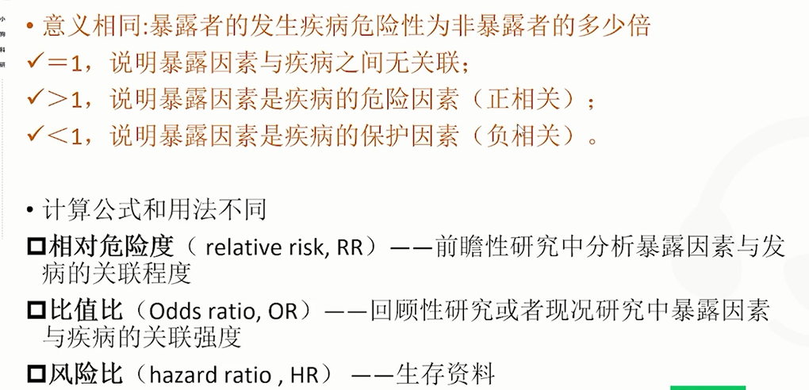
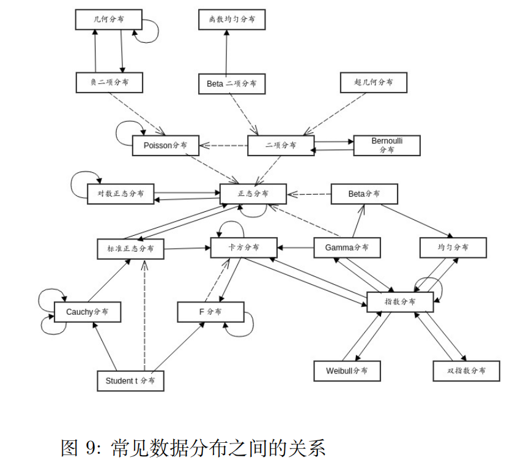
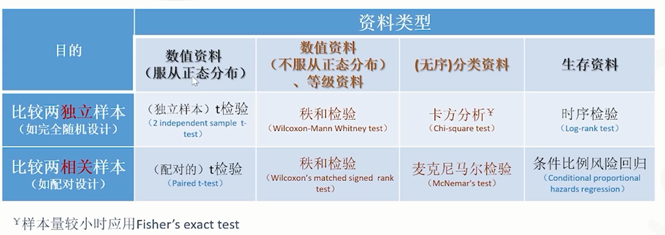
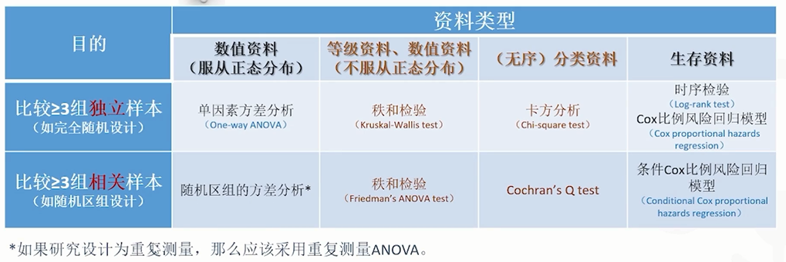
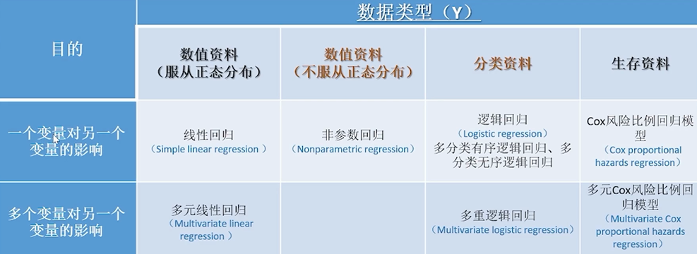
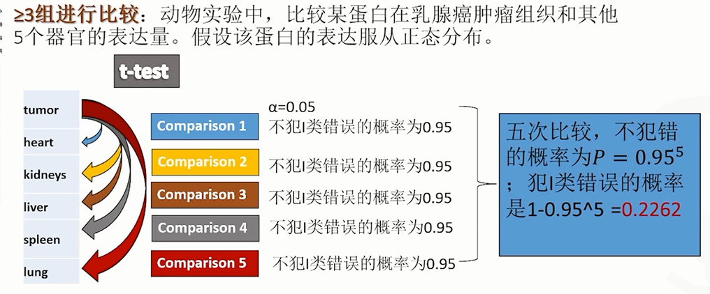
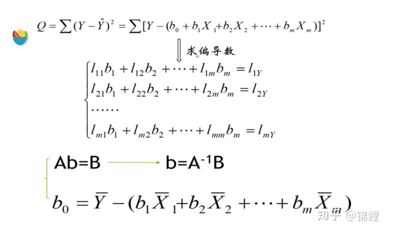
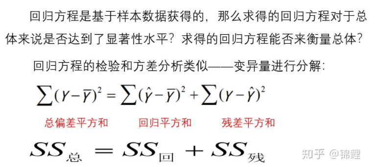
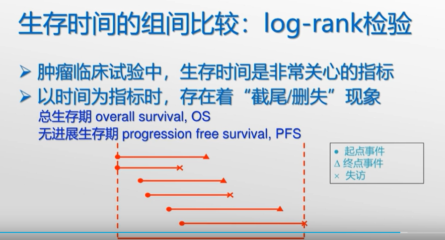

# 统计与研究设计 {#Statistics-and-Research-Design}

## 常用参数释义
### 因果回归参数

#### 自变量/解释变量

决定因变量/被解释变量的变量。

#### 因变量/被解释变量

被自变量/解释变量影响的变量。

[内生变量](https://www.zhihu.com/search?q=内生变量&search_source=Entity&hybrid_search_source=Entity&hybrid_search_extra={"sourceType"%3A"answer"%2C"sourceId"%3A833842985})：在模型内部被决定的变量。

[外生变量](https://www.zhihu.com/search?q=外生变量&search_source=Entity&hybrid_search_source=Entity&hybrid_search_extra={"sourceType"%3A"answer"%2C"sourceId"%3A833842985})：独立于模型其他解释变量的解释变量，模型中其他解释变量的变化不影响该变量的变化，而我们要研究的外生变量的变化反过来会造成内生变量的变化。

变量与[方程式](https://www.zhihu.com/search?q=方程式&search_source=Entity&hybrid_search_source=Entity&hybrid_search_extra={"sourceType"%3A"answer"%2C"sourceId"%3A833842985})的关系：方程左边的变量一般是被解释变量/因变量，也是内生变量。外生变量一般只作为参数和自变量使用，不作为被解释变量/因变量。但也有一些反例，如无差异曲线和预算线，等产量线和等成本线，式子左端被设定为常数，可以视作参数/外生变量。

关系：[单方程模型](https://www.zhihu.com/search?q=单方程模型&search_source=Entity&hybrid_search_source=Entity&hybrid_search_extra={"sourceType"%3A"answer"%2C"sourceId"%3A833842985})中，解释变量/自变量一般均为外生变量，包括多变量单方程模型，里面所有解释变量都是自变量，也都是外生变量，此外，模型的参数也都可视作外生变量，只是在模型中视作常数。换句话说，在单方程模型中，内生变量就指的是方程左端的因变量/被解释变量，而外生变量包括方程左端的自变量/解释变量，以及方程的参数。

关于参数：在理论模型中，参数是外生变量，由参数决定的均衡点的坐标元素是内生变量。参数和理论模型中的均衡分析相关。我们在研究均衡(均衡一般与联立方程模型相关)的静态分析时，一般假设参数值均不变，研究此时的均衡状态；在比较静态分析中，我们可以放开某个参数，研究该参数变动时原有均衡状态的变动，并分析比较新旧均衡状态。动态分析涉及到滞后内生变量，解释起来太麻烦，略去不提。

[虚拟变量](https://www.zhihu.com/search?q=虚拟变量&search_source=Entity&hybrid_search_source=Entity&hybrid_search_extra={"sourceType"%3A"answer"%2C"sourceId"%3A833842985})/哑变量：一些只有属性但没法量化的因素对被解释变量/因变量也有影响，例如季节、教育程度等等，为了研究这些因素对被解释变量/因变量的影响，可以构造只取“0”或“1”的[人工变量](https://www.zhihu.com/search?q=人工变量&search_source=Entity&hybrid_search_source=Entity&hybrid_search_extra={"sourceType"%3A"answer"%2C"sourceId"%3A833842985})，这就是哑变量或者虚拟变量。举个例子，研究教育程度对平均工资的影响时，可以设定0代表小学以下，D1代表小学教育程度，D2代表中学，D3代表大学，这三个变量都只能取值0或1，于是可设立模型Y＝β0+β1D1+β2D2+β3D3，如果你是大学毕业，那就是D3＝1，D1和D2＝0，这样的话就可以研究这种只有属性但没法量化的变量对因变量/被解释变量的影响。

控制变量，是个要求，不是变量。控制变量在物理学的概念是指那些除了实验因素(自变量)以外的所有影响实验结果的变量，这些变量不是本实验所要研究的变量，所以又称[无关变量](https://www.zhihu.com/search?q=无关变量&search_source=Entity&hybrid_search_source=Entity&hybrid_search_extra={"sourceType"%3A"answer"%2C"sourceId"%3A833842985})、无关因子、非实验因素或非实验因子。只有将自变量以外一切能引起因变量变化的变量控制好，才能弄清实验中的因果关系。控制变量衍生到生活中的作用是控制一定影响因素从而得到真实的结果(抄的百度百科)。在经济学里，控制变量可以理解为“其他条件不变，α变量变动对β变量/均衡状态(X1, X2)的影响”。

协变量：在一个更大的系统里，协变量也影响因变量，但在特定的模型中，协变量属于我们不想研究的、希望它能保持不变的变量，这种变量一般被归为“其他条件不变”，这就要求你研究的模型所有变量位于同一个协变量水平上。

### 生存分析参数

#### OR/HR/RR



- RR考虑了终点事件的发生与否，而HR不仅考虑了终点事件的有无，还考虑了到达终点所用的时间及截尾数据。HR就是包含了时间效应的RR。
- 当总体发生率比较低时，OR与RR基本相等。当总体率差值较大时，OR与RR差异明显。
- 补充一点在cox回归中RR值和HR值的计算逻辑是一样的；

#### 逻辑回归中的OR值

```R
OR值是《流行病学》中的重要概念，称作“优势比”（odds ratio），也称“比值比”，反映的是某种暴露与结局的关联强度。一般而言，OR值的意义可以总结如下（假设结局发生记为1，不发生记为0）：OR = 1，暴露与结局的无相关性；OR > 1，暴露可以促进结局的发生；OR < 1，暴露可以抑制结局事件的发生Logistic很重要的意义就在于会直接输出OR值，这一点甚至比看直接的回归系数（β）还有意义。OR值与回归系数β的数量关系为：OR = eβ。


## 所谓的“优势”可以理解为“暴露比值”！那怎么理解暴露比值呢？
在本例中，对于患有糖尿病的对象，暴露比值为：吸烟的比例除以不吸烟的比例，即为：24/16 = 1.50；同样，在不患有糖尿病的人群中，也可以计算一个吸烟的比例除以不吸烟的比例，即为：18/22 = 0.82。把这两个比例相除，就得到了吸烟与糖尿病相关关系的OR值，即OR = 1.50/0.82= 1.83>1。由此，我们可以初步推断，吸烟会加重患糖尿病的风险。
```


### 方差分析参数解释

#### 常见研究设计：

（1）完全随机设计：将受试对象随季节分配到各组中进行实验或者观察。

（2） 配对设计：数据不独立；

#### 分组设计匹配：

##### 3.2.1 自体匹配

1 将同一受试对象处理（实验或者治疗）前后的结果进行比较。

2 对同一样品采取两种不同的方法测量同一指标

3 同一受试对象的不同部位进行测量。

##### 3.2.2 异体匹配：

2.4 两个受试对象匹配后，按照随机原则接受两种处理。

4 随机区组设计（randomized block design）: 

数据不独立

将条件或者性质相似的受试对象配成一个区组，然后区组内每个受试对象再随机分到各个比较组，分别接受不同处理。

5 重复测量设计（repated measurement design）：数据不独立

指同一观测对象被基于某种处理后，在不同时间点上对某指标进行多次测量（M>2）所得的资料。

##### 3.2.3 配对检验

```
配对样本t检验是单样本t检验的特例。配对t检验有多种情况：配对的两个受试对象分别接受两种不同的处理；同一受试对象接受两种不同的处理；同一受试对象处理前后的结果进行比较（即自身配对）；同一对象的两个部位给予不同的处理

配对检验的特点：
（1）在配对设计得到的数据中，每队数据之间都有一定的相关，如果采用成组t检验就无法利用这种关系，从而浪费大量统计信息。
（2）统计学解决方法是求出每对的差值，通过检验该差值总体均数是否为零，就可以得知量化总处理有无差异
```

#### 方差分析中常用参数释义

##### 3.3.1 期望和标准差

```
期望：概率的平均值 标准差：衡量数据的波动大小。
```

##### 3.3.2 自由度

```
简单说， [公式] 个样本，如果在某种条件下，样本均值是先定的 (fixed)，那么只剩 [公式] 个样本的值是可以变化的。

##参见知乎的【如何理解统计学中「自由度」这个概念？】的答案：

# 自由度的解释参见：
## 维基百科关于自由度描述为当以样本的统计量来估计总体的参数是，样本中独立或能自由变化的数据的个数统称为为该数据量的自由度。
## 需要注意是在其他的回答中，自由度定义是更为复杂的，定义为矩阵投影的秩。而且矩阵的自由度在定义时需要注意是统计分布中使用自由度这个概念，而不是在先验分布中使用自由度。
## 这里作者举了一个简单的例子，但又10个数，如果知道其中9个数和平均值，那么剩下的1个数必然也是知道的。因此自由度为9，n-1.这也就意味着唯一确定的数据需要九个向量维度来决定。
```


### 回归分析中常用参数释义

#### 残差

```R
## 理解残差：
# 参见网页：
https://blog.csdn.net/Noob_daniel/article/details/76087829?utm_medium=distribute.pc_relevant_t0.none-task-blog-BlogCommendFromBaidu-1.control&depth_1-utm_source=distribute.pc_relevant_t0.none-task-blog-BlogCommendFromBaidu-1.control

# z在实际建模中，数据之间的残差是指实际值与观测值之间的差。残差蕴含相关模型的重要信息，可以将残差看做误差的观测值。
# 使用：可以查看残差的分布规律，进而通过分布规律来评估残差和原始数据之间的拟合关系。
par(marow=c(1,4))
plot(lm)

残差图的分布趋势可以帮助判明所拟合的线性模型是否满足有关假设。如残差是否近似正态分布、是否方差齐次，变量间是否有其它非线性关系及是否还有重要自变量未进入模型等。.当判明有某种假设条件欠缺时， 进一步的问题就是加以校正或补救。需分析具体情况，探索合适的校正方案，如非线性处理，引入新自变量，或考察误差是否有自相关性。

## 线性回归模型的残差检验假定条件
线性假定：X与Y之间的关系是线性的
独立性假定：对于一个特定的x，它所对应的残差∈ \in∈与其它x所对应的残差∈ \in∈相互独立
正态假定:残差服从期望为0的一个正态分布
同方差假定:对于所有的x，残差∈ \in∈的方差都是相同的
```


### 常用分布描述

#### 时间分布族：

```
指数分布解决的问题是“要等到一个随机事件发生，需要经历多久时间”

伽玛分布解决的问题是“要等到n个随机事件都发生，需要经历多久时间”

泊松分布解决的是“在特定时间里发生n个事件的概率”。

韦伯分布是泊松分布的现实版本，泊松分布过于严苛。
```

##### 5.1.1 指数分布

```
指数分布 (Exponential distribution) 用来表示独立随机事件发生的时
间间隔，比如旅客进机场的时间间隔、中文维基百科新条目出现的时间间隔
等等。许多电子产品的寿命分布一般服从指数分布。有的系统的寿命分布也可用指数分布来近似。λ是平均单位时间发生次数，如果λ越大，两次间隔时间必然越短。

指数分布是伽玛分布和 weibull 分布的特殊情况，产品的失效是偶然失效时，其寿
命服从指数分布。

描述：x由小到大，y由大到小，单向递减；

泊松过程的时间增量（即时间间隔）符合指数分布，此处的指数分布是事件的间隔时间的概率。下面这些一般符合指数分布：

婴儿出生的时间间隔
来电的时间间隔
```

##### 5.1.2 伽玛分布

```
伽玛分布(Gamma)是著名的皮尔逊概率分布函数筷中的重要一员，称为皮尔逊型分布。它的曲线有一个峰，但左右不对称。假设随机变量X为等到第α件事发生所需之等候时间。

“指数分布”和“χ2分布”都是伽马分布的特例。 

Gamma分布中的参数α称为形状参数（shape parameter），β称为逆尺度参数。
```

##### 5.1.3 泊松分布	

```
1、事件是独立事件；
2、在任意相同的时间范围内，事件发生的概率相同；
3、可以知道某个时间范围内，发生某件事情x次的概率是多大；
4、泊松分布的特点是期望与标准差的值是一致的。

日常生活中，大量事件是有固定频率的：
事件在单位时间内发生0次的概率、发生1次的概率 ... 发生∞次的概率。
假设：事件之间的平均时间是已知的，事件的确切时间是随机的。


某医院平均每小时出生3个婴儿
某公司平均每10分钟接到1个电话
```

##### 5.1.4 韦伯分布

```
因为正态分布或者泊松分布过于理想化，韦伯分布相对来说更接近现实一些(从概率密度函数来看，韦伯分布一般具有长尾分布，即右偏分布的特点)。

weibull(韦伯) 分布，又称韦氏分布或威布尔分布，是可靠性分析和寿
命检验的理论基础。Weibull 分布能被应用于很多形式，分布由形状、尺度
（范围）和位置三个参数决定。其中形状参数是最重要的参数，决定分布密
度曲线的基本形状，尺度参数起放大或缩小曲线的作用，但不影响分布的形
状。Weibull 分布通常用在故障分析领域 ( field of failure analysis) 中；尤
其是它可以模拟 (mimic) 故障率 (failture rate) 持续 ( over time) 变化的分
布。故障率为：一直为常量 (constant over time)，那么 α = 1，暗示在随机事件中发生一直减少 (decreases over time)，那么 α < 1，暗示 “早期失效
(infant mortality)” 一直增加 (increases over time)，那么 α > 1，暗示 “耗 尽 (wear out)” 随着时间的推进，失败的可能性变大。
```

##### 5.1.5 Gompertz分布

```
Gompertz分布是一种重要的连续时间的寿命分布，通过调整参数值，Gompertz分布的概率密度函数可能是单调递减或者单峰分布的。

## 该分布是参数cox回归的一种重要分布形式：

```


#### 连续概率分布

##### 5.2.1 F分布

```
F-分布（F-distribution）是一种连续概率分布，被广泛应用于似然比率检验，特别是 ANOVA 中。F 分布定义为：设 X、Y 为两个独立的随机变量，X 服从自由度为 k1 的卡方分布，Y 服从自由度为 k2 的卡方分布，这2个独立的卡方分布被各自的自由度除以后的比率这一统计量的分布。
```

##### 5.2.2 T分布、[高斯分布](https://www.zhihu.com/search?q=高斯分布&search_source=Entity&hybrid_search_source=Entity&hybrid_search_extra={"sourceType"%3A"answer"%2C"sourceId"%3A1146286595})(Gaussian)

```
应用在估计呈正态分布的总体的平均数。它是对两个样本均值差异进行显著性测试的
学生 t 检定的基础。
```

#### 离散概率分布

###### 5.3.1 二项分布/伯努利分布

```
案例发生是离散的。结果只有二项选择；可多次发生，称之为累计二项分布；
1、做某件事次数是固定的，用n表示
2、每一次事件都有两个可能的结果；
3、每次成功的概率都是相等的，成功的概率用p表示
4、分析者所感兴趣的是成功x次的概率是多少
```

###### 5.3.2 几何分布

```
## 几何是二项分布的延进模式：分析者所感兴趣的进行x次尝试后，取得第一次成功的概率；

1、做某件事次数是固定的，用n表示
2、每一次事件都有两个可能的结果；
3、每次成功的概率都是相等的，成功的概率用p表示
```

##### 5.3.3 贝塔（Beta）分布

```
贝塔分布 (Beta Distribution) 是指一组定义在 (0,1) 区间的连续概率分
布，Beta 分布有 和 两个参数 α,β>0，其中 α 为成功次数加 1，β 为失败
次数加 1。Beta 分布的一个重要应该是作为伯努利分布和二项式分布的共
轭先验分布出现，在机器学习和数理统计学中有重要应用。贝塔分布中的参
数可以理解为伪计数，伯努利分布的似然函数可以表示为，表示一次事件发
生的概率，它为贝塔有相同的形式，因此可以用贝塔分布作为其先验分布。

## 简单来说：
其实描述的就是我们在做抛硬币实验的过程中，我们当前如果已经观测到 a+1次正面，  b+1次反面，那么此时硬币正面朝上的真实概率的可能性分布。正如二项分布可以看做是重复进行伯努利实验所得到的分布，Beta分布可以看做是重复进行二项分布所得到的分布。
```



### 其他统计参数释义
#### 信息熵

```
## 参见论文：<熵 理 论 及 其 应 用>  陈建珍 ,赖志娟

##  熵最早期源于热力学的相关研究，早期的研究中普朗克、玻尔兹曼等注明物理学家都对熵系统做了深入的研究；熵就是系统处于某一宏观状态下可能性的的度量，也就是说，系统的熵越大，则系统处于该状态下概率就越大。

## 熵增加原理：孤立系统的熵永不减少，或者任一孤立系统或绝热系统的自发发生过程总是朝着熵增加的方向进行；

## 系统的平衡态上述熵具有最大值的状态；也就是出现概率最大的状态；

## 获取信息等于消除熵，也就是将高熵降低为低熵。有一个问题是裸地是高熵还是低熵状态，评价高熵还是低熵的标准是混乱程度，显然在裸地—森林的等级演替过程中，系统的熵是始终增加的。并且在系统达到相对稳定时，达到最大熵状态(出现概率最大的状态，为何这种状态胡出现，以及这种状态是如何偏移的)。这种最大熵状态反映了群落内部的平均性结构化，此次群落内部每个物种的功能特性所扮演的功能生态位在整体群落结构中具有一致性；但也不能否认，单独物种在群落构造中所扮演功能的差异，但是功能的差异以量级来评估本身就是存在问题的，这只是我们定义的单维尺度的评估，而在符合维度尺度上，物种可能处于等价态。此外，还需要考虑到群落系统是如何维持最大熵状态下，系统的熵增过程是伴随着无序化的增加（这种无序化是如何体现的？实际上系统是逐步进行有序化的一个进程，群落演替不断发生，但伴随着群落的演替阶段的进行，群落的生产力也在不断提高，光合作用吸收外界的二氧化碳（产生高能的葡萄糖，排出氧气），同时呼吸作用分解糖释放co2和水分，释放），系统以负熵为食(有序的，如太阳光)

## 关于信息熵的定义实际上和概率值的求解基本一致：
## 所有事情概率均等发生时，log2M
## 一般分布：累积和(pilog2pi-1)，其中pi表示事情每次发生个概率，因为事情发生的概率会 随着抽样结果(剩余因素)的改变而改变。                                                                  
```

#### 最大熵

```
## 实际上最大熵模型是本质上 贝叶斯理论的一种延伸范式，和信息熵理论相结合；
## 具体解释：参见：
https://blog.csdn.net/qq_16137569/article/details/82560785

## 最大熵理的两个理论前置假设：
第一个是系统在平衡状态下，熵最大；（## 还未参那篇论文关于最大熵的应用生态学解释）
第二个是如果有约束条件，最大熵原理也可以表述为在满足约束条件的模型集合中选取熵最大的模型。

## 在统计分析时接近均匀分布的概率具有较高的熵。当且仅当X的分布是均匀分布事上式右边的等号成立，所以X服从均匀分布时熵最大。
## 将上面的结论和最大熵模型进行结合分析，实际上在评估生态系统时，使用最大熵模型和中性定理的本质是类似的。在均匀分布的背景假设下，物种的实际分布是存在约束偏倚的；这种约束偏移本身对均匀分布进一步修正，这个结果反映是在修正背景环境约束下，物种在所有受到约束的背景环境中处于平均分布状态，这种平均分布状态本身就是对物种的保守型的估计，这种保守型说明物种在边缘种群和核心种群(## 或者说集合种群)中所处的环境条件异质性状态会在某些环境组合下处于均质化状态。
	上面这种均质化状态，又是相对特殊的。均质化反映的是物种在所处群落环境中保留某一特殊状态的下的偏好，这种偏好性是存在波动和偏差以及局域适应性差异的。这种适应性差异本身和群落本身存在构造对应、发育对应关系。如何将这种关系定量的体现出现，将对于解释生态位理论在物种共存中将起到重要解释作用；
	但最大熵理论在解释物种共存态时，本身存在的一个问题是它是否有足够的解释度来阐释系统熵的问题——这里的系统熵，需要的不仅仅是局域、景观、区域以及全球生态系统本身的架构，还需要构建“熵流”。熵流的方向和大小本身也是需要定义的；##这里可能需要重新去理解和认识邬建国老师的论文中关于熵耗理论的认识；
	
	此外，需要理解的是最大熵在构建过程中是否考虑到种群的构建过程，这或许也是为什么种群建模的假设过程中，种群是处于平衡态的原因。但是 种群内往往是处于不平衡状态的，特别是对于先锋种群来讲，如何理解先锋种群的建模结果也是非常重要的。
	此外，关于建模过程中存在的若干问题，还需要理解的是关于那篇文章的相关理解；
	
	种群的均质化反映是内在的，还是外在的，也是需要确认的；内在所谓的就是物种本身的生理特性所决定物种的均一化生境需求，而外在是在种群构建过程中，外在环境的给与提供了合适的生境供其生长。此外，这种内在和外在之间的联系对于，不同分布区的物种是否存在特异性差异？这种差异性的来源是什么？需要进一步的分解问题、、、分解到基本 单元再去解释。
	学而有崖，知而无崖；
```


## 临床研究中常用的统计方法和常见问题

```
## 资料来源：
1、《临床研究中常用的统计方法和常见问题》
```

### 统计推断与区间估计

```R
## 统计推断：
由样本信息对相应总体的特征进行推断：

参数估计：
根据样本的统计量估计总体参数的过程：点估计和区间估计；
（如果区间包含原假设值 --> 接受原假设；反之则相反）

假设检验：
对所估计的总体首先提出一个假设，然后通过样本数据去推断是否拒绝这一假设；包括参数检验和非参数检验；关键是用P值衡量数据与关于参数的原假设的差异程度；

总体参数：总体的某些数据值特征
样本统计量：根据样本计算得出的某些数据值特征；---例如均值、四分位数等等；

区间估计：基于数据推断对应参数的一个可能区间
如果区间包括原假设值-->接受原假设（无法拒绝原假设）
如果区间不包括对应原假设值--->拒绝原假设（无充足理由接受备择假设）

## 为什么要做统计推断：
因为需要从全局的范围，也即从总体上对问题作出判断。不可能也不允许对研究总体的每一个个体均做观测；

##  参数估计： - 点估计：
点估计：直接以样本统计量作为相应总体参数的估计值；
优点：方法简单； 去诶单：没有充分利用样本信息，不能反映抽样误差的影响；

## 参数估计： -- 区间估计
区间估计： 在给定置信度下（如95%），采用样本统计量估计总体参数的可能范围；
置信区间：根据样本均数计算出有（1-@）把握包含总体均数的一个数值范围，这个数值范围成为总体均数的置信区间，该（1-@）称为置信度；

## 总结来说：
假设检验是对检验样本与未知总体分布做的检验评估，但数据形式多样性，在此基础上可用点估计或者区间估计两种方法来间接评估检验样本与未知总体分布的关系。
```


### 统计方法选择：
#### 统计方案的目的

统计描述：集中趋势和离散趋势；

差异性分析：比较组间均数、率和中位数等的差异；

相关性分析：分析两个或者多个变量之间的关系

影响性分析：分析某一个结局发生的影响因素（如线性回归、逻辑回归和生存分析等）

#### 统计方法选择

包含分析目的、资料类型和研究设计三个组分；

分析目的：统计描述/推断？比较组别间差异? 以及计算变量的关联？

资料类型：数值/分列/生存资料？ 是否服从正态？是否为等级资料？

研究设计：数据是否独立？样本量大小？几组（因素和水平）？

| 结局（outcome） | 暴露因素 | 单因素       | 多因素           | 检验效应         |
| --------------- | -------- | ------------ | ---------------- | ---------------- |
| 分类变量        | 分类变量 | 卡方检验     | 逻辑回归         | OR, 95%CI        |
|                 | 连续变量 | T检验        | 逻辑回归         | OR, 95%CI        |
|                 |          |              | ROC分析          | AUC,95% CI       |
| 连续变量        | 分类变量 | 卡方检验     | 多元线性回归     | beta, 95% CI     |
|                 | 连续变量 | 回归分析     | 协变量、多元回归 | 截距值、95% CI   |
| time to event   | 分类     | Kaplan meier | Cox 回归         | HR，beta，95% CI |

除此以外，效应的估计还可以基于相对危险度（relative risk,RR）进行计算。包括危险度比（risk ratio）:暴露组的危险度（累积发病率）与对照组之比；率比（rate ratio ，RR）暴露组的发病密度与对照组之比。

| 分析指标   | 常用模型                   |
| ---------- | -------------------------- |
| 血糖变化值 | 协方差分析（一般线性模型） |
| 呕吐次数   | Poission回归模型           |
| 改善率     | Logisitic回归模型          |
| OS,PFS     | Cox比例风险模型            |










#### 描述性统计的讨论

- 定性资料

  对于定性变量（包括二分类变量、顺序变量和名义变量），一般采用频数和百分比描
  述，其中等级资料可采用中位数和四分位间距进行描述[13]。

- 定量资料

  先进行正态性检验，如果变量近似正态分布一般采用均数和标准差，偏态分布需采用中位数和四分位间距[14]。

- 临床研究的主要结局：

  对主要结局指标通常会采用多种形式进行综合描述：均值、标准差、中位数、最小值
  和最大值或范围、变异系数。

- 包含时间的生存资料：

  对于小样本或大样本未分组的生存资料常采用Kaplan-Meier法，而对例数较多的分组资
  料采用寿命表法，对生存时间进行中位数及上下四分位间距的统计描述，同时绘制生存曲线直观反映生存情况。

##### 一元定性资料

- 单组设计：常用于样本率的参数与总体的已知率之间差异性检验，主要适用于一些无法设计对照组。

  该资料的统计主要利用二项分布原则和总体进行比较，大样本（N>30）采用按近似正态分布基于Z分布进行计算，小样本（n<30）时采用采用Clopper-Pearson精确法或Blyth-Still的二项式比例计算。

- 成组设计：若响应变量是二分类，则构成常见的四格表。

  在横断面研究中根据不同的条件选择卡方检验或Fisher精确检验，评价组间构成比的差异。在病例-对照研究和队列研究的四格表可用于计算OR和RR及其可信区间，同时采用Mantel-Haenszel卡方对OR和RR进行统计检验。

  在临床试验中，常用于安全性指标（不良事件是否发生）发生率的组间评价，样本例数较少时，直接指定Fisher精确检验。

  若响应变量是多值有序变量，可采用Wilcoxon秩和检验（两组）和Kruskal-Wallis检验（两组以上）。

  若行和列的属性构成配对结构时，可用McNemar检验或Kappa检验对一致性分布进行定性和定量的检验。

  若分组变量为有序多分类，而响应变量为二分类时，除了可用卡方检验外，还可使用Cochran-Armitage趋势检验来检验率和有序多分类变量之间是否存在线性趋势

##### 一元定量资料

- 单组设计：

  与定性资料应用范围类似，但样本估计的参数是均值和中位数，需要根据正态性检验的结果选择统计方法。当符合正态分布时，采用单样本T检验，均值的可信区间基于正态分布计算。不满足则使用秩和检验中位数的可信区间基于非参方法计算。

- 成组设计：

  若两组定量资料是配对关系，则计算差值后采用单组设计的统计方法。

  若组间的资料独立，则需根据各组的正态分布检验和方差齐性检验选择独立样本的t检
  验和Wilcoxon秩和检验（两组），或方差分析和Kruskal-Wallis检验（两组以上）。
  
  对于两组以上的检验，如果差异有统计学意义，可能需要根据研究设计选择合适的方法进行事后的两两比较分析。呈现结果时，需要呈现差异值（均值或中位数）及其95%可信区间。t检验和方差分析可根据t分布或正态分布进行可信区间的估计。而非参数检验不基于概率分布，差值中位数的可信区间估计需采用Hodges-Lehmann估计或bootstrap估计。
  

#### 相关分析和回归分析

 - 在临床研究中常用的回归分析是多重线性回归（连续型变量）、Logistic回归
   （二值变量、多值有序变量和多值名义变量，二项分布）、Poisson回归（计数型变量，Poisson分布）、负二项回归（计数型变量，负二项分布）和COX模型回归（生存资料），在实际应用中根据不同的结局指标类型选择合适的回归模型。

 - 协方差分析：

   在研究干预效果时，基线作为特殊的协变量必须要纳入考虑，协方差分析是回归分析和方差分析的结合，扣除基线值对因变量的影响之后，再研究分组的修正均值的差别，该方法在多重线性回归中实现。

   在干预型临床试验中一般会设立对照组并进行试验前后的测量，协方差分析仅能有效检验试验后组间的差异，不能用差异来衡量干预效果，

   双重差分方法使用越来越广泛[20]，其思想是实验组前后的变化值减去对照组前后变化值得到真正的干预效应。

#### 生存资料分析

- 生存分析不仅需要分析感兴趣的重点事件是否发生，还要考虑到达终点时经历的时间长短。

  其中生存曲线的组间比较常采用Log-rank检验（对远期差异敏感）和Wilcoxon检验（对近期敏感）。

- 一般可分为参数模型的回归分析和半参数COX回归分析。若确定生存资料服从某种特定的分布（包括Weibull 分布、指数分布、对数正态分布或者Gamma分布等），需使用相应的参数模拟拟合。若无法获得生存资料数据分布时，可采用COX等比例风险模型，其不依赖特定分布的特点，在随访研究中得到非常广泛的应用。

- COX模型的使用需要满足风险等比例的前提假设，对分类协变量可检验生存曲线是否交叉，对连续协变量需拟合偏残差与生存时间的关系。
- 一般的生存资料假定受试者在随访时间内最多经历一次随访事件，然而受试者可能经过
  多次相同或类似的结局事件（复发），针对该类生存资料需要采用Anderson-Gill强度模型，该模型假定每次事件类型相同且相互独立。

#### 重复测量数据

- 所谓重复测量数据是指在纵向资料中可能会对结局指标进行多次测量，构成重复测量的数据。由于该数据的 非独立性，不满足一般回归的前提假设，常用的统计方法有重复测量的方差分析、混合效应模型和广义估计模型。

- 重复测量的方差分析思想是总变异分解成个体内的变异和个体间的变异，需要满足正态性、方差齐性和球形的前提假设。但数据中存在缺失时，分析会将存在的研究对象全部删除，这会降低有效样本量的大小。

- 混合效应模型和广义估计模型采用纵向数据格式，能有效利用样本的信息，根据不同的协方差矩阵结构保证分析结果更加准确保守，同时能对时变因素进行多重比较。所以针对重复测量数据应主要采用混合效应模型和广义估计模型。

- 混合效应模型考虑随机效应，是对个体水平值的估计，而广义估计模型主要考虑固定效应，是对总体平均水平值的估计，在分析时根据需求选择

- 连续变量的一致性评价：

  ```
  ### 连续变量的一致性评价
  
  我们常需要考察连续变量之间的一致性，连续变量之间，只有属性相同，才可以做一致性分析。比如，不同方法测量结果的一致性，多次测量结果的一致性，不同研究者评分的一致性。研究者在解决这类问题时，常用的方法包括配对t检验、相关分析、组内相关系数等。采用这些方法进行一致性分析，是否恰当呢?
  
  - t检验： 做出统计结果，并不一定有临床统计意义；
  
  - 相关分析： 只有相关性，无因果性
  
  - 回归法：比如最常见线性回归，可建立两测量结果之间的线性方程，y=a bx。如果截距a与0无差异，斜率b与1无差异，则可认为两测量结果一致。如图，橙线为理想的情况y=x，蓝线为建立的线性方程y=0.939x-0.135。Bootstrap获得截距的区间估计为 -0.356~0.039，包含0;斜率的95%区间估计为0.885~1.010，包含1，可认为两测量结果一致。‍需要注意的是需要先判定数据是否可以使用置信区间方法进行分析。
  
  - **组内相关系数‍**
  
    组内相关系数(Intraclass correlation coefficient，即ICC)，主要用于考察定量资料的一致性。组内相关系数介于0和1之间，越接近1，说明重复测量之间的差异越小，即重复测定的一致性越好。组内相关系数是研究对象间变异占总变异的比例，当测量结果范围较小，即重复测量中，各测量结果均较接近，此时ICC的计算就与试试不太相符了。这说明，ICC的应用受到测量结果范围的影响，比较适用于不同研究对象结果差别较大的情况。
  
  - **5.Bland-Altman法‍**
  
    Bland-Altman法最早由Bland和Altman在1986年提出。绘制两测量值差值D对应于均值A的散点图，即Bland-Altman图。如果D和A是独立的，当大部分测量值落在差值的95%参考值范围内，且此范围在专业上也可认为是一致的，则认为两测量结果一致。如图，横坐标为两测量结果的均值，总坐标为两测量结果的差值，大部分测量结果均落在差值的95%参考值范围内，可说明两测量结果一致性较好。当然，还需要考察差值的95%参考值范围在专业上是否可以被认为是一致的。
  
  
  ```


#### 正交设计

##### 试验设计的基本概念

```
1、因素和试验指标并非成因果关系，而是相关关系。

2、因素水平：
因素在试验中所处的各种状态或所取的不同值，称为该因素的水平，也称为水平或位级。
因素可以包含具体指、状态

3、组合处理：所有试验因素的水平组合所形成的试验点称为处理组合。
以2个二水平因素的试验为例：
表示为 两个变量，每个变量有两个水平。

4、全面试验：对全部组合处理都进行试验。表示为试验各因素水平的乘积；

5、存在全面试验和部分试验的矛盾：
矛盾来自于：全面试验的组合处理多，但希望进行少数试验，即进行正交试验设计；另一方面，实施少数试验希望能够获取全面的试验信息，则称之为科学处理试验结果。

6、因素试验：研究各因素对试验指标的影响，了解各因素的重要程度，并直接获得最优组合处理，或者求得回归方程的试验。

7、因素试验可以为根据试验目的、因素数量和试验时间进行划分。其中实验目的可以划分为验证性试验和探索性试验，因素数量可以划分为单因素试验和多因素试验，试验时间又可以划分为同时试验和序贯试验。
   同时试验适合长期实验设计，多个项目同时进行。序贯设计是指下一次试验必须在上一次的实验基础之上。
```

##### 正交设计方法

最简单的正交表是 ![[公式]](https://www.zhihu.com/equation?tex=L_%7B4%7D%5Cleft%282%5E%7B3%7D+%5Cright+%29) ，含意如下：“L”代表正交表；L 下角的数字“4”表示有 4 横行，简称行，即要做四次试验；括号内的指数“3”表示有3 纵列，简称列，即最多允许安排的属性是3 个；括号内的数“2”表示表的主要部分只有2 种数字，即每个属性有两种水平1与2。正交表的特点是其安排的试验方法具有均衡搭配特性。也就是说，3个属性，每个属性有2个水平的选择实验采用全因子设计需要23=8个备选方案，而采用正交设计只需要4个。当然这是非常简单，差异并不明显，但是如果属性和水平都比较大，二者的差异就会非常明显，显然能够大大减少工作量。因而正交实验设计在包括选择实验在内的很多领域研究中已经得到广泛应用。正交设计的数量可以用以下公式来计算：

n=c×s-c+1 其中n为正交设计的数量，即正交表中的行，c为属性的数量，即正交表中的列，s为属性水平的数量。

- 两种主要设计：

  1、等水平正交表：指所有因素均有多个相同水平数量的因素

  2、非等水平正交表：指部分因素有多个水平

- 设计方原则：

  （1）每一列中，不同的数字出现的次数相等。例如在两水平正交表中，任何一列都有数码“1”与“2”，且任何一列中它们出现的次数是相等的；如在三水平正交表中，任何一列都有“1”、“2”、“3”，且在任一列的出现数均相等。

  （2）任意两列中数字的排列方式齐全而且均衡。例如在两水平正交表中，任何两列（同一横行内）有序对子共有4种：（1，1）、（1，2）、（2，1）、（2，2）。每种对数出现次数相等。在三水平情况下，任何两列（同一横行内）有序对共有9种，1.1、1.2、1.3、2.1、2.2、2.3、3.1、3.2、3.3，且每对出现数也均相等。

  以上两点充分的体现了正交表的两大优越性，即“均匀分散性，整齐可比”。通俗的说，每个属性的每个水平与另一个属性各水平各碰一次，这就是正交性。


### 统计分析中的常见问题

#### 控制1类错误和2类错误

##### 1和2类错误的概念定义：

```
一般来说，一类错误就是：没有效应的时候，统计结果却显示p < 0.05，也叫假阳性；二类错误就是有效应时却显示p > 0.05，也叫假阴性。

控制1类错误，也称之为控制阿尔法（总1类错误率，Familywise Erorr Rate,FWE);
控制2类错误，也称之为控制贝塔；，其中1-贝塔= power，也称为效力；
```

##### 控制错误的原因：



```R
控制一类错误，最主要的就是控制多重比较带来的假阳性率膨胀。有些多重比较显而易见，比如同一自变量有三个水平，两两比较就产生了3次比较，这种情况下需要校正。另外一个比较隐性的会带来假阳性率膨胀的是在收集数据时，边收集边分析，达到统计显著之后就停止收集。这种边收集边分析实际上是可以让一切实验都变得显著起来，包括Bem (2011)年的那个实验就有这种可能。

上面讲的这个实验是一个试验分析过程中，数据边分析边处理；统计人员就发现在处理一定阶段后，数据结论迅速变得显著。往往临床统计实验会到此阶段结束，这可能会导致第一类错误的发生。而实际上随着实验进展持续补充，可以发现显著性结论就会逐渐消失。

## 1类错误发生的场景？应该考虑
每一项临床试验的研究目的都可以抽象为一个或多个检验假设。当检验假设为多个时，就要考虑@的控制问题。

多个主要疗效指标组间比较问题；
多个组间比较问题
多个时点组间比较（期中分析）
亚组内组间比较问题？


## 什么时候不需要考虑阿尔法的控制？
如果临床试验是单臂或双臂设计、使用单个主要指标、事先只指定了一个与主要指标相关的原假设且在一个时间点上进行统计推断，则无须考虑α的控制问题。


## 补充说明：
数据不足所导致的1类错误，还可能会导致变量间存在共线性关系。反过来说即为变量间的共线性关系可能会导致1类错误的发生；
```

##### 解决多终点问题的统计学考量

```r
## 控制1类错误的检验方法：
1、闭锁检验法（closed testing）
2、gate-keeper/ 固定顺序法
3、阿尔法分配法

## 控制二类错误：
增加样本量、提高试验质量

```

**理清思路--最关键**

参考资料：https://www.bilibili.com/video/BV1Rq4y1g7g8?from=search&seid=1353280413434012036&spm_id_from=333.337.0.0

| 项目   | 没有拒绝H0            | 拒绝H0      |
| ------ | --------------------- | ----------- |
| H0为真 | 正确决策（1-α）       | I类错误 α   |
| H0为假 | II类错误（β）取伪错误 | 正确决策1-β |

```
## 核心概念：
本质上假设检验是抽样分布对总体分析的一次检验评估；
其中原始总体分析成为u0，抽样分布为u1；

1、情况1；正确决策（1-α）：
样本落在非拒绝域，此时总体分布u0 = 抽样分布u1，支持原假设成立。

2、情况2：发生I类错误α ：
造成此种情况的原因在于抽样具有随机性，因此当抽样的分布落在拒绝域时（α的概率），此时就会产生统计错误（I类错误）。
这种情况比较容易发生在多重检验假设中，因此在多重检验假设中数据被随机分组和重抽样的概率远大于整体重抽样的结果。

3、情况3：发生II类错误（β）：
原假设不成立情况为真（备择假设成立），此时如果抽样分布的数量受限（并未对真实分布的全部进行随机抽样，而是造成抽样偏差），那么就有可能u1分布结果中的数据期望落在了uo的非拒绝域，从而造成统计错误（II类错误）。此时，发生二次错误的概率为β。
 
 4、情况4：正确决策（1-β）：
 与情况3的情况相反，原假设为假，此时备择假设为真，那么u1分布中的随机抽样情况就有1-β的概率落在u1分布中，在此种情况下会严哥拒绝原假设。其中1-β称之为power，也称功效或检出力或把握度。 	
```

```
### 不同决策参数之间的关系：
1、 功效（1-β）随着 α的升高而上升；
2、 u1-u0上升，功效1-β也随着上升；
3、样本量（n）增加，功效1-β也随着上升；
```

#### 多重共线性检验

```R
1、**模型参数估计不具备可解释性**，有时甚至会出现回归系数的符号与实际情况完全相反的情况，比如逻辑上应该系数为正的特征系数 算出来为负。

2、**本应该显著的自变量不显著，本不显著的自变量却呈现出显著性**（也就是说，无法从p-值的大小判断出变量是否显著——下面会给一个例子）

一个更直观的例子，在使用gbdt的时候，对feature importance top1的features进行多次repeat，下一次训练的时候，feature importance中这个feature的

3、**多重共线性使参数估计值的方差增大，模型参数不稳定，也就是每次训练得到的权重系数差异都比较大**。

其实多重共线性这样理解会简单很多:

假设原始的线性回归公式为：

y=w1*x1+w2*x2+w3*x3

训练完毕的线性回归公式为：

y=5x1+7x2+10x3,

此时加入一个新特征x4，假设x4和x3高度相关，x4=2x3,则

y=w1*x1+w2*x2+w3*x3+w4*x4=w1*x1+w2*x2+(w3+2w4)*x3

因为我们之前拟合出来的最优的回归方程为：

y=5x1+7x2+10x3

显然w3+2w4可以合并成一个新的权重稀疏 w5，则

y=w1*x1+w2*x2+w5*x3,显然：

y=w1*x1+w2*x2+w3*x3和y=w1*x1+w2*x2+w5*x3是等价的。。。。

那么最终最优的模型应该也是 y=5x1+7x2+10x3

但是考虑到引入了x4，所以w4和w3的权重是分开计算出来的，这就导致了

w5=10=w3+2w4，显然这个方程有无穷多的解，比如w3=4，w4=3，或者w4=-1，w3=12等，因此导致了模型系数估计的不稳定并且可能会出现负系数的问题。

### 补充
数据不足所导致的1类错误，还可能会导致变量间存在共线性关系。反过来说即为变量间的共线性关系可能会导致1类错误的发生；
```


## 差异分析
### 方差检验与T检验的选择

```R
### 区别：
## 方差检验：
方差分析是R.A.Fisher发明的，用于两个及两个以上样本均数差别的显著性检验。
方差分析主要用途是均数差别的显著性检验，分离各有关因素并估计其对总变异的作用，分析因素间的交互作用，方差齐性检验。

## T检验：
t检验是戈斯特为了观测酿酒质量而发明的，并于1908年在Biometrika上公布。

### 联系：
两者都要求比较的资料服从正态分布；而且两样本均数的比较及方差分析均要求比较组有相同的总体方差；配伍组比较的方差分析是配对比较t检验的推广，成组设计多个样本均数比较的方差分析是两样本均数比较t检验的推广；
```


### Z 分布、T检验、F检验和卡方检验

#### 假设检验方法的选择

```
## 根据总体方差是否已知和样本容量大小（30）：
当样本总体方差已知 或者 方差未知但样本容量较大时，使用Z检验；
当样本总体方差未知，且 样本容量较小时，使用t检验；

## F检验主要适用于检验两个样本分布的方差是否相同：
比较两组数据的方差，以确定他们的精密度是否有显著性差异
在进行双独立样本T检验时，对于两组小样本，需进行F检验以测试其方差齐性

## 卡方检验：
卡方检验属于非参数检验，主要是比较两个及两个以上样本率（构成比）以及两个分类变量的关联性分析，其根本思想在于比较理论频数和实际频数的吻合程度（偏离期望）或者拟合优度问题。
```

#### 各分布介绍

##### Z分布的介绍

```R
Z分布即为正态分布（normal distribution）。
## 参数分布：
正态分布的两个参数μ和σ决定了正态分布的位置和形态。为了应用方便，常将一般的正态变量X通过u变换[(X-μ)/σ]转化成标准正态变量Z，以使原来各种形态的正态分布都转换为μ=0，σ=1的标准正态分布（standard normaldistribution）,亦称Z分布。
根据中心极限定理，通过抽样模拟试验表明，在正态分布总体中以固定 n 抽取若干个样本时，样本均数的分布仍服从正态分布，即N（μ，σ）。所以，对样本均数的分布进行Z变换，也可变换为标准正态分布N (0,1)

## 适用条件：
正态分布
总体标准差已知或者样本容量足够大(>30)

## 用途
检验一个样本平均数与一个己知的总体平均数的差异是否显著
检验来自两个的两组样本平均数的差异性，从而判断它们各自代表的总体的差异是否显著
```

```R
z.test(x,y,alternarive ="two.sided",mu=0,sigma.x =sd(x),
	sigma.y=sd(y),conf.level=0.95)
```

##### T分布

```R
## 参数分布：
由于在实际工作中，往往σ(总体方差)是未知的，常用s（样本方差）作为σ的估计值，为了与Z变换区别，称为t变换，统计量T值的分布称为T分布。

## 适用条件：
独立性、正态性或近似正态、方差齐性（两小样本所对应的两总体方差相等,一般用F检验）
当样本例数较小时，要求样本取自正态总体；（当样本数少于30时，需要检验满足正态分布，若数量较多，根据中心极限定律，样本会趋向正态分布）

## 用途：
样本均数与群体均数的比较看差异是否显著；
两样本均数的比较看差异是否显著。

## 三种类型条件：
单样本T检验：检测样本均值与总体均值之间的差异
配对样本T检验：检验样本某个状况前后的均值有无差异
双独立样本T检验：检测两组样本均值有无差异（需保证两组小样本的方差齐性）
```

##### F分布：

```R
## 适用条件：
总体均值未知
样本来自于正态总体

## 用途
比较两组数据的方差，以确定他们的精密度是否有显著性差异
在进行双独立样本T检验时，对于两组小样本，需进行F检验以测试其方差齐性

var.test(x, y, ratio = 1,
         alternative = c("two.sided", "less", "greater"),
         conf.level = 0.95, ...)
```


[TOC]

### T检验

#### t检验的统计前提

```
关于T检验的知识原理参见：
t检验的适用条件：已知一个总体均数；可得到一个样本均数及该样本标准差；样本来自正态或近似正态总体。

https://zhuanlan.zhihu.com/p/138711532?from_voters_page=true
1、两个样本需来自正太总体；
2、两个样本的方差需相等（方差齐性）。
对于第一个条件，我们可以用一些test来检验其正太性，比如Shapiro-Wilk test，Kolmogorov-Smirnov test，或者用Q-Q plot；而方差齐性可通过F-test， Levene's test， Bartlett's test 等来检验。
3、一般来说，我们还希望两样本数量级别趋于一致。
```

#### 单样本t检验


```r
## 检验mtcars中wt所对应的这批汽车的平均重量是否等于3
View(mtcars)
attach(mtcars)
mean(wt)
```

```
## [1] 3.21725
```

```r
t.test(wt,mu=3)#双边t检验
```

```
## 
## 	One Sample t-test
## 
## data:  wt
## t = 1.256, df = 31, p-value = 0.2185
## alternative hypothesis: true mean is not equal to 3
## 95 percent confidence interval:
##  2.864478 3.570022
## sample estimates:
## mean of x 
##   3.21725
```

```r
#假设我们先验得到这批汽车的重量不可能小于3，那么到底是等于3还是大于3呢，可以进行单侧检验
t.test(wt,mu=3,alternative = "greater")#原假设相等，备择假设大于3
```

```
## 
## 	One Sample t-test
## 
## data:  wt
## t = 1.256, df = 31, p-value = 0.1092
## alternative hypothesis: true mean is greater than 3
## 95 percent confidence interval:
##  2.923979      Inf
## sample estimates:
## mean of x 
##   3.21725
```

注：

1.理论上，t test 依赖于正态性假设

2.但大多数情况下，一些抽样的总体不服从正态分布，由中心极限定理可知，大样本的t统计量也会近似服从正态分布

3.样本量具体多大才符合要求，传统答案是30。但真正不是靠经验推断，而是看总体的Skewness(衡量总体分布的斜度)

（ref:How large does n have to be for Z and T intervals）

4.Z test,基于总体方差已知，一般无现实意义。现实中多是由样本参数去估计总体参数。

5、Z检验（Z Test）又叫U检验。由于实际问题中大多数[随机变量](https://baike.baidu.com/item/随机变量/828980)服从或近似服从[正态分布](https://baike.baidu.com/item/正态分布/829892)，U作为[检验统计量](https://baike.baidu.com/item/检验统计量/5850402)与X的均值是[等价](https://baike.baidu.com/item/等价/9205321)的，且计算U的分位数或查相应的分布表比较方便。通过比较由样本观测值得到的U的观测值，可以判断数学期望的显著性，我们把这种利用服从[标准正态分布](https://baike.baidu.com/item/标准正态分布/552653)统计量的检验方法称为U检验（U-test）。

#### 双样本t检验


```r
# 例如检验mtcars中手动挡的车和自动档的车重量是否有差异）
wt_am = wt[am==0]
wt_mn = wt[am==1]

t.test(wt_am,wt_mn)#Welch Two Sample t-test,基于两种车方差不相等
```

```
## 
## 	Welch Two Sample t-test
## 
## data:  wt_am and wt_mn
## t = 5.4939, df = 29.234, p-value = 6.272e-06
## alternative hypothesis: true difference in means is not equal to 0
## 95 percent confidence interval:
##  0.8525632 1.8632262
## sample estimates:
## mean of x mean of y 
##  3.768895  2.411000
```

```r
t.test(wt_am,wt_mn,var.equal = T)#基于两种车方差相等
```

```
## 
## 	Two Sample t-test
## 
## data:  wt_am and wt_mn
## t = 5.2576, df = 30, p-value = 1.125e-05
## alternative hypothesis: true difference in means is not equal to 0
## 95 percent confidence interval:
##  0.8304317 1.8853577
## sample estimates:
## mean of x mean of y 
##  3.768895  2.411000
```

注：后者依赖于两种车型方差相等假设，power（达到预期建设检验效果的可能性。例如这两种车型的重量存在差异是真实的，那我们就要达到拒绝原假设，接受备择假设的预期目的，以辅助形成我们实验的预期结论）可能会更高 。但一般不推荐，因为同方差检验未必是对的。

sample size determination based on power function(基于功效函数决定样本量)

功效函数：给定真实参数值和样本量，假设被拒绝的概率

由此反推，如果给定真实参数值(现实中可以通过小样本对总体均值和方差进行粗估计)和期望的假设被拒绝的概率，样本量需要多少？


```r
power.t.test(n=32,delta = abs(3.5-3),sd=sd(wt),sig.level = 0.05,power = NULL,type = "one.sample",alternative = "one.sided")#3.5为真实总体均数，3为假设检验均数，delta为真实均数与原假设均数的差
```

```
## 
##      One-sample t test power calculation 
## 
##               n = 32
##           delta = 0.5
##              sd = 0.9784574
##       sig.level = 0.05
##           power = 0.8813668
##     alternative = one.sided
```

```r
power.t.test(n=32,delta = abs(3.2-3),sd=sd(wt),sig.level = 0.05,power = NULL,type = "one.sample",alternative = "one.sided")#different(delta)越大，n越大，power越大
```

```
## 
##      One-sample t test power calculation 
## 
##               n = 32
##           delta = 0.2
##              sd = 0.9784574
##       sig.level = 0.05
##           power = 0.3036989
##     alternative = one.sided
```

```r
#反过来：
power.t.test(n=NULL,delta = abs(3.2-3),sd=sd(wt),sig.level = 0.05,power = 0.9,type = "one.sample",alternative = "one.sided")
```

```
## 
##      One-sample t test power calculation 
## 
##               n = 206.3315
##           delta = 0.2
##              sd = 0.9784574
##       sig.level = 0.05
##           power = 0.9
##     alternative = one.sided
```

如果是双样本，标准差建议使用双样本标准差的平方平均


```r
power.t.test(n=NULL,delta = abs(1-0),sd=sqrt(var(wt_am)+var(wt_mn)),sig.level = 0.05,power = 0.9,type = "two.sample",alternative = "two.sided")#0为原假设两样本无差异
```

```
## 
##      Two-sample t test power calculation 
## 
##               n = 21.70693
##           delta = 1
##              sd = 0.9924804
##       sig.level = 0.05
##           power = 0.9
##     alternative = two.sided
## 
## NOTE: n is number in *each* group
```

#### 配对t检验

为了提高功效，在实验条件允许的情况下，我们可以采集配对数据，每对数据的其他协变量相近（控制变量法的统计版本），此时不应使用之前的t test，会导致检验结果过于保守（too conservative,p值变大。换句话说，可能存在差异，但是用t test检验不出来）

因为两组样本之间存在强相关性，从而带来更高的precison(精准) and power

例如检验两次模拟考试题的难度，统计8个学生的两次成绩


```r
# （在试验设计时配对设计决定了能否用配对t检验）
x=c(113,120,138,120,100,118,138,123)
y=c(138,116,125,136,110,132,130,110)
cor(x,y)
```

```
## [1] 0.2460957
```

```r
t.test(x,y,paired = T)
```

```
## 
## 	Paired t-test
## 
## data:  x and y
## t = -0.65127, df = 7, p-value = 0.5357
## alternative hypothesis: true mean difference is not equal to 0
## 95 percent confidence interval:
##  -15.628891   8.878891
## sample estimates:
## mean difference 
##          -3.375
```

```r
t.test(x,y)
```

```
## 
## 	Welch Two Sample t-test
## 
## data:  x and y
## t = -0.56597, df = 13.855, p-value = 0.5805
## alternative hypothesis: true difference in means is not equal to 0
## 95 percent confidence interval:
##  -16.177442   9.427442
## sample estimates:
## mean of x mean of y 
##   121.250   124.625
```


### 方差分析
#### 方差检验的理论基础：

```R
常用采用的分析方法就是方差分析（ANOVA，analysis of variance），这是由英国统计学家R.A.Fisher首创，以F命名，故方差分析又称为F检验。

# 变异是方差分析的基本思想
因为数据越多，变异程度就越大，为了解决这个问题，就需要用变异除以自由度（例数-1），这样比较的就是平均的变异，因此方差分析中就出现了均方（MS）和组内均方的概念。
组间均方/组内均方就是通常所说的F值，实际上代表了这样一个含义：如果组间变异远远大于组内变异，那么组间均方除以组内均方的值肯定很大，反之，这一值就会很小。但是，到底大到什么程度才认为有统计学意义呢，那就得根据F分布来判断。


## anova计算过程:
第一步，计算组内、组间、随机因素的数据差异程度；
第二步，计算组间数据差异程度占观测变量（因变量）数据总差异的比例，与组内差异、随机因素的差异占比之间的大小关系。
SST=SSA+SSE，SST为观测变量总离差平方和，SSA为组间离差平方和，SSE为组内离差平方和。

## f统计量：
F = MS组间/ MS组内

## 应用条件：
①各样本是相互独立的随机样本，均来自正态分布总体；
②相互比较的各样本的总体方差相等，即具有等方差齐性；
③每个样本之间都是独立的。
```


#### 数据正态检验、非参检验和事后检验

##### 事前检验

```R
## 变量统计分析及可视化：

############### 数据摘要统计：
sdmdata %>% 
  group_by(class) %>%
  ## 不包括p值以外的其他参数均包括在内；
  get_summary_stats(BIO10, type = "common")
  
################ 数据正态检验：
#正态分布检验：用shapiro.test()
shapiro.test(sdmdata$BIO10)    
#方差齐性检验：用bartlett.test()或者leveneTest()
bartlett.test(BIO10~class,data=sdmdata)   #巴雷特检验
# 正态性检验和方差齐性检验，p值都小于0.05，所以不符合正态性，方差不齐，采用非参数检验
## 或者使用：
library (car) #conduct Levene's Test for equations of variances
leveneTest(weight_loss ~ program, data = data) 
```

##### 参数及非参数检验：

```R
################ 参数检验：
result <- aov(value~variable,data=anova1)
summary(result)


#fit the one-way ANOVA model
## var.equal=TRUE满足方差齐性的需要：
result2 <- oneway.test(value~variable,data=anova1,var.equal=TRUE)
# 各水平的总体方差不相等(var.equal=FALSE)，则使用Welch的近似方法
result2 <- oneway.test(value~variable,data=anova1,var.equal=FALSE)

############## 非参数检验：
# 使用kruskal.test进行非参数检验：
kruskal.test(DEPDC1 ~ molecular_group, data=myeloma)
# 从Kruskal-Wallis检验的输出中，我们知道组之间存在显着差异，但是我们不知道哪些组对是不同的。

library(rstatix)
# games_howell_test，适合方差不齐：
ht <-  sdmdata %>% games_howell_test(BIO10~class,conf.level  =  0.95,detail=T)

# 邓恩检验：多适用秩排序数据
pwc <- sdmdata %>% dunn_test(BIO10~class, p.adjust.method = "fdr") 
# nemenyi.test：多适用秩排序数据
pwc <- sdmdata %>% nemenyi.test(BIO10~class, p.adjust.method = "tukey") 


############ 事后模型变量残差检验：
## qq图：
# 理想情况下，标准化残差将沿着图中的直线对角线下降。
# 然而，在上图中，我们可以看到残差在开始和结束时偏离了这条线。
# 这表明我们的正态性假设可能被违反。
plot(model)
residual <- rstudent(result4)
shapiro.test(residual)
qqnorm(residual, pch=20, cex=2)
qqline(residual, col="gray60", lwd=2)
```

##### 参数及非参数事后检验；

###### 事后检验的参数逻辑

```R
# LSD：
相当于t检验，只不过它需要在方差分析一定要有统计学差异的情况下才用。所以LSD法并没有控制假阳性错误。

# SNK法
SNK法是先按多组均值大小排序，然后按一个有点类似于t检验的公式分别比较（不过误差计算不同）。比如a、b、c三组均值分别是a最小，c最大，b居中。那么比较时，很显然a和c差别最大，所以在最后的界值上做一些调整。

# Bonferroni法
它的思想是调整检验水准，根据比较的次数重新设定检验水准，然后根据P值做出结论。比如常规的检验水准是0.05，只要P小于0.05就认为有统计学差异。但是如果用Bonferroni法调整，则需要0.05除以比较次数，如比较6次，这时调整后的检验水准是0.05/6=0.0083，也就是说，P值小于0.0083才算有差异。过于严苛！

# Tukey法，有时也叫Tukey HSD法（Honestly Significant Difference test）
Tukey法也是基于q检验，大概意思是先确定一个最大差异的临界值，然后分别对其中两组比较，看看哪两组差值大于这个界值，就算有差异。Tukey法是大多数统计学家首先推荐的两两比较方法，不过这种方法只适用于组间例数相等的情况。对于组间例数不等的时候，可用修正的Tukey法，也叫作Tukey-Kramer法。

```

###### 事后检验的执行代码：

```R
############## 参数事后检验：
方差分析得出总体之间有差异，要进一步知道哪两组之间有差异，就要使用均数间的多重比较，常用的比较方法有SNK检验（q检验），LSD检验，Bonferroni检验，Dunnett检验，TurkeyHSD检验，
# 使用pairwise.t.test来说事先事后检验：
pairwise.t.test(x, g, p.adjust.method = ”bonferroni”,
                pool.sd = !paired, paired = FALSE,
                alternative = c("two.sided", "less", "greater"),
                ...)
# multcomp包中glht()函数提供了多重均值更全面的方法，
result4 <- aov(value ~ variable, data = anova1)
tukey4 <- glht(result4, linfct=mcp(variable="Tukey"))
summary(tukey4)


############# 非参数事后检验：
# 组间检验：使用 posthoc.kruskal.nemenyi.test进行事后秩和检验：
posthoc.kruskal.nemenyi.test(BIO10~class,data=sdmdata, dist="Tukey")
## 组内检验：
# 参见：https://blog.csdn.net/jbb0523/article/details/109990924
# 参见：https://baijiahao.baidu.com/s?id=1731958531513315048&wfr=spider&for=pc
# DunnTest:处理组与对比组样本均数之间差别有无统计学意义；
# NemenyiTest:是完全随机设计多样本间多重比较秩和检验的方法；
# 相对来说，当分组较少时，使用DunnTest比使用NemenyiTest更合适；’
ans <- kwAllPairsDunnTest(count ~ spray, data = InsectSprays,
                          p.adjust.method = "bonferroni")
ans <- kwAllPairsNemenyiTest(count ~ spray, data = InsectSprays)
summary(ans)
```

#### 可视化比较解释差异：i

```R
library(ggpubr)
library(rstatix)

# Visualization: box plots with p-values
data("ToothGrowth")
df <- ToothGrowth

## 设计放置描述p值的范围：
my_comparisons <- list( c("0.5", "1"), c("1", "2"), c("0.5", "2") )
p <- ggboxplot(df, x = "dose", y = "len",
  color = "dose", palette =c("#00AFBB", "#E7B800", "#FC4E07"),
               add = "jitter", shape = "dose")

## 参见compare_means()含义体，支持参数和非参数，也支持p值调整：
p + stat_compare_means(comparisons = my_comparisons,
                       label = "p.signif") + 
  stat_compare_means(label.y = 50)      
```

#### 单因素与多因素方差置换检验

```r 
## 单变量方差置换检验：
# 优点不需要对数据做前置假设，也不需要进行非参数的秩排序；
# 只能进行两两比较：
library(lmPerm)
sdmdata$species <- factor(sdmdata$species)
data <- c(1:8)
lapply(data,function(x){summary(aovp(sdmdata[,x]~class,data=sdmdata,perm="Prob"))})  		

## 多元方差置换分析检验：
# 当大量数据参与建模时，检验过程时间漫长；
# 默认矩阵为bray”布雷距离，但是该距离矩阵中不能包含负值。
# 因此上述的代码中选择使用欧式距离矩阵进行计算
library(vegan)
va.dist<-vegdist(sdmdata[,1:8], method='euclidean')
set.seed(36) #reproducible results
va_monva<-adonis2(va.dist~class, data=sdmdata, permutations = 9, method="euclidean")
va_monva
```

#### 协方差分析

##### 数据要求

- 变量特征

  因素（自变量）：二分或分类变量  ——主要是指因变量，或者先验设计条件。
  协变量：连续的等距或等比数据，且数据无界
  因变量：连续的等距或等比数据，且数据无界

- 变量分布假设

  在每个组内，结果变量应该近似服从正态分布。可用**直方图**目测，用统计方法：**正态性统计检验方法（如K-S统计检验）**。

  每个组的方差应该是近似的。统计检验：**Levene统计量，若不显著，则齐性**

  协变量与自变量之间相互独立，不相关。协变量与因变量之间是线性关系，且在每个组之间因变量对协变量的回归系数无显著差异

##### 原理

协方差分析仍然沿承方差分析的基本思想，并在分析观测变量变差的时候，考虑了协变量的影响，人为观测变量的变动受四个方面的影响，即控制变量的独立作用、控制变量的交互作用、协变量的作用和随机因素的作用，并且在扣除协变量的影响后，再分析控制变量的影响

##### 平行性检验

也就是协变量与自变量之间本身就相关，且协变量是连续变量时，这种一个情况下，协变量不再是用于被控制掉的变量，而是也变成自变量来作分析。

对于协方差分析，X是定类数据，Y是定量数据；协变量为定量数据；如果协变量是定类数据，可考虑将其纳入X即自变量中，也或者将协变量作虚拟变量处理；协变量为干扰项，但并非核心研究项；因此通常情况下只需要将其纳入模型中即可，并不需要过多的分析；

因此此时，协方差分析需要满足一个重要的假设：即“平行性检验”，如果交互项（即有*号项）的p 值>0.05则说明平行，满足“平行性检验”，可进行分析。如果协方差分析不满足“平行性”，交互项（即有*号项）的p 值< 0.05则说明不平行，不满足“平行性检验”，此时则应该将协变量项移出。

分类协变量可以通过设置虚拟变量引入回归，有关虚拟变量的设置，你可以参考有关的计量经济学书籍，很简单，如果你的分类变量有三个分类，那么你要设置两个虚拟变量表示教育这个分类变量。例如：教育分为三类（初中，高中，大学），你可以如此设置虚拟变量：D1=（1-高中，0-其它）；D2=(1-大学，0-其它）。然后将D1、D2引入回归模型即可。

(1) 协方差分析中，X是定类数据，Y是定量数据；协变量通常为**定量数据**；如果协变量是定类数据，可考虑将其纳入X即自变量中，或者将协变量做虚拟变量处理。

(2) 平行性检验：协方差分析有一个重要的假设即“平行性检验”。“平行性”是指：自变量X与协变量对于因变量Y的影响时，自变量X与协变量之间保持独立性。

如果交互项（即有*号项）的P值>0.05则说明平行，满足“平行性检验”，可进行后续分析。如果协方差分析不满足“平行性”条件，则应该将协变量项移出。

##### R代码构建：

控制协变量之后，p值会小一点，这里的案例协变量对于体重是显著影响的。关于函数aov(y ~ x1 + x2, data)，写法的不同表示不同的结果，注意x1位置的地方才是协变量的位置

- 单变量协方差模型：

  ```
  data（"litter"）
  # 第一种的是控制的协变量是gesttime，去讨论不同剂量对于老鼠体重的影响
  # gesttime是一个小老鼠处在母老鼠中的孕期时间，
  summary(aov(weight ~ gesttime + dose ,data = litter))
  ```

- 多因素协方差分析：

  ```
  litter$type =  rep(c("a","b"),each = 5,length = 74)
  
  ## 还是控制协变量gesttime
  summary(aov(wight ~ gesttime +dose*type ,data = litter))
  
  
  ```

##### 协方差权重分析

```R
## 协方差分析的一般写法：
## 学习使用线性协方差分析：
# 单因素与多因素协方差分析：
library(multcomp)
data(litter)
head(litter)

## one-way anova:
# dose --weigth
# -Ggesttime,weight ~dose
# 注意以下两种写法存在差异，表示的y-x之间的关系；
# 其中weight ~ gesttime+dose，dose表示协方差；
# 注意两种写法得到的结果不同；weight ~ dose+ gesttime
summaty(aov(weight ~ gesttime+dose,data =litter))
summaty(aov(weight ~ dose+ gesttime,data =litter))

## 计算权重；根据协方差重新估算权重；
library(dplyr)
library(effects)

litter$dose <- as.factor(litter$dose)
fit <- aov(weight ~ gesttime +dose,data = litter)
with(litter ,effect("dose",fit)) ## 注意这里with的用法；

litter %>% 
  group_by(dose) %>%
  summarise(mean = mean(weight))

## 单因素方差分析：
litter$rate <- litter$weight/litter$gesttime
summary(aov(rate ~dose,data =litter))
# 多因素方差分析：使用  * 号；
litter$type <- rep(c("A","B"),each =5,length=74)
summary(aov(weight ~ gesttime + dose*type,data =litter))

## 多因素方差分析重复测量；
# 单因素与双因素；
data(CO2)
CO2
chill <- subset(CO2,Treatment == 'chilled')
head(chill)
## 后面这个Error(Plant/conc)，一般是先写组间再写组内；
summary(aov(uptake ~ type +Error(Plant/conc),chill))
summary(aov(uptake ~ conc*Type +Error(Plant/conc),chill))

## 非参数分析
## 重抽样进行非参数方差分析：
library(lmPerm)
head(litter)
summary(avop(wight ~ dose*type,data =litter))
summary(aov(weight ~ dose*type,data =litter))

summary(avop(weight ~ gesttime +dose*type,data =litter))
summary(aov(weight ~ gesttime +dose*type,data =litter))

```

#### 重复方差分析

```
 	重复测量资料(repeated measurement data)最常见的情况是同一个试验对象前后有2次测量结果的试验结果，也称作前后测量设计(premeasure-postmeasure design)，例如患者治疗前、治疗后；或者治疗后0-30-60-90min；
	此外，重复测量还会设计到在前后顺序改变过程中的交互变量发生改变，这意味着总方差的分解过程会伴随着交互变量的改变而改变；

## 重复方差设计预配对t检验的区别：
1 、配对设计中同一对子的两个实验单位可以随机分配处理，两个实验单位同期观察试验结果。而前后测量设计不能同期观察试验结果，虽然可以在前后测量之间安排处理，但本质上比较的是前后差别，推论处理是否有效是有条件的，即假定测量时间对观察结果没有影响。
2、 配对t检验要求同一对子的两个实验单位的观察结果分别与差值相互独立，差值服从正态分布。而前后两次观察结果通常与差值不独立，大多数情况下第一次观察结果与差值存在负相关关系。
3、配对设计用平均差值推论处理的作用，前后测量测序除了分析平均差值外，还可以进行相关回归分析，

## 参见：
https://www.jianshu.com/p/c069b8e1f116?u_atoken=19661ad4-06d4-4328-8b96-7ec983cccab6&u_asession=019sinCUmhZijSx5BcKwUSz-31dp_WQ2KyV1DtH7R8wqlR9PNRMffTu0wDcSyp3DPiX0KNBwm7Lovlpxjd_P_q4JsKWYrT3W_NKPr8w6oU7K8LlDszb4VKvZSLj6z16asYCvvWHyhA8I9G3hxoTho1LGBkFo3NEHBv0PZUm6pbxQU&u_asig=05WNt_hYBhw9zV7ayn6DKF9el7aghxS8TgXtIIMVtP4GuLjq_Dv_H02vjshnpjcoTOi4qU6j5JoSUbOjbqpPWWybn8e6oLup71aP5KvjNsdoB2Tg6_3P7sPmwCIwOQD4SHudy2Z8O0dH01UmttFfv8i2LZnTk3gII2pm-F2sxgK5z9JS7q8ZD7Xtz2Ly-b0kmuyAKRFSVJkkdwVUnyHAIJzb7SyALGM6K39o0gaVD9xOOiVnEg-9w7mAfXSq6H6sczChTz2MQxpCmDDGYlh3aZze3h9VXwMyh6PgyDIVSG1W9uaEkgYtB28u977gxyvmpd2t06Kw4WXjL8pvgPxmcQynUEYxNDGjK6RsclALBwSzrS2ByRO_qDyMhSv6xqX9HqmWspDxyAEEo4kbsryBKb9Q&u_aref=UIT1%2F0q4ZN1Y%2BuJN4m6X%2FAtsP5A%3D
```


### 卡方检验
#### 卡方检验简介

 分布为基础的假设检验方法。它的原假设是：观察频数与期望频数没有差别。值表示观察值域理论值之间的偏离程度。分布及自由度获得原假设成立情况下当前统计量的概率P。如果p值很小，说明观察值与理论值偏离程度太大，应当拒绝原假设，表示比较资料之间有显著差异。否则将不能拒绝原假设。

#### 样本量要求

至少卡方检验的每一个单元格，要求其最小期望频数均大于1，且至少有4/5的单元格期望频数大于5，此时使用卡方分布计算出的概率值才是准确的。否则应该用确切概率法。
四格表资料的卡方检验，样本量与方法选择

| 样本量                       | 方法             |
| ---------------------------- | ---------------- |
| n＞40且T(理论频数)＞5        | 皮尔逊卡方       |
| n大于40且至少一个格子1＜T＜5 | 校正卡方         |
| n＜40或T＜1                  | Fisher确切概率法 |

#### 卡方检验R代码

##### 单变量卡方检验

```
x = c(210,312,170,85,223)
chisq.test(x)#该函数默认检验概率是否均匀
```

##### chisq.test()

```R
# 函数对二维表的行列变量进行卡方检验
## Pearson's Chi-squared test
#使用vcd包中Arthritis数据集
library(vcd)
#生成列联表格式
mytable <- xtabs(~Treatment+Improved,data = Arthritis)
#卡方检验
chisq.test(mytable)
# Pearson s Chi-squared test
#data:  mytable
#X-squared = 13.055, df = 2, p-value = 0.001463
#p值小于0.05,说明治疗情况和改善情况不独立。

## 结合base-R的chisq-test:
library(broom)
meldata %$%        # note $ sign here
  table(ulcer.factor, status_dss) %>% 
  chisq.test() %>% 
  tidy()


```

##### 配对卡方检验：

```R
### 2、配对四格表资料的卡方检验：
计数资料的配对设计常用于两种检验方法，特别是对样本中各观测单位中，与person chisp 卡方检验不同的是该检验更多的是关注同一人群干预前后状态后的配对检验。
而配对χ2检验只能给出两种方法差别是否具有统计学意义的判断。

##当假设检验为McNemar卡方检验，检验统计量有两种情况：
# 并且该方法主要用于样本量不大的资料：
## McNemar's检验（配对卡方检验）用于分析两个相关率的变化是否有统计学意义。

- 当b+c<40时，使用连续性矫正，即correct =T
- 当b+c》40时，不使用连续性矫正，即correct =F

mcnemar.test(x,correct = T)


## 补充说明：
kappa一致性检验：
二者区别：1、Kappa检验旨在评价两种方法是否存在一致性；配对χ2检验主要确定两种方法诊断结果是否有差别；2、Kappa检验会利用列联表的全部数据，而配对χ2检验只利用“不一致“数据；3、Kappa检验可计算Kappa值用于评价一致性大小，而配对χ2检验只能给出两种方法差别是否具有统计学意义的判断。Kappa值判断标准：Kappa≥0.75，说明两种方法诊断结果一致性较好; 0.4≤Kappa<0.75，说明两种方法诊断结果一致性一般; Kappa<0.4，说明两种方法诊断结果一致性较差。
```

##### Fisher精确检验

```R
## Fisher
卡方检验使用条件：1.随机样本数据； 2.卡方检验的理论频数不能太小。 两个独立样本比较可以分以下3种情况： 1.所有的理论数T≥5并且总样本量n≥40，用Pearson卡方进行检验。 2.如果理论数T＜5但T≥1，并且n≥40，用连续性校正的卡方进行检验。 3.如果有理论数T＜1或n＜40，则用Fisher’s检验。


## Fisher's Exact Test for Count  
## 一个调用技巧：先使用卡方检验，当出现warning时，改用fisher()
## Warning in chisq.test(.): Chi-squared approximation may be incorrect
## 格式fisher.test(mytable),mytable是一个二维列联表Data
library(vcd)
mytable <- xtabs(~Treatment+Improved,data = Arthritis)
#调用fisher.test()函数
fisher.test(mytable)
	
Fishers Exact Test for Count Data
data:  mytable
p-value = 0.001393
alternative hypothesis: two.sided
#P小于0.05，两者之间不独立

```

##### 分层卡方检验：

##### 3.5.1 主检验--Cochran-Mantel-Haenszel检验(CMH)

假设检验：

H0：为任一层的行变量x与列变量y均不相关；

H1：为至少有一层x与y存在统计学关联；

```R
## Cochran-Mantel-Haenszel test  为两个二分类变量进行分层卡方检验。
mytable <- xtabs(~Treatment+Improved+Sex,data = Arthritis)
#调用mantelhaen.test()函数
mantelhaen.test(mytable)

	Cochran-Mantel-Haenszel test

data:  mytable
Cochran-Mantel-Haenszel M^2 =
14.632, df = 2, p-value =
0.0006647
#结果表明，患者接受的治疗与得到的改善在性别的每一水平下并不独立

## 计算各层OR值：
apply(mydata,3,function(x)(x[1,1]*x[2,2])  / (x[1,2]*x[2,1]) 
```

##### 3.5.2 OR值齐性检验--Breslow-Day检验

对于分层病例对照研究或者队列研究资料，通常应用-Breslow-Day检验对各层的效应值（OR/RR）进行齐性检验。

若不拒绝齐性假设（P>0.05）才可依据CMH检验的结果退单出暴露因素是否与疾病相关。如果相关，可进一步用Mantel-Haensze法估计OR或RR值及其可信区间。

若拒绝齐性假设（P<0.05）则提示分层变量与暴露因素间存在交互作用，此时CMH检验的结果不能说明问题，可进行多元逻辑回归分析。

```
library(DescTools)
BreslowDayTest(mydata,correct =T) 

## 补充：
WoolfTest(x)  检验结果与BreslowDayTest一致；
```

#### 分类变量的关联性统计

若得知两个分类变量之间有关联性，需进一步分析关系的密切程度时，可计算Pearson列联系数。

列联系数C取值在0-1之间，0表示完全独立，1表示完全相关。

```
library(survual)
library(vcd)
#生成列联表格式
mytable <- xtabs(~Treatment+Improved,data = Arthritis)
#卡方检验
chisq.test(mytable)
# 关联检验：
assocstats(mytable)
```


## 多元线性回归
### 多元线性回归的概念和基础公式

```
参见：https://zhuanlan.zhihu.com/p/289014877
```

### 多元线性回归的本质

```
求出每项参数x的系数和常数项，使得预测值和与样本值y最接近，让误差平方和Q最小。
一般使用最小二乘法来抵消正负问题，使得回归模型转为求解Q的过称；
如下图所示：求Q的最小值的问题题，是将预测值带入(这里的预测值为实际参数值)，分别对X1,X，。。XM，求偏导得到线性方程组，通过矩阵解法2得到常数项和系数的值；
```



### 回归方程的参数解释：

#### 回归分解

```
首先对总偏差平方和进行分解，分解为回归平方和与残差平方和。对于回归方程来讲，残差平方和越小越好，因为它对应的是预测值与样本值之间的差异。这里和一元回归类似，采用 F 检验。目的就是检验：回归平方和是否大于残差平方和（F的右尾检验），如果大于，那么就可以说该方程具有统计意义。

```


#### 多元线性回归的条件


### 回归方程的评价指标

#### 均方误差（MSE）：

本质上与上面的最小残差平方和没有本质的区别，只是加了一个平均数；意义在于可以有效降维到数据本体的单位上



#### 均方根误差（RMSE）：


实质与均方误差是一样的。只不过用于数据更好的描述。
例如：要做房价预测，每平方是万元（真贵），我们预测结果也是万元。

**MSE与RMSE的区别仅在于对量纲是否敏感**

#### R2：


**其中SSR表示残差，SST表示总偏差平方和 **


如果结果是0，就说明我们的模型跟瞎猜差不多。
如果结果是1。就说明我们模型无错误。
如果结果是0-1之间的数，就是我们模型的好坏程度。
如果结果是负数。说明我们的模型还不如瞎猜


#### F统计：

F统计为已解释方差和未解释方差的比值。这意味着如果F值大是好的；


#### 基于混淆矩阵评价：

##### 5.1  原始混淆矩阵

```
### 模型中常用的参数释义
TP: 将正类预测为正类数 
FN: 将正类预测为负类数 
FP: 将负类预测为正类数 
TN: 将负类预测为负类数 
准确率(accuracy) = 预测对的/所有 = (TP+TN)/(TP+FN+FP+TN)
精确率(precision，也叫正确率) = TP/(TP+FP) 
召回率(recall) = TP/(TP+FN) 

## 敏感性（sensitivity，TPR，也称之为真阳性率和召回率（recall））=  TP / (TP + FN)   ，“有病的被判断为有病的”越大，“漏检”(FN)越小。
特异性（specificity，TNR）=  TN / (TN + FP)   ，Specificity的值越大，说明“健康的被判断为健康的”的越大，“误检”(FP)越小。
F值（F1,即为精确率和召回率的调和平均值） = 精确率 * 召回率 * 2 / ( 精确率 + 召回率) 
阴性预测率（negative, NPV): TN / (TN + FN): 被分为负类中分为负类的；
阳性预测量（positive, PPV）: TP / (TP+FP): 被分为正类中分为正类的；

```

##### 5.2 混淆矩阵二次开发

```
## Youden指数：Sensitivity+Specificity−1=TPR−FPR
约登指数(Youden index)：是评价筛查试验真实性的方法，假设其假阴性（漏诊率）和假阳性（误诊率）的危害性同等意义时，即可应用约登指数。约登指数是灵敏度与特异度之和减去1。表示筛检方法发现真正的患者与非患者的总能力。指数越大说明筛查实验的效果越好，真实性越大。

## ROC曲线：
接收者操作特征曲线(receiver operating characteristic curve)，是反映敏感性和特异性连续变量的综合指标，roc曲线上每个点反映着对同一信号刺激的感受性。
具体计算原理是基于二分类计算一个预测得分，然后在给定一个分类阈值，，并将概率值（预测得分）大于阈值的测试样本预测类表记为真，否则为假，就可以得到不同分类阈值下的TPR和FPR。再将所有对应分类阈值对应的成对TPR和FPR在同一张图中连接起来即可使用。

## AUC值：
AUC (Area Under Curve) 被定义为ROC曲线下的面积，显然这个面积的数值不会大于1。又由于ROC曲线一般都处于y=x这条直线的上方，所以AUC的取值范围一般在0.5和1之间。使用AUC值作为评价标准是因为很多时候ROC曲线并不能清晰的说明哪个分类器的效果更好，而作为一个数值，对应AUC更大的分类器效果更好。
```

### 回归解释相关参数：

#### 多元线性回归的参数选择

```R
## 模型选择：
https://en.wikipedia.org/wiki/Feature_engineering

## 特征选择：
https://en.wikipedia.org/wiki/Feature_engineering

## 特征学习：
https://en.wikipedia.org/wiki/Feature_learning
```

#### 线性回归的五大基本假设

```
假设一：误差的分布是正态分布

因为只有误差的分布是正态分布的时候，最小二乘估计才是最优解/最有可能的值。

如果误差项不呈正态分布，意味着置信区间会变得很不稳定，我们往往需要重点关注一些异常的点（误差较大但出现频率较高），来得到更好的模型。

假设二：误差的方差是常数

如果误差的方差不是常数，也就是异方差性。那么在假设一中说了误差的分布需要是正态分布，也就是与方差得是一个常数矛盾。所以当误差的方差是一个可变值的时候，意味着当我们进行建立回归模型的时候，往往会高估误差项（outlier）的重要性，导致回归效果不好。

假设三：误差项之间相互独立

同理，在假设一中，若误差项的分布为正态分布，那么误差项之间也需要相互独立。如果误差项之间不相互独立的话，那么就是说明他们存在自相关性。也就是后一项的值会受到前一项的影响（常常出现在时间序列数据集上）。当自相关性发生的时候，我们测的标准差往往会偏小，进而会导致置信区间变窄。

假设四：不存在多重共线性

首先，要弄清楚多重共线性与变量之间不存在相关关系区别开。变量之间没有多重共线性，不意味着他们没有相关关系，反之亦然。

多重共线性是指，如果我们发现本应相互独立的自变量们出现了一定程度（甚至高度）的相关性，那我们就很难得知自变量与因变量之间真正的关系了。

当多重共线性性出现的时候，变量之间的联动关系会导致我们测得的标准差偏大，置信区间变宽。那也就是说，使用最小二乘法求解得到的回归线不再是最佳的，有效性减小。


假设五：线性性与可加性
线性性：X1每变动一个单位，Y相应变动a1个单位，与X1的绝对数值大小无关。

可加性：X1对Y的影响是独立于其他自变量（如X2）的。
```


### 回归解释相关补充：

#### 线性回归与多元逻辑回归的区别

```
线性回归解决的是回归问题，逻辑回归相当于是线性回归的基础上，来解决分类问题。
简单来说，回归问题使用的是最小二乘法来逼近回归解，而逻辑回归则使用似然估计方法来找到最佳分类概率值。逻辑回归可以理解为在线性回归后加了一个sigmoid函数。将线性回归变成一个0~1输出的分类问题。线性回归得到大于0的输出，逻辑回归就会得到0.5 ~ 1的输出；线性回归得到小于0的输出，逻辑回归就会得到0 ~ 0.5的输出；

联系：
逻辑回归可以理解为在线性回归后加了一个sigmoid函数。将线性回归变成一个0~1输出的分类问题。

区别：
1.线性回归用来预测连续的变量（房价预测），逻辑回归用来预测离散的变量（分类，癌症预测）；
2.线性回归是拟合函数，逻辑回归是预测函数
3.线性回归的参数计算方法是最小二乘法，逻辑回归的参数计算方法是似然估计的方法

附加1：
1）线性回归要求变量服从正态分布，逻辑回归对变量分布没有要求。
2）线性回归要求因变量是连续性数值变量，逻辑回归要求因变量是分类型变量。
3）线性回归要求自变量和因变量呈线性关系，逻辑回归不要求自变量和因变量呈线性关系
4）逻辑回归是分析因变量取某个值的概率与自变量的关系，而线性回归是直接分析因变量与自变量的关系
```

#### 线性回归与lasso回归与岭回归（ridge）回归的区别

```
与逻辑回归一样，线性回归同样面临着在training的时候过分依赖训练集的数据，导致过拟合问题，所以我们需要在原线性回归的损失函数中加点别的东西，让回归/拟合过程中减少对训练集的“关注”。同样地，采取的策略就是在损失函数中加入正则项L1或者L2.

lasso regression = linear regression + L1 regularization

ridge regression = linear regression + L2 regularization

随着正则化强度的增大，θ的取值会逐渐变小，L1正则化会将参数压缩到0，L2正则化只会让参数尽量小，不会取到0。
所以在L1正则化在逐渐加强的过程中，相对不重要的特征的参数会比相对重要的特征的参数更快地变成0. 所以L1正则化本质是一个特征选择的过程。选出少量但重要的特征，以防止过拟合问题。
而L2正则化在加强的过程中，会尽量让每个特征对模型都有一些贡献，相对不重要的特征的参数会非常接近0.
```


## 相关检验

### 相关检验和系数

```R
x=c(113,120,138,120,100,118,138,123)

y=c(138,116,125,136,110,132,130,110)
## 计算协方差：
协方差用于衡量两个变量的总体误差。而方差是协方差的一种特
殊情况，即当两个变量是相同的情况。设 X,Y 为两个随机变量，
cov(x,y)
##  相关系数：
相关系数是用以反映变量之间相关关系密切程度的统计指标。相关系
数是按积差方法计算，同样以两变量与各自平均值的离差为基础，通过两个
离差相乘来反映两变量之间相关程度。
cor(x,y)

cor.test(x,y)
```

## 医疗相关检验
### Log-rank检验

适合于肿瘤临床实验中，生存时间是非常重要的指标。但以时间为指标时，存在着“截尾/删失”现象。因此会使用累积阶段的生存率或者生存期作为组间比较的工具。

其中生存过程的描述称之为：KM曲线法；

生存过程的比较：log-rank检验。

注意：（1）logrank检验存在等比例风险假设，需要注意试验组和对照组不能存在交叉；


